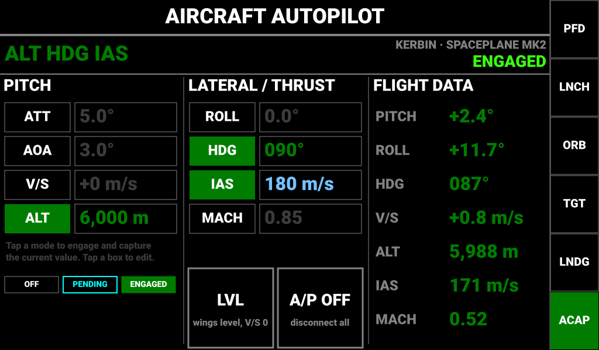
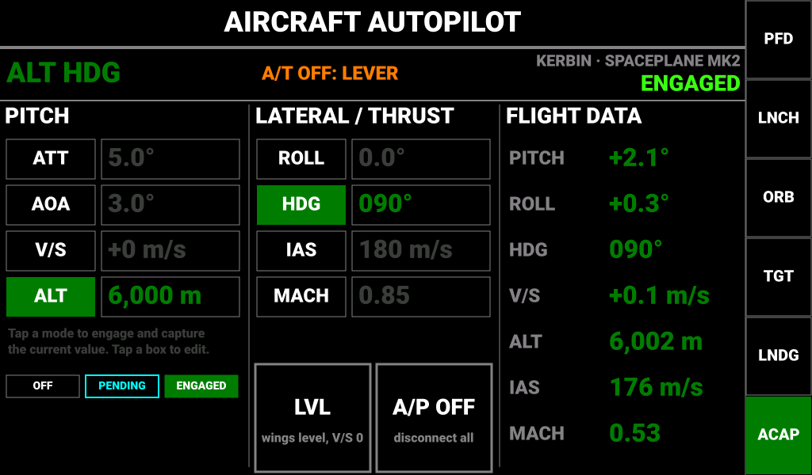
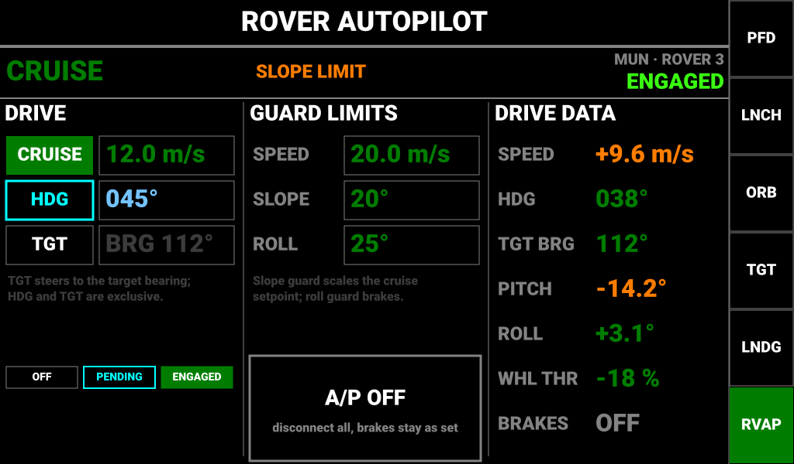

# Kerbal Controller Mk1 — Hold-Mode Autopilot (Aircraft & Rover Consoles)

**Status:** Draft for review
**Project:** Kerbal Controller Mk1
**Organization:** Jeb's Controller Works
**Author:** J. Rostoker
**Runs on:** Master controller (Teensy 4.1), `Software/Controller_Main`
**Controlled from:** Info Display 2 (I2C `0x13`) — the panel that hosts the Ascent Autopilot console
**Companion documents:** `Ascent_Autopilot.md`, `Ascent_Autopilot_Interface.md`, `I2C_Protocol_Specification.md` §15

---

## 1. Overview

The hold-mode autopilot adds pilot-selectable **hold modes** for aircraft and rovers alongside the
existing launch-to-orbit ascent autopilot. Where the ascent autopilot flies a *profile* and hands
control back at the end, a hold mode holds *one quantity* — an attitude, a vertical speed, an
altitude, an airspeed, a heading, a rover speed — for as long as the pilot leaves it engaged.

Everything closes the loop on the master Teensy exactly as the ascent autopilot does: telemetry in
over KerbalSimpit, rotation / throttle / wheel commands out. The pilot controls it from two new
touch consoles on Info Display 2, **AIRCRAFT AUTOPILOT** and **ROVER AUTOPILOT**, which share the
Ascent Autopilot console's chrome, keypad, pending/confirmed colouring, and I2C command channel.

The autothrottle is also wired to the **Throttle Module's motorised slider** (§7): when an
airspeed hold is engaged the physical lever follows the commanded throttle, and the pilot grabbing
the lever disconnects the autothrottle. There is never a moment where the lever position and the
game throttle disagree.

### 1.1 Mode summary

| Vehicle | Group | Mode | Holds | Actuator |
|---------|-------|------|-------|----------|
| Aircraft | Pitch | **ATT** | Pitch attitude above the horizon | Pitch (via attitude loop) |
| Aircraft | Pitch | **AOA** | Pitch relative to the surface-velocity vector (angle of attack) | Pitch |
| Aircraft | Pitch | **V/S** | Vertical speed | Pitch, cascaded through ATT |
| Aircraft | Pitch | **ALT** | Sea-level altitude | Pitch, cascaded ALT → V/S → ATT |
| Aircraft | Lateral | **ROLL** | Bank angle | Roll |
| Aircraft | Lateral | **HDG** | Heading, by banking (bank-limited turn) | Roll, cascaded HDG → ROLL |
| Aircraft | Thrust | **IAS** | Indicated airspeed | Throttle + Throttle Module lever |
| Aircraft | Thrust | **MACH** | Mach number | Throttle + Throttle Module lever |
| Aircraft | — | **LVL** | One-tap recovery: ROLL 0° + V/S 0 | Roll + pitch |
| Rover | Drive | **CRUISE** | Ground speed | Wheel throttle |
| Rover | Steer | **HDG** | Heading | Wheel steering |
| Rover | Steer | **TGT** | Bearing to the current target | Wheel steering |
| Rover | Guards | *SPEED / SLOPE / ROLL* | Editable limits, not modes (§5.3) | Cruise setpoint scaling; brakes |

Modes within a group are **mutually exclusive**: engaging ALT drops V/S, engaging HDG drops ROLL,
engaging MACH drops IAS. Modes in different groups combine freely (ALT + HDG + IAS is the normal
cruise configuration). Engaging any hold mode **disarms the ascent autopilot**, and arming the
ascent autopilot disconnects every hold mode.

### 1.2 Files

| File | Role |
|------|------|
| `hold_autopilot.h` | Public API: mode enums, `HoldConfig`, `HoldStatus`, setters, engage/disconnect |
| `hold_autopilot.ino` | Mode manager, outer loops, autothrottle, cruise control, disconnect logic |
| `ascent_autopilot.ino` | Attitude loop `apSteer()` factored out so both autopilots share it (§6.1) |
| `simpit_message_handler.ino` | Registers `TARGETINFO_MESSAGE`; feeds `hpIngest*()` |
| `function_definitions.ino` | InfoDisp poll/ack/push wiring; Throttle Module auto-move hook; stick suppression |
| `KCMk1_InfoDisp/Screen_ACFT_AP.ino`, `Screen_ROVR_AP.ino` | The two consoles (chrome + draw + touch) |
| `KCMk1_InfoDisp/I2CSlave.ino`, `AAA_Screens.ino`, `TouchEvents.ino` | New status frames, ASC key cycling, new screens |

---

## 2. Telemetry and outputs

All inputs are already registered by `registerInputChannels()` except `TARGETINFO_MESSAGE`.

| Channel | Used for |
|---------|----------|
| `ROTATION_DATA_MESSAGE` | Heading, pitch, roll; surface-velocity heading and pitch (AOA reference) |
| `VELOCITY_MESSAGE` | Vertical speed (V/S, ALT); surface speed magnitude (CRUISE) |
| `ALTITUDE_MESSAGE` | Sea-level altitude (ALT hold) |
| `AIRSPEED_MESSAGE` | IAS, Mach, g-force |
| `FLIGHT_STATUS_MESSAGE` | Vessel type (console routing), vessel situation (rover airborne guard) |
| `ATMO_CONDITIONS_MESSAGE` | Atmosphere presence (aircraft modes refuse to engage in vacuum) |
| `ACTIONSTATUS_MESSAGE` | Brake state (cruise disconnect), SAS state |
| `TARGETINFO_MESSAGE` | **New on the master.** Target bearing for rover TGT mode |
| `THROTTLE_CMD_MESSAGE` | Game throttle echo (autothrottle resync) |

Outputs: `ROTATION_MESSAGE` (pitch/yaw/roll), `THROTTLE_MESSAGE`, `WHEEL_THROTTLE_MESSAGE`,
`WHEEL_STEER_MESSAGE`, `SAS_ACTION` / `BRAKES_ACTION`, and the Throttle Module `CMD_SET_THROTTLE`.

**Rover speed sign.** `VELOCITY_MESSAGE.surface` is unsigned. Direction is derived from the angle
between vessel heading and surface-velocity heading: more than 90° apart means reverse. This is the
same derivation the ROVER screen already uses for its signed speed readout.

**Angular rate.** No rate telemetry exists. Damping terms use a filtered first difference of the
attitude samples at the Simpit refresh rate (§6.4).

---

## 3. Navigation on Info Display 2

The **ASC** sidebar key (button 5) becomes a three-mode key, following the same cycling rule as PFD,
ORB, TGT and LNDG:

| Press | Behaviour |
|-------|-----------|
| First press from another screen | Context console by vessel type: rocket / lander → ASCENT AUTOPILOT, plane → AIRCRAFT AUTOPILOT, rover → ROVER AUTOPILOT |
| Repeat press | Cycles ASCENT → AIRCRAFT AP → ROVER AP |
| Key caption | `ASC` / `ACAP` / `RVAP` (four characters, as the other mode captions) — **naming open for review, §11** |
| Key colour | `TFT_DARK_GREEN` while **any** autopilot is armed or engaged (extends the existing armed annunciation) |

Two new screen types, `screen_ACFTAP = 14` and `screen_ROVRAP = 15`, are appended after
`screen_NAV`; `screen_COUNT` becomes 16. The manual-selection latch behaves as on every other
screen. Neither console is ever auto-selected by the mission ladder: like the ascent console, they
are reached only by the pilot's key press.

Unit 1 compiles both consoles out exactly as it compiles out the ascent console
(`apEnqueueCmd()` returns `false`): **Info Display 2 remains the single command source**.

---

## 4. Aircraft Autopilot console



*ALT, HDG and IAS engaged; the pilot has just dialled a new IAS setpoint (cyan, awaiting echo).*



*The pilot grabbed the throttle lever: IAS dropped to OFF and the banner carries the reason.*

### 4.1 Layout

The console reuses the Ascent Autopilot geometry verbatim — banner 64 px, three 298 px columns at
x = 6 / 322 / 638, 58 px rows from y = 172, 176 × 50 value boxes — so the existing `textLeft`,
`apPut`, keypad and touch-routing helpers serve it unchanged.

| Region | Content |
|--------|---------|
| Banner, left | Engaged mode list in engaged-green (`ALT  HDG  IAS`), or `A/P OFF` in dark grey. A disconnect reason follows in `TFT_ORANGE` for 5 s after an automatic disconnect (§5.4) |
| Banner, right | Body · vessel name (small, grey); `ENGAGED` in `TFT_NEON_GREEN` or `A/P OFF` in dark grey. Appends `...` while a tap is unacknowledged, never flips optimistically (same rule as ARMED/DISARMED) |
| Column 1 **PITCH** | Mode rows ATT, AOA, V/S, ALT: a 112 px mode button + a 176 px setpoint box |
| Column 2 **LATERAL / THRUST** | Mode rows ROLL, HDG, IAS, MACH; below them the **LVL** and **A/P OFF** buttons side by side (145 × 136 each, in the ARM button's footprint) |
| Column 3 **FLIGHT DATA** | Read-only PITCH, ROLL, HDG, V/S, ALT, IAS, MACH from the InfoDisp's own Simpit link (as APA/PEA/G are on the ascent console) |

Commanded throttle is deliberately **not** shown: while the autothrottle is engaged the physical
lever *is* the throttle readout (§7).

### 4.2 Fields

| Slot | Mode / field | Setpoint units | Range | Capture on engage | Keypad kind |
|------|--------------|----------------|-------|-------------------|-------------|
| ATT | Pitch attitude | ° above horizon | −45 … +45 | current pitch | numeric, signed |
| AOA | Angle of attack | ° relative to surface prograde | −10 … +25 | current pitch − surface-velocity pitch | numeric, signed |
| V/S | Vertical speed | m/s | −100 … +100 | current vertical speed, rounded to 1 m/s | numeric, signed |
| ALT | Altitude (ASL) | m | 0 … 70 000 (Kerbin); clamped to atmosphere top for the current body | current altitude, rounded to 10 m | numeric, thousands separators |
| ROLL | Bank angle | ° | −60 … +60 | current roll | numeric, signed |
| HDG | Heading | ° | 0 … 359.9 | current heading, rounded to 1° | numeric |
| IAS | Indicated airspeed | m/s | 20 … 1 500 | current IAS | numeric |
| MACH | Mach number | — | 0.10 … 6.00 | current Mach | numeric, 2 dp |

Setpoint boxes are drawn in `TFT_DARK_GREY` while their mode is off, `TFT_DARK_GREEN` when
confirmed, and `TFT_SKY` while a pilot edit awaits its echo — exactly the ascent console's rule.

### 4.3 Touch behaviour

| Tap | Result |
|-----|--------|
| Mode button, mode off | Queue `ENGAGE` with payload `1.0`. The master captures the current value as the setpoint and echoes both. Button shows **pending** (cyan outline) until the echo lands, then **engaged** (green fill). Any other mode in the same group drops in the same echo |
| Mode button, mode engaged | Queue `ENGAGE` with payload `0.0`. Button shows pending until echoed **off** |
| Setpoint box | Opens the existing numeric keypad (`+/-`, `.`, `DEL`, `CLR`, `ENT`, `CANCEL`; the `OFF` key is disabled on this console). `ENT` queues `SET_*` with the value. Editing is allowed **whether or not the mode is engaged**: an engaged mode retargets, an off mode simply stores the value for later. Setting the box does *not* engage the mode |
| LVL | Queue `LVL`. Master engages ROLL at 0° and V/S at 0, dropping HDG/ATT/AOA/ALT. Thrust group untouched |
| A/P OFF | Queue `AP_OFF`. Master drops every hold mode and returns SAS to stability assist (§5.5) |

Mode buttons are three-state and draw in the panel's existing vocabulary:

| State | Rendering |
|-------|-----------|
| Off | Black fill, `TFT_GREY` 1 px outline, white caption |
| Pending | Black fill, `TFT_CYAN` 3 px outline, cyan caption — tap sent, not yet echoed |
| Engaged | `TFT_DARK_GREEN` fill, white caption |

### 4.4 Engage refusals

The master refuses (does not echo) an aircraft-mode engage when: the vessel has no atmosphere
around it (`hasAtmosphere == false`), the ascent autopilot is armed, or telemetry is stale. The
console keeps showing the pending outline until the pilot taps again or 3 s elapse, after which it
reverts to off and the banner shows `REFUSED` in orange. This is the same "don't echo a rejected
value" convention the ascent interface defines.

---

## 5. Rover Autopilot console



*CRUISE engaged at 12 m/s, being scaled back by the slope guard on a 14° downgrade; HDG tap
pending.*

### 5.1 Layout

| Region | Content |
|--------|---------|
| Banner | Engaged modes (`CRUISE  HDG`) / `A/P OFF`; guard state or disconnect reason in orange; body · vessel; `ENGAGED` / `A/P OFF` |
| Column 1 **DRIVE** | Mode rows CRUISE (speed setpoint), HDG (heading setpoint), TGT (no setpoint; box shows the live target bearing, muted when no target) |
| Column 2 **GUARD LIMITS** | Editable SPEED, SLOPE, ROLL limits; **A/P OFF** button (298 × 136, the ARM footprint) |
| Column 3 **DRIVE DATA** | Signed SPEED, HDG, TGT BRG, PITCH, ROLL, commanded WHL THR, BRAKES |

### 5.2 Fields

| Slot | Field | Units | Range | Capture on engage | Notes |
|------|-------|-------|-------|-------------------|-------|
| CRUISE | Ground speed | m/s, signed | −10 … +60 | current signed speed, rounded to 0.5 | Negative holds a reverse speed |
| HDG | Heading | ° | 0 … 359.9 | current heading | Exclusive with TGT |
| TGT | Drive to target | — | — | — | Refused when no target is set; drops if the target is lost |
| SPEED | Cruise cap | m/s | 1 … 60 | — | CRUISE setpoint is clamped to this |
| SLOPE | Slope guard | ° | 5 … 45 | — | See §5.3 |
| ROLL | Roll guard | ° | 5 … 60 | — | See §5.3 |

### 5.3 Guards

Guards are limits, not modes: they are always active while CRUISE is engaged.

- **Slope guard.** Above half the SLOPE limit the cruise setpoint scales linearly toward zero at
  the limit, on up- and down-grades alike (`|pitch|`). The banner shows `SLOPE LIMIT` in orange and
  the SPEED and PITCH readouts turn orange while it is acting.
- **Roll guard.** If `|roll|` exceeds the ROLL limit, cruise disconnects, wheel throttle goes to
  zero and **brakes are applied**. Banner: `ROLL LIMIT`. Brakes stay applied until the pilot releases
  them (the master never releases brakes on its own).
- **Airborne guard.** If the vessel situation leaves *landed* / *splashed* for more than 500 ms,
  cruise and steering disconnect with wheel throttle zero. Banner: `AIRBORNE`. No brakes: locked
  wheels on touchdown flip rovers.

### 5.4 Touch behaviour

Identical to the aircraft console: tap a mode to engage-with-capture, tap again to disengage, tap a
box to edit at any time, A/P OFF drops everything. Guard-limit boxes are plain editable fields
(`TFT_DARK_GREEN` / `TFT_SKY`) with no mode button.

---

## 6. Mode logic on Controller_Main

### 6.1 Shared attitude loop

`apSteer(cmdPitch, cmdHeading, dt)` and its roll hold move out of `ascent_autopilot.ino` into a
small shared attitude controller with two entry points:

- `attSteerRocket(pitch, heading)` — the existing behaviour: heading error corrected with **yaw**.
- `attSteerAircraft(pitch, bankCmd)` — heading is *not* corrected with yaw. The lateral group
  supplies a bank command; the pitch group supplies a pitch command; yaw is left at zero (or a small
  turn-coordination term, §6.4).

Both use the same body-frame rotation of navball errors and the same clamped-integral PID, with
**separate gain sets** per vehicle class (`HoldConfig.acftGains`, `.rocketGains`). Rocket gains on a
plane oscillate.

### 6.2 Cascades

```
ALT ──(ALT→V/S: K_alt, V/S cap ±vsMax)──▶ V/S ──(V/S→pitch: PI, pitch cap ±pitchMax)──▶ ATT ──▶ attitude loop
AOA ──(pitch = srfVelPitch + aoa)────────────────────────────────────────────────────▶ ATT ──▶ attitude loop
HDG ──(HDG→bank: K_hdg, bank cap ±bankMax)──▶ ROLL ─────────────────────────────────▶ attitude loop
IAS / MACH ──(PI, anti-windup, slew-limited)──▶ throttle 0..1 ──▶ THROTTLE_MESSAGE + Throttle Module
CRUISE ──(PI on signed speed, slope-scaled setpoint)──▶ wheel throttle −1..1 ──▶ WHEEL_THROTTLE_MESSAGE
HDG / TGT (rover) ──(P on heading error, speed-scheduled gain)──▶ wheel steer −1..1 ──▶ WHEEL_STEER_MESSAGE
```

Defaults (`HoldConfig`): `vsMax` 30 m/s, `pitchMax` 25°, `bankMax` 30°, `aoaMax` 20°,
throttle slew 0.25/s, cruise wheel-throttle slew 0.5/s.

### 6.3 Engage, capture, retarget

- **Engage captures.** Every engage command stores the current measured value as the setpoint
  before the loop runs, so engagement is bumpless. The captured value is echoed in the next status
  push and becomes the box's confirmed value.
- **Setpoints apply while engaged.** Unlike the ascent setters, `hpSet*()` is never gated on
  engagement. The reconcile-by-echo rule clears the cyan state either way.
- **Group exclusion** is enforced on the master: engaging a mode clears its group siblings in the
  same update, and the status push reflects all of it at once so the console never shows two
  greens in one group.
- **Ascent exclusion.** `hpEngage()` calls `apDisarm()` if the ascent autopilot is armed;
  `apArm()` calls `hpDisconnectAll(REASON_ASCENT)`.

### 6.4 Damping and rates

Pitch-rate, roll-rate and yaw-rate estimates are first differences of the attitude samples,
low-pass filtered (τ ≈ 0.25 s), used as the D term on measurement (not on error) so setpoint steps
do not kick the surfaces. A small yaw term proportional to bank × pitch-rate gives turn coordination;
it is optional and off by default. The Simpit plugin refresh interval bounds all of this — 125 ms
is workable for a plane with SAS off; anything slower will need the plugin's refresh setting lowered.

### 6.5 Disconnect rules

| Trigger | Aircraft | Rover | Banner reason |
|---------|----------|-------|---------------|
| Pilot stick deflection > 25 % on a held axis for > 300 ms | Drops the modes on that axis group (pitch stick → pitch group; roll stick → lateral group) | Steer input drops HDG/TGT | `STICK` |
| Pilot touches the Throttle Module slider (§7) | Drops IAS/MACH | — | `LEVER` |
| Throttle Module 100 / 0 / UP / DOWN button | Drops IAS/MACH, then the button acts normally | — | `LEVER` |
| Brakes applied | — | Drops CRUISE | `BRAKES` |
| Manual wheel-throttle input | — | Drops CRUISE | `STICK` |
| Vessel situation not landed/splashed for > 500 ms | — | Drops all | `AIRBORNE` |
| Roll guard | — | Drops all + brakes | `ROLL LIMIT` |
| Left atmosphere (`inAtmosphere` false > 2 s) | Drops all | — | `NO ATMO` |
| Telemetry timeout (2 000 ms) | Drops all, SAS stability assist, **throttle left as is** | Drops all, wheel throttle 0, no brakes | `TELEMETRY` |
| Ascent autopilot armed | Drops all | Drops all | `ASCENT` |
| Vessel or scene change | Drops all, silently | Drops all, silently | — |
| A/P OFF tap | Drops all | Drops all | — (pilot action) |

The aircraft telemetry failsafe **does not cut throttle** — the ascent behaviour of throttling to
zero is wrong for a plane. It hands the airframe to stock SAS stability assist at the current
throttle and lets the pilot take over.

### 6.6 Stick suppression

While a pitch-group mode is engaged the master stops forwarding the Rotation joystick's pitch axis
to KSP; likewise roll for the lateral group and yaw is always forwarded. The suppressed axis is
still *read* for the 25 % override test above. Trim mode and precision mode on the joystick are
unaffected. The Translation joystick is never suppressed.

### 6.7 SAS

Stock SAS is switched off whenever a pitch or lateral mode is engaged (raw rotation fights it) and
returned to **stability assist** on any full disconnect, so the pilot never inherits a plane with
SAS off. Thrust-only engagement (IAS or MACH alone, no attitude modes) leaves SAS exactly as the
pilot has it.

---

## 7. Throttle Module integration (auto-move)

The Throttle Module (`0x2C`) has a motorised slider driven by `CMD_SET_THROTTLE` (uint16 BE,
0 … `INT16_MAX`), a capacitive touch sensor reported as status flag bit 2, a *motor moving* flag
(bit 3), and four buttons (100 / UP / DOWN / 0) reported as rising-edge events. `CMD_SET_THROTTLE`
is ignored by the module while the pilot is touching the slider or while it is disabled.

### 7.1 Autothrottle output path

While IAS or MACH is engaged, each autothrottle update produces one throttle value `t ∈ 0..1` and:

1. Sends `THROTTLE_MESSAGE` with `t × INT16_MAX` to KSP, as the ascent autopilot does.
2. Sends `CMD_SET_THROTTLE` with the same value to the Throttle Module **when it has moved by more
   than 1 % since the last command sent, and at most every 200 ms**. The slew limit in §6.2 keeps
   the lever moving smoothly rather than hunting; the deadband stops the H-bridge chattering at the
   setpoint.
3. Ignores the Throttle Module's reported wiper value as a *pilot input* while engaged — the wiper
   is following the motor. Its reports still update the master's throttle position variable, so the
   moment the autothrottle disconnects the master's idea of the lever is already correct and no
   jump occurs. **This is the whole point of driving the lever**: there is no sync problem to solve
   on disconnect because the lever is already at the commanded throttle.

### 7.2 Pilot takes the lever

- **Touch** (status bit 2 set): the master disconnects IAS/MACH immediately with reason `LEVER`,
  stops sending `CMD_SET_THROTTLE`, and resumes forwarding the wiper as ordinary pilot throttle. The
  module has already stopped its motor on its own, so there is no fight even if the master is a poll
  late.
- **Buttons** (100 / 0 / UP / DOWN): same disconnect, then the master applies the button's normal
  function, so `THRTL_00` while engaged is a one-press "autothrottle off and idle".
- **Precision mode** (`CMD_SET_PRECISION`): the autothrottle refuses to engage while the module is
  in precision mode, and entering precision mode disconnects it. Precision mode re-centres the
  slider physically, which is incompatible with the lever-follows-command rule.
- **Module disabled** (`CMD_DISABLE`, or `throttleEn` false on the master): the autothrottle still
  runs the game throttle but the lever is not driven; the console banner shows `LEVER OFF` in grey
  as a reminder that the lever will not be in sync on disconnect. On disconnect in this state the
  master keeps sending the last autothrottle value to KSP until the wiper passes through it
  (classic throttle-sync latch), then hands over.

### 7.3 Motor-moving flag

While bit 3 (motor moving) is set the master treats the wiper as in transit and does not use it for
the 1 % deadband comparison, which prevents a new `CMD_SET_THROTTLE` from being issued against a
stale mid-travel position.

### 7.4 Rover cruise and the lever

Rover CRUISE drives `WHEEL_THROTTLE_MESSAGE`, not the game throttle, and the lever is not driven.
Whether the Throttle Module lever should act as the rover's wheel throttle at all is a master-side
mapping question that predates this design; it is listed in §11.

### 7.5 Ascent autopilot

The ascent autopilot's managed throttle gains the same lever-follow behaviour through the shared
`throttleOut(t)` helper, so the lever rides up and down with max-Q and apoapsis taper during an
ascent, and a pilot grabbing the lever during an ascent is a disconnect of the throttle manager
only (the ascent autopilot continues steering with the pilot's throttle). This is a small change to
existing behaviour and is called out for review.

---

## 8. I2C contract (Info Display 2 ⇄ Controller_Main)

The transport in `Ascent_Autopilot_Interface.md` is reused unchanged: the 10-byte outbound packet
with its 7-byte command frame, the 2-byte control/ACK write, one command in flight, execute on
`cmdSeq` change, ACK by echo. This section only adds opcodes and two new status frames.

### 8.1 Command opcodes

Payload is a little-endian float32 as before. For `ENGAGE_*` opcodes the payload is `1.0` to engage
(with capture) and `0.0` to disengage.

| Opcode | Name | Payload | Master call |
|--------|------|---------|-------------|
| `0x12` | `HOLD_AP_OFF` | 0 | `hpDisconnectAll(REASON_PILOT)` |
| `0x13` | `HOLD_LVL` | 0 | `hpLevel()` |
| `0x20` | `ENGAGE_ATT` | 1/0 | `hpEngage(HP_PITCH_ATT, on)` |
| `0x21` | `ENGAGE_AOA` | 1/0 | `hpEngage(HP_PITCH_AOA, on)` |
| `0x22` | `ENGAGE_VS` | 1/0 | `hpEngage(HP_PITCH_VS, on)` |
| `0x23` | `ENGAGE_ALT` | 1/0 | `hpEngage(HP_PITCH_ALT, on)` |
| `0x24` | `ENGAGE_ROLL` | 1/0 | `hpEngage(HP_LAT_ROLL, on)` |
| `0x25` | `ENGAGE_HDG` | 1/0 | `hpEngage(HP_LAT_HDG, on)` |
| `0x26` | `ENGAGE_IAS` | 1/0 | `hpEngage(HP_THR_IAS, on)` |
| `0x27` | `ENGAGE_MACH` | 1/0 | `hpEngage(HP_THR_MACH, on)` |
| `0x28` | `SET_ATT` | ° | `hpSetAtt(v)` |
| `0x29` | `SET_AOA` | ° | `hpSetAoa(v)` |
| `0x2A` | `SET_VS` | m/s | `hpSetVs(v)` |
| `0x2B` | `SET_ALT` | m | `hpSetAlt(v)` |
| `0x2C` | `SET_ROLL` | ° | `hpSetRoll(v)` |
| `0x2D` | `SET_HDG` | ° | `hpSetHdg(v)` |
| `0x2E` | `SET_IAS` | m/s | `hpSetIas(v)` |
| `0x2F` | `SET_MACH` | — | `hpSetMach(v)` |
| `0x30` | `ENGAGE_CRUISE` | 1/0 | `hpEngage(HP_ROV_CRUISE, on)` |
| `0x31` | `ENGAGE_RHDG` | 1/0 | `hpEngage(HP_ROV_HDG, on)` |
| `0x32` | `ENGAGE_RTGT` | 1/0 | `hpEngage(HP_ROV_TGT, on)` |
| `0x33` | `SET_CRUISE` | m/s (signed) | `hpSetCruise(v)` |
| `0x34` | `SET_RHDG` | ° | `hpSetRoverHdg(v)` |
| `0x35` | `SET_MAXSPD` | m/s | `hpSetMaxSpeed(v)` |
| `0x36` | `SET_MAXSLOPE` | ° | `hpSetMaxSlope(v)` |
| `0x37` | `SET_MAXROLL` | ° | `hpSetMaxRoll(v)` |

`0x00`–`0x11` remain the ascent autopilot's. Ranges are clamped on the InfoDisp before queueing
(per §4.2 / §5.2) and range-checked again on the master.

### 8.2 Status frames

The master learns the console on screen from `activeScreen` (outbound byte 2) and pushes **only
the frame that console needs**, at 5–10 Hz or on change. Frames are dispatched by write length in
`onI2CReceive()` like the existing 40-byte frame; the three lengths (28, 40, 44) plus the 2-byte
control write are all distinct.

**Aircraft status — 44 bytes, sync `0xA6`**

```
Byte 0      : 0xA6
Byte 1      : flags      bit0 anyEngaged, bit1 thrustEngaged, bit2 leverTouched,
                         bit3 leverDriven (module enabled and following), bit4 ascentArmed
Byte 2      : pitchMode  0 OFF, 1 ATT, 2 AOA, 3 VS, 4 ALT
Byte 3      : latMode    0 OFF, 1 ROLL, 2 HDG
Byte 4      : thrMode    0 OFF, 1 IAS, 2 MACH
Byte 5      : reason     last disconnect reason (0 none, 1 STICK, 2 LEVER, 3 BRAKES, 4 AIRBORNE,
                         5 ROLL LIMIT, 6 NO ATMO, 7 TELEMETRY, 8 ASCENT, 9 REFUSED)
Byte 6      : reasonAge  seconds since the reason was set (saturates at 255; console hides it > 5)
Byte 7      : reserved
Bytes 8..43 : nine float32 LE — setpoint echoes and one output:
   [0] att °  [1] aoa °  [2] vs m/s  [3] alt m  [4] roll °  [5] hdg °  [6] ias m/s  [7] mach
   [8] cmdThrottle 0..1   (not displayed; kept for the bench console and logging)
```

**Rover status — 28 bytes, sync `0xA7`**

```
Byte 0      : 0xA7
Byte 1      : flags      bit0 cruise, bit1 hdg, bit2 tgt, bit3 brakesApplied,
                         bit4 slopeGuardActive, bit5 targetAvailable
Byte 2      : reason     as above
Byte 3      : reasonAge
Bytes 4..27 : six float32 LE:
   [0] cruise m/s (signed)  [1] hdg °  [2] maxSpeed  [3] maxSlope °  [4] maxRoll °
   [5] cmdWheelThrottle −1..1
```

Live flight data (pitch, altitude, IAS, speed, target bearing, brake state, …) is **not** carried:
the console reads it from its own Simpit link, as the ascent console does for apoapsis and g.

**Reconcile rule.** A pending mode-button state clears when the corresponding mode byte matches
the commanded state; a pending setpoint clears when its echo matches within tolerance (0.05 ° / 0.5 m
/ 0.1 m/s / 0.005 Mach). A refused engage is simply not echoed and times out on the console (§4.4).

### 8.3 InfoDisp `AppState` additions

`hpPitchMode`, `hpLatMode`, `hpThrMode`, `hpFlags`, `hpReason`, `hpReasonAge`, the eight aircraft
setpoints; `rvFlags`, `rvReason`, `rvReasonAge`, the five rover values and `rvCmdWheel`. Demo mode
drives all of them from a simple model so the consoles can be laid out without a master, as
`Demo.ino` does for the ascent console.

---

## 9. Master-side work list

In dependency order. Items 1 and 2 are prerequisites the ascent console already needs.

1. **InfoDisp poll / ACK / status push** in `function_definitions.ino` — read `0x13`, verify the
   frame checksum, dispatch on `cmdSeq` change, ACK on the next control write, push the frame for
   the active screen. Nothing in Controller_Main does this yet.
2. **Throttle Module `CMD_SET_THROTTLE` hook** and the touch / button / precision handling of §7.
3. **Shared attitude controller** factored out of `ascent_autopilot.ino` with rocket and aircraft
   entry points and per-class gains.
4. **`hold_autopilot.h/.ino`**: mode manager, cascades, autothrottle, cruise, steering, guards,
   disconnect rules, `HoldStatus` for the push, bench serial console (`ENG ALT`, `SET IAS 180`,
   `LVL`, `OFF`, `STATUS`, …) mirroring the ascent one.
5. **Stick suppression** on held axes in the Rotation joystick forwarding path.
6. `TARGETINFO_MESSAGE` registration and `hpIngestTarget()`.
7. Vessel-type routing for the ASC key's first press (needs `vesselType` from
   `FLIGHT_STATUS_MESSAGE`, already parsed on both boards).

---

## 10. Assumptions and limitations

- KSP1 + KerbalSimpit; axis full-scale ±`INT16_MAX`; wheel throttle and steer are `int16` on the same
  scale. `WHEEL_THROTTLE_MESSAGE` / `WHEEL_STEER_MESSAGE` are outbound-to-game channels distinct
  from the `WHEEL_CMD_MESSAGE` echo the InfoDisp already reads.
- Loop bandwidth is bounded by the Simpit refresh interval. Modes are tuned for a plane with SAS off
  at the default interval; very light or very draggy craft will need gain changes.
- HDG hold on an aircraft assumes a conventional airframe that turns when banked. Tail-sitters, VTOL
  hovers and rockets in atmosphere should use the rocket entry point (ATT with yaw correction),
  selectable via `HoldConfig.steerLikeRocket`.
- Rover TGT steers to the *bearing*, with no obstacle or terrain awareness.
- Altitude hold is on sea-level altitude only. There is intentionally no terrain-following mode.

---

## 11. Open questions for review

1. **Sidebar captions.** `ASC` / `ACAP` / `RVAP` are placeholders. Alternatives: `ASC` / `A-AP` /
   `R-AP`, or keep the key reading `ASC` in every mode and rely on the title bar.
2. **Ascent throttle on the lever (§7.5).** Should the lever follow the ascent autopilot's managed
   throttle, and should grabbing it during an ascent hand the throttle to the pilot while steering
   continues? Alternative: lever grab during an ascent is a full DISARM.
3. **Rover wheel throttle source.** Does the Throttle Module lever drive wheel throttle for rovers on
   the master today, or is it the Translation joystick? This decides whether the lever should follow
   CRUISE and whether lever touch should disconnect it (§7.4).
4. **Stick-override threshold.** 25 % for 300 ms is a first guess; the alternative is "any input
   beyond the joystick deadband", which is more sensitive to a bumped stick.
5. **LVL semantics.** As drawn, LVL keeps the thrust group. Should it also engage IAS at the current
   speed so a single tap fully stabilises the aircraft?
6. **Dual Encoder module.** Binding the two encoders to the active pitch-group and thrust-group
   setpoints (altitude / vertical speed and airspeed) would give in-flight adjustment without the
   keypad. Not in scope here, but the setpoint API is designed so the master can apply encoder deltas
   directly and the console picks them up through the echo.
7. **Rover HDG while stationary.** Steering a parked rover does nothing; should HDG refuse to engage
   below 0.5 m/s, or engage and simply wait?

---

## 12. Mockup sources

The three console mockups are generated by `assets/gen_hold_mode_mockups.py` (Python 3, no
dependencies) using the InfoDisp palette and the Ascent Autopilot console geometry, so they can be
regenerated after layout changes. Render with any SVG viewer or headless Chromium.
