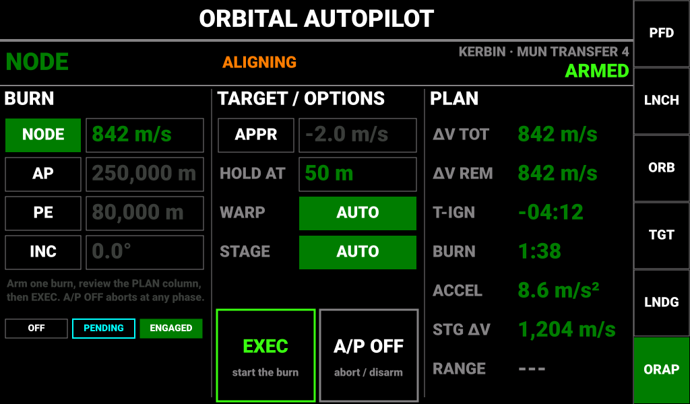
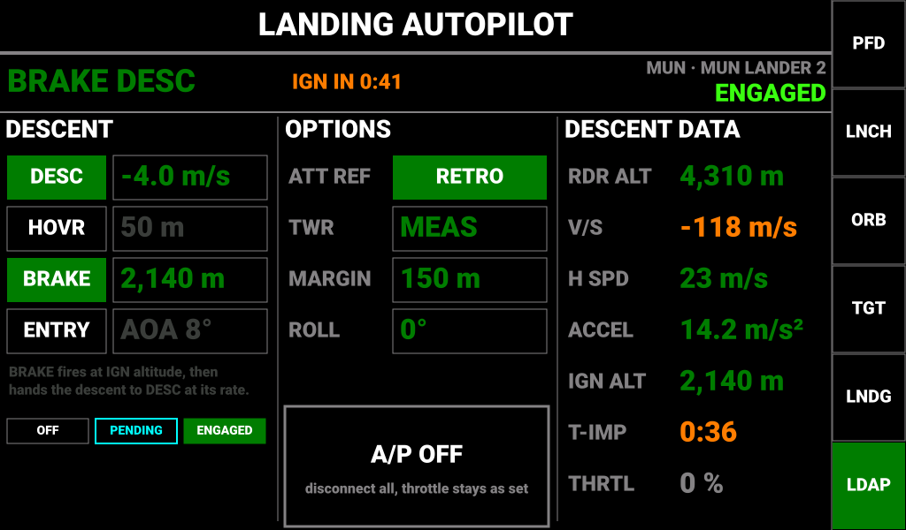
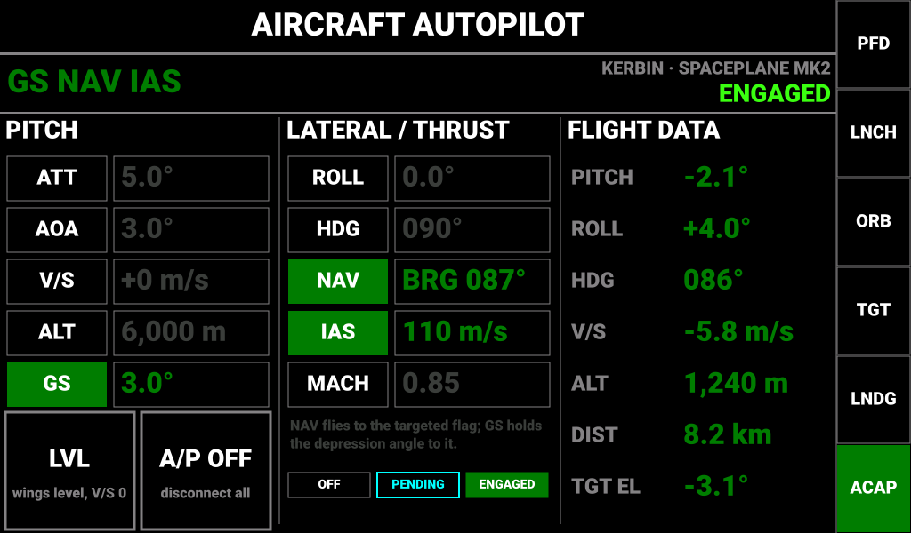
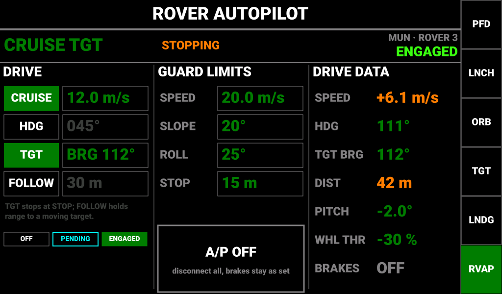

# Kerbal Controller Mk1 — Mission Autopilot (Orbital, Landing, Approach and Navigation Modes)

**Status:** Draft for review
**Project:** Kerbal Controller Mk1
**Organization:** Jeb's Controller Works
**Author:** J. Rostoker
**Runs on:** Master controller (Teensy 4.1), `Software/Controller_Main`
**Controlled from:** Info Display 2 (I2C `0x13`), the autopilot console key
**Builds on:** `Hold_Mode_Autopilot.md` (implemented), `Ascent_Autopilot.md`, `Ascent_Autopilot_Interface.md`

---

## 1. Overview

This is the second tranche of autopilot functions: the ones that are realistic with the telemetry
KerbalSimpit actually provides and the machinery the branch already has (the shared attitude
controller, the throttle owner model, the console command channel). They were selected in two
tiers:

**Cheap — composition of what exists**

| Function | Console | What it reuses |
|----------|---------|----------------|
| Maneuver node executor | ORBITAL | Ascent coast + circularisation phases; stock SAS maneuver mode; warp-to |
| Apoapsis / periapsis burns to a target | ORBITAL | Same burn executor, vis-viva planning the circularisation screen already does |
| Re-entry attitude hold | LANDING | Hold autopilot's AOA mode with an orbital-retrograde reference plus roll hold |
| Descent-rate hold and hover | LANDING | The autothrottle loop with vertical speed / radar altitude as the controlled variable |
| Rover arrive-and-stop, follow | ROVER AP | Drive-to-target plus a speed schedule by distance |
| Auto-stage as a standalone option | ORBITAL, LANDING | The ascent module's stage-on-low-ΔV logic |

**Realistic — one new piece of work each**

| Function | Console | The new piece |
|----------|---------|---------------|
| Plane change to a target inclination | ORBITAL | Time-to-node from the orbital elements |
| Approach-rate hold for rendezvous | ORBITAL | Relative-velocity decomposition into along-line-of-sight and lateral, RCS translation |
| Aircraft approach to a targeted flag | AIRCRAFT AP | Lateral navigation to the target bearing and a glide-slope hold on the depression angle to it |
| Suicide-burn cue and auto-ignition | LANDING | An acceleration estimate from stage ΔV and burn time, refined by measured g during the burn |

Two consoles are added to the autopilot key — **ORBITAL AUTOPILOT** and **LANDING AUTOPILOT** —
and the AIRCRAFT AP and ROVER AP consoles gain one row each. Everything runs on the master; the
displays remain consoles. As before, the panel confirms only what the master echoes back.

### 1.1 Mode summary

| Console | Mode | Does | Actuators |
|---------|------|------|-----------|
| ORBITAL | **NODE** | Executes the next maneuver node: align, warp, burn, cut | SAS maneuver mode, throttle, warp-to, stage |
| ORBITAL | **AP** | Burns at periapsis to put apoapsis at the setpoint | SAS prograde / retrograde, throttle, warp-to |
| ORBITAL | **PE** | Burns at apoapsis to put periapsis at the setpoint | as AP |
| ORBITAL | **INC** | Burns at the nearer node to reach the target inclination | SAS normal / anti-normal, throttle, warp-to |
| ORBITAL | **APPR** | Closes on the target at a commanded rate, nulls lateral relative velocity, holds at a distance | SAS target mode, RCS translation |
| ORBITAL | *WARP*, *STAGE* | Options: automatic warp to ignition; auto-stage during burns | warp-to, stage |
| LANDING | **DESC** | Holds a vertical speed with the throttle | throttle; SAS surface-retrograde or radial-out |
| LANDING | **HOVR** | Holds a radar altitude (cascaded through DESC) | as DESC |
| LANDING | **BRAKE** | Arms a suicide burn: fires at the computed ignition altitude, hands off to DESC | throttle, SAS retrograde |
| LANDING | **ENTRY** | Holds an angle of attack relative to orbital retrograde and a roll angle | attitude loop |
| AIRCRAFT AP | **NAV** | Lateral: banks to the bearing of the targeted flag | roll, cascaded through HDG |
| AIRCRAFT AP | **GS** | Pitch: holds the depression angle to the targeted flag | pitch, cascaded through V/S |
| ROVER AP | **TGT** (extended) | Drives to the target and stops at STOP distance | wheel throttle + steer, brakes |
| ROVER AP | **FOLLOW** | Holds range to a moving target | wheel throttle + steer |

Within a console the burn modes (NODE / AP / PE / INC) are exclusive and APPR is exclusive with
them; the landing modes DESC / HOVR / BRAKE are one group and ENTRY another. Across consoles there is
**one attitude owner and one throttle owner at a time** (§7.6): engaging a mode that needs either
takes it from whichever module has it. Rover modes are independent of all of this.

### 1.2 Files

| File | Role |
|------|------|
| `burn_autopilot.h/.ino` | Burn executor (align → warp → burn → cut) and the three planners: node, apsis, plane change; approach-rate hold |
| `landing_autopilot.h/.ino` | DESC / HOVR / BRAKE / ENTRY, acceleration estimate, ignition-altitude computation |
| `hold_autopilot.ino` | NAV and GS added to the aircraft groups; FOLLOW and arrive-and-stop added to the rover modes |
| `auto_stage.ino` | The shared stage-on-low-ΔV helper, used by ascent, burn and landing modules |
| `ap_arbiter.ino` | Attitude and throttle ownership across ascent, hold, burn and landing modules |
| `infodisp_link.ino` | Opcodes `0x14`–`0x16`, `0x38`–`0x3A`, `0x40`–`0x5E`; status frames `0xA8`, `0xA9`; grown `0xA6`, `0xA7` |
| `simpit_message_handler.ino` | Registers `MANEUVER_MESSAGE`; feeds the new modules |
| `KCMk1_InfoDisp/Screen_ORBT_AP.ino`, `Screen_LNDG_AP.ino` | The two new consoles |
| `KCMk1_InfoDisp/Screen_ACFT_AP.ino`, `Screen_ROVR_AP.ino` | The added rows |
| `KCMk1_InfoDisp/I2CSlave.ino`, `AAA_Screens.ino`, `TouchEvents.ino`, `Demo.ino` | Frame dispatch by sync byte, five-console key ring, demo models |

---

## 2. Telemetry and outputs

| Channel | New on master? | Used for |
|---------|----------------|----------|
| `MANEUVER_MESSAGE` | **yes** | Time to node, node ΔV (live, so also the remaining ΔV during the burn), duration, node heading / pitch |
| `ORBIT_MESSAGE` | no | Eccentricity, semi-major axis, inclination, argument of periapsis, true anomaly, period → apsis and plane-change planning, node timing |
| `APSIDES_MESSAGE`, `APSIDESTIME_MESSAGE` | no | Apsis burn termination and warp lead |
| `DELTAV_MESSAGE`, `BURNTIME_MESSAGE` | no | Stage ΔV and stage burn time → **acceleration estimate** (§7.1), auto-stage, fuel abort |
| `AIRSPEED_MESSAGE` (g-force) | no | Measured acceleration during a burn refines the estimate |
| `ALTITUDE_MESSAGE` (surface) | no | Radar altitude for HOVR and BRAKE |
| `VELOCITY_MESSAGE` | no | Vertical and surface speed; horizontal speed derived |
| `ROTATION_DATA_MESSAGE` | no | Attitude, surface and orbital prograde (retrograde is the antipode) |
| `TARGETINFO_MESSAGE` | no (registered for rover TGT) | Distance, relative speed and its direction, bearing and elevation to target → APPR, NAV, GS, FOLLOW |
| `FLIGHT_STATUS_MESSAGE` | no | Situation (landed), target present |
| `SOI_MESSAGE` + `body_params.h` | no | Body gravity and radius → μ for vis-viva, ignition altitude |

Outputs: `THROTTLE_MESSAGE`, `ROTATION_MESSAGE` (ENTRY only; everything else points with stock SAS),
`TRANSLATION_MESSAGE` (APPR), `WHEEL_MESSAGE`, `setSASMode()` (maneuver, prograde, retrograde,
normal, anti-normal, radial-out, target), `TIMEWARP_TO_MESSAGE`, `STAGE_ACTION`, `BRAKES_ACTION`.

**Acceleration estimate.** Simpit does not send thrust or mass. The stage's average acceleration is
`stageDeltaV / stageBurnTime`, available before any burn from two channels the master already
reads; during a burn in vacuum the felt g from the airspeed message is the thrust acceleration
directly, and the estimate is replaced by a filtered measurement after two seconds of steady
throttle. A TWR override on the landing console bypasses both. Burn duration is `ΔV / a`.

---

## 3. Navigation on Info Display 2

The autopilot key's ring grows from three consoles to five, ordered by mission phase:

| Order | Console | Caption | First press lands here when |
|-------|---------|---------|-----------------------------|
| 1 | ASCENT AUTOPILOT | `ASC` | on the pad, or a rocket / lander climbing under thrust |
| 2 | ORBITAL AUTOPILOT | `ORAP` | in orbit or sub-orbital and not descending in the corridor |
| 3 | LANDING AUTOPILOT | `LDAP` | the RE-ENTRY or POWERED DESCENT ladder rule holds (descending in the corridor, or low with vertical speed negative) |
| 4 | AIRCRAFT AUTOPILOT | `ACAP` | a plane in an atmosphere |
| 5 | ROVER AUTOPILOT | `RVAP` | a rover |

The first-press context reuses the mission ladder's own tests (`missionContextScreen()` rules 2
and 3 for LANDING), so the key and the ladder cannot disagree about what a descent is. The key is
green while any autopilot is armed, engaged or executing.

### 3.1 The ring is filtered by vessel type and situation

A repeat press cycles only through the consoles the current vessel can use, in the order above
(decided as option C in review, §10 q.1). The ring is never deeper than three.

| Vessel type (KSP `vesselType`) | Ring | Situation rule |
|--------------------------------|------|----------------|
| Ship, Lander, Probe, Relay, Station, Base, Unknown | ASC → ORAP → LDAP | — |
| Plane | ACAP → ORAP → LDAP | — |
| Rover | RVAP | **Not landed or splashed**: RVAP → ORAP → LDAP, so a rover still on its lander or skycrane keeps the orbital and landing consoles through delivery |
| EVA, Flag, Debris, Space Object | none | the key does nothing |

Consoles a type cannot reach are ones it cannot use: a rocket has no use for airspeed hold, a
plane none for a vertical gravity turn. Two cases are covered by KSP itself rather than by the
panel: KSP's vessel type is editable in flight from the rename dialog, so a rocket-typed VTOL that
wants the aircraft holds, or a skycrane that reads as Lander after the rover separates, is retyped
by the pilot. The hold autopilot's rocket-steering option for tail-sitters lives on the aircraft
console and is therefore reached by typing such a vessel as Plane. This goes in the operating guide.

The same rule applies to the three-console ring already in the firmware (ASC / ACAP / RVAP), where
it collapses to one console per type until the orbital and landing consoles exist.

Two new screen types, `screen_ORBTAP = 16` and `screen_LNDGAP = 17`; `screen_COUNT` becomes 18.

---

## 4. Orbital Autopilot console



*A node burn armed and aligning; the PLAN column shows what EXEC will do.*

### 4.1 Layout

| Region | Content |
|--------|---------|
| Banner | Armed mode; **phase** in orange (`ALIGNING`, `WARPING`, `BURNING`, `DONE`) or a disconnect reason; body · vessel; `ARMED` / `EXECUTING` / `A/P OFF` |
| Column 1 **BURN** | NODE (box: node ΔV, or `NO NODE`), AP (target apoapsis), PE (target periapsis), INC (target inclination). Arming one clears the others |
| Column 2 **TARGET / OPTIONS** | APPR (closing-rate setpoint, negative = closing), HOLD AT (hold distance), WARP toggle, STAGE toggle; **EXEC** (relabels itself **WARP** when a warp is ready, §4.3) and **A/P OFF** side by side |
| Column 3 **PLAN** | ΔV TOT, ΔV REM, T-IGN, BURN duration, ACCEL estimate, STG ΔV, RANGE to target |

### 4.2 Arm, review, execute

Burns are two-step, like the ascent console's ARM: **arming** a mode runs the planner and fills the
PLAN column but moves nothing; **EXEC** starts the executor. The pilot sees the ΔV, ignition time and
burn duration before committing, and a plan that cannot be made (no node, no target, apsis
already past the setpoint, ΔV beyond the stage) is refused with the reason in the banner.

Setpoint boxes edit at any time; editing an armed mode's setpoint re-plans. Editing during
`BURNING` is refused.

APPR is a hold, not a burn: tapping it engages immediately, as on the other consoles.

### 4.3 Phases

```
IDLE ──arm──▶ PLANNED ──EXEC──▶ ALIGN ──pointing OK──▶ WARP READY ──WARP tap──▶ WARPING ──T-ign──▶ BURN ──ΔV rem ≤ cut──▶ DONE
                                  │                         │  (or wait it out)      │                  │
                                  └── any abort test ───────┴───────────────────────┴──────────────────┴──▶ ABORT (throttle 0, SAS stability)
```

- **ALIGN** sets the SAS mode for the burn and waits until **both** hold: the pointing error is
  under 2°, and the attitude rate estimate has been under 0.5°/s for 3 s (the settle backstop).
  The pointing reference is the node vector (maneuver message), the orbital prograde or retrograde
  vector (rotation data), or the **orbit normal computed from telemetry**: the normal is
  perpendicular to the radius vector, so it is always horizontal in the navball frame, and its
  heading is the orbital prograde heading − 90° (anti-normal + 90°). If the error has not fallen
  under 2° within 30 s the burn aborts with reason `ALIGN` rather than firing in the wrong
  direction — this catches a craft SAS cannot turn (torque imbalance, no reaction wheels). Decided
  as option C plus the settle backstop in review (§10 q.2).
- **WARP READY / WARPING.** The panel never warps unasked (decided as option C in review, §10
  q.3). With the WARP option on, once aligned the banner shows `WARP READY`, the EXEC button
  relabels itself **WARP**, and a second tap sends a warp-to for ignition minus the align lead —
  the plugin's warp-to-node / apoapsis / periapsis instants with a negative delay, or a plain time
  delay for a plane-change node. The pilot commits to the burn once and to the warp once, each with
  the PLAN column on screen. With no tap the executor simply waits for ignition. With the WARP
  option off the button stays EXEC-disabled during the wait and the pilot may warp from the Time
  module; the executor re-runs ALIGN on exit from any warp. The executor refuses to warp if the
  plan has changed since EXEC (§4.4), so a stale plan cannot warp the craft to the wrong place.
- **BURN** runs the throttle law of §7.1 and auto-stage if enabled.
- **DONE** cuts the throttle, returns SAS to stability assist and disarms. The banner holds `DONE`
  for five seconds.

### 4.4 Re-planning

An armed plan is recomputed whenever the orbital elements move by more than a threshold
(semi-major axis 0.5 %, eccentricity 0.005, inclination 0.1°, or the node's ΔV by 1 m/s) — an
unplanned burn, a staging event that changed the acceleration estimate, or a new node. The PLAN
column updates. If this happens after EXEC and before ignition the executor drops back to
`PLANNED` with the banner reading `RE-PLANNED`, and EXEC must be tapped again; it never warps on
a plan the pilot has not seen.

---

## 5. Landing Autopilot console



*BRAKE armed at 4.3 km with ignition computed at 2,140 m; DESC will take over at −4 m/s.*

### 5.1 Layout

| Region | Content |
|--------|---------|
| Banner | Engaged modes; `IGN IN m:ss` while BRAKE is armed, `FIRING` during the burn, or a reason; body · vessel; `ENGAGED` / `A/P OFF` |
| Column 1 **DESCENT** | DESC (vertical-speed setpoint, negative), HOVR (radar-altitude setpoint), BRAKE (box shows the computed ignition altitude), ENTRY (angle-of-attack setpoint) |
| Column 2 **OPTIONS** | ATT REF toggle (RETRO / RADIAL), TWR (override; `MEAS` when 0), MARGIN (metres added to the ignition altitude), ROLL (ENTRY roll hold); **A/P OFF** |
| Column 3 **DESCENT DATA** | RDR ALT, V/S, H SPD, ACCEL estimate, IGN ALT, T-IMP (radar altitude over descent rate), THRTL |

### 5.2 Behaviour

- **DESC** holds vertical speed with the throttle (§7.2). Attitude is stock SAS in the ATT REF mode:
  surface-retrograde kills horizontal velocity on the way down; radial-out is pure vertical. Below
  1 m/s horizontal speed the reference switches to radial-out automatically, because retrograde
  swings wildly at low speed.
- **HOVR** holds radar altitude by commanding a vertical speed to DESC (cascade, capped ±10 m/s).
  Engaging captures the current radar altitude.
- **BRAKE** arms: it points retrograde, computes the ignition altitude continuously and shows it,
  fires full throttle when radar altitude falls to it, and hands off to DESC at DESC's setpoint once
  the vertical speed reaches it. DESC engages automatically at that moment if it was not already.
  Arming BRAKE with no DESC setpoint uses −3 m/s.
- **ENTRY** holds an angle of attack relative to orbital retrograde plus a roll angle through the
  attitude controller. It disconnects when surface speed drops below 250 m/s, which is where the
  descent screens' parachute logic takes over.
- **Touchdown**: on landed or splashed the throttle goes to zero and everything disconnects with
  reason `LANDED`.

---

## 6. Extensions to the aircraft and rover consoles



*GS and NAV flying an approach to a flag on the runway threshold; the buttons move under the pitch column.*

- **GS** joins the pitch group. Its setpoint is the depression angle to the target (3° default).
  It needs a target; it refuses without one and drops if the target is lost. Disconnects at 200 m
  range: the flare is the pilot's.
- **NAV** joins the lateral group and banks toward the target bearing through the HDG cascade.
  Same target rules.
- The LVL and A/P OFF buttons move to the foot of the pitch column so both columns take five rows;
  the hint and legend move under the lateral column. Flight data gains DIST and TGT EL (elevation
  to target) in place of IAS and MACH, which remain visible as their own setpoint rows.



*Arriving: TGT is slowing the rover to stop 15 m from the target.*

- **TGT** gains arrive-and-stop: the cruise setpoint is capped by `√(2·a·(dist − stop))` with a
  decel constant of 2 m/s², and at the stop distance the wheels go to zero and the brakes are
  applied, reason `ARRIVED`. The banner shows `STOPPING` while the cap is below the cruise setpoint.
- **FOLLOW** holds range to a moving target: speed setpoint from the range error plus the closing
  rate, steering as TGT. It is exclusive with HDG and TGT. STOP is the guard column's fourth row.

---

## 7. Master modules and control laws

### 7.1 Burn executor

One executor, three planners. A planner returns:

```
struct BurnPlan {
  uint8_t  sasMode;        // AP_MANEUVER, AP_PROGRADE, AP_RETROGRADE, AP_NORMAL, AP_ANTINORMAL
  float    dvTotal;        // m/s
  float    tIgnition;      // s from now (already includes the half-duration lead)
  uint8_t  warpInstant;    // TIMEWARP_TO_NEXT_MANEUVER / _APOAPSIS / _PERIAPSIS / _NOW
  float    warpDelay;      // s, negative = before the instant
  float  (*remaining)();   // live remaining ΔV for the cut test
};
```

- **Node**: `dvTotal` and `remaining()` come straight from the maneuver message; `sasMode` is
  maneuver mode; ignition at `timeToNode − duration/2`.
- **Apsis**: μ = g₀·R² from the body table. AP burns at periapsis: with r = R + Pe the current
  speed is `v = √(μ(2/r − 1/a))` and the target `v' = √(μ(2/r − 1/a'))` with `a' = (r + R + Ap_target)/2`;
  ΔV = v' − v, prograde if positive. PE is the mirror at apoapsis. `remaining()` is the apsis error
  converted at the current rate of change, so the cut anticipates the telemetry lag.
- **Plane change**: node true anomalies are `ν_AN = 360° − ω` and `ν_DN = 180° − ω`. Time to each
  is from the mean anomaly difference over the mean motion `2π/period`, via the eccentric anomaly.
  The nearer node is used; ΔV = `2·v_node·sin(Δi/2)` with `v_node` from vis-viva at
  `r = a(1 − e²)/(1 + e·cos ν)`; normal at the ascending node to raise inclination, anti-normal to
  lower, mirrored at the descending node. `remaining()` is `2·v·sin(|i − i_target|/2)`.

Throttle law: full throttle until `remaining < a_est · 3 s`, then taper linearly to a 5 % floor,
cut at `remaining < 0.2 m/s` or when it starts increasing (overshoot). Duration and ignition lead
use the acceleration estimate of §2.

### 7.2 Landing loops

- **DESC**: throttle PI on vertical-speed error, `Kp` 0.05 per m/s, `Ki` 0.02, integrator initialised
  to the current throttle for a bumpless engage, slew 0.5/s. Output floor 0 and ceiling 1.
- **HOVR**: `vsCmd = clamp(0.3 · (alt_sp − radarAlt), ±10)` into DESC.
- **BRAKE**: `h_ign = v²/(2(a − g)) · (1 + 0.15) + MARGIN`, with `v` the total speed, `a` the
  acceleration estimate or TWR·g, `g` the body's surface gravity. Refused if `a ≤ 1.2 g`. T-IMP is
  `radarAlt / |vs|`, shown orange under 30 s.
- **ENTRY**: reference heading = orbital prograde heading + 180°, reference pitch = −orbital
  prograde pitch; commanded pitch = reference + AOA; heading held at the reference; roll held at
  ROLL. Through the rocket entry of the attitude controller.

### 7.3 Approach-rate hold

SAS target mode keeps the nose on the target, so the body frame is approximately the
line-of-sight frame. Relative velocity `v_rel` (magnitude from the target message, direction from
its heading and pitch) and the line of sight (target heading and pitch) are both navball-frame
vectors; rotate them into the body frame with the vessel's heading, pitch and roll. Then:

- forward translation = `k_a · (rate_sp − v_along)`, with `rate_sp` scaled toward zero as the
  range approaches HOLD AT (`rate_sp = max(rate_sp, −range/20)`),
- lateral translation = `−k_l · v_lateral` on each body axis,
- all clamped to ±1, deadbanded at 0.05 m/s.

Disconnects when the target is lost or the closing rate exceeds `range/5`.

### 7.4 Aircraft NAV and GS

- **NAV**: `bank = clamp(hdgKp · wrap180(bearing − heading), ±bankMax)` — the HDG cascade with the
  bearing as setpoint.
- **GS**: the depression angle to the target is `−targetPitch`. `vsCmd = −V_gnd · tan(gs_sp) + K_gs · V_gnd · (gs_sp − (−targetPitch))`
  with `K_gs` 0.1 per degree, capped ±vsMax, into the V/S loop. Ground speed is surface speed.

### 7.5 Rover arrive-and-stop and follow

- **TGT**: `v_cap = √(2 · 2 m/s² · max(0, dist − stop))`; cruise setpoint = `min(cruise, v_cap)`;
  at `dist ≤ stop` wheels to zero, brakes on, TGT and CRUISE disconnect with reason `ARRIVED`.
- **FOLLOW**: `v_sp = clamp(0.5 · (dist − range) − closing, −maxSpeed, maxSpeed)` where `closing`
  is the relative speed projected on the line of sight (the same projection the display's target
  screens do). Steering as TGT.

### 7.6 Ownership and arbitration

| Resource | Owners | Rule |
|----------|--------|------|
| Attitude (rotation channel / SAS mode) | ascent, hold-aircraft pitch/lateral, burn, landing | One at a time. Engaging takes it; the previous owner disconnects with reason `OTHER AP`. Rover steering is a separate channel |
| Throttle (game + lever) | ascent, hold-aircraft thrust, burn, landing | One at a time, same rule; `THR_OWNER_BURN` and `THR_OWNER_LANDING` join the enum in `control_links.h` |
| Translation | approach hold only | — |
| Wheels | rover modes only | — |
| Warp | burn executor only | Never warps while another owner holds attitude or throttle |
| Staging | `auto_stage.ino` | Fires when the current throttle owner is above 10 % throttle, stage ΔV < 5 m/s, and the owner's remaining ΔV exceeds the threshold; 2 s lockout |

The arbiter is a small tab that the modules call on engage; it holds nothing itself.

### 7.7 Disconnect rules

| Trigger | Burn / APPR | Landing | NAV / GS | TGT / FOLLOW | Reason |
|---------|-------------|---------|----------|--------------|--------|
| Telemetry timeout | throttle 0, SAS stability | **throttle unchanged**, SAS unchanged, disconnect | as aircraft rules | wheels 0 | `TELEMETRY` |
| Node removed | NODE aborts | — | — | — | `NO NODE` |
| Target lost | APPR drops | — | drop | drop | `NO TARGET` |
| SOI change | abort | disconnect | — | — | `SOI` |
| Pointing error not under 2° within 30 s of ALIGN | abort | — | — | — | `ALIGN` |
| Stage ΔV exhausted, auto-stage off | abort | BRAKE / DESC keep the throttle, annunciate | — | — | `FUEL` |
| Stick override | burn continues, APPR drops | ENTRY drops | as before | as before | `STICK` |
| Lever touched | burn aborts | DESC / HOVR / BRAKE drop, attitude stays | — | — | `LEVER` |
| Landed / splashed | — | throttle 0, all off | — | — | `LANDED` |
| Another autopilot engages | drop | drop | drop | — | `OTHER AP` |
| Below 200 m range | — | — | GS drops | — | `FLARE` |

---

## 8. I2C contract

The transport is unchanged. New opcodes:

| Opcode | Name | Payload | Master call |
|--------|------|---------|-------------|
| `0x14` | `ENGAGE_NAV` | 1/0 | `hpEngage(HP_MODE_NAV, on)` |
| `0x15` | `ENGAGE_GS` | 1/0 | `hpEngage(HP_MODE_GS, on)` |
| `0x16` | `SET_GS` | ° | `hpSetGs(v)` |
| `0x38` | `ENGAGE_FOLLOW` | 1/0 | `hpEngage(HP_MODE_FOLLOW, on)` |
| `0x39` | `SET_FOLLOW_RANGE` | m | `hpSetFollowRange(v)` |
| `0x3A` | `SET_STOP_DIST` | m | `hpSetStopDist(v)` |
| `0x40`–`0x43` | `ARM_NODE`, `ARM_AP`, `ARM_PE`, `ARM_INC` | 1 arm / 0 disarm | `bpArm(mode, on)` |
| `0x44` | `ENGAGE_APPR` | 1/0 | `bpEngageApproach(on)` |
| `0x48`–`0x4C` | `SET_AP`, `SET_PE`, `SET_INC`, `SET_APPR_RATE`, `SET_APPR_DIST` | m / m / ° / m/s / m | `bpSet*()` |
| `0x4D` | `SET_WARP` | 1/0 | `bpSetAutoWarp(on)` |
| `0x4E` | `SET_AUTOSTAGE` | 1/0 | `asSetEnabled(on)` (shared with LANDING) |
| `0x4F` | `EXEC` | 0 | `bpExecute()` — also the WARP tap when the phase is `WARP READY` |
| `0x50`–`0x53` | `ENGAGE_DESC`, `ENGAGE_HOVR`, `ENGAGE_BRAKE`, `ENGAGE_ENTRY` | 1/0 | `lpEngage(mode, on)` |
| `0x58`–`0x5D` | `SET_DESC_RATE`, `SET_HOVR_ALT`, `SET_TWR`, `SET_MARGIN`, `SET_ENTRY_AOA`, `SET_ENTRY_ROLL` | m/s / m / — / m / ° / ° | `lpSet*()` |
| `0x5E` | `SET_ATT_REF` | 0 retro / 1 radial | `lpSetAttRef(v)` |

`HOLD_AP_OFF` (`0x12`) now aborts or disconnects whichever console it is sent from; the master
applies it to the module that owns the active screen, and to everything if sent from a console that
owns nothing.

### 8.1 Status frames

**Dispatch changes from length to sync byte.** The Info Display's receive handler reads any
inbound write of 3 bytes or more into one 64-byte buffer and the main thread dispatches on byte 0.
Lengths stay fixed per frame but no longer need to be unique. The 2-byte control write is
unchanged.

| Sync | Console | Length | Layout |
|------|---------|--------|--------|
| `0xA5` | ASCENT | 40 | unchanged |
| `0xA6` | AIRCRAFT AP | **48** | as before, `latMode` 3 = NAV, `pitchMode` 5 = GS, float [8] = gs angle, [9] = cmdThrottle |
| `0xA7` | ROVER AP | **36** | as before plus flags bit6 follow, floats [5] followRange, [6] stopDist, [7] cmdWheel |
| `0xA8` | ORBITAL | 52 | byte 1 flags: bit0 armed, bit1 executing, bit2 autoWarp, bit3 autoStage, bit4 targetAvailable, bit5 nodeAvailable, bit6 apprEngaged; byte 2 mode (0 none, 1 NODE, 2 AP, 3 PE, 4 INC); byte 3 phase (0 IDLE, 1 PLANNED, 2 ALIGN, 3 WARP READY, 4 WARPING, 5 BURN, 6 DONE, 7 ABORT, 8 RE-PLANNED); byte 4 reason; byte 5 reasonAge; 6–7 reserved; floats [0] targetAp, [1] targetPe, [2] targetInc, [3] apprRate, [4] apprDist, [5] dvTotal, [6] dvRemaining, [7] tIgnition, [8] burnDuration, [9] accelEst, [10] cmdThrottle |
| `0xA9` | LANDING | 44 | byte 1 flags: bit0 engaged, bit1 brakeArmed, bit2 brakeFiring, bit3 attRefRadial, bit4 autoStage, bit5 landed; byte 2 mode (0 OFF, 1 DESC, 2 HOVR, 3 BRAKE); byte 3 entryEngaged; byte 4 reason; byte 5 reasonAge; 6–7 reserved; floats [0] descRate, [1] hovrAlt, [2] twrOverride, [3] margin, [4] entryAoa, [5] entryRoll, [6] ignitionAlt, [7] accelEst, [8] cmdThrottle |

Live data shown on the consoles (node ΔV, T-node, radar altitude, vertical speed, target range…)
comes from the display's own Simpit link as on the other consoles. `AppState` gains the `ob*` and
`ld*` echo fields plus the new aircraft and rover ones.

New reasons: `NO NODE`, `NO TARGET`, `SOI`, `FUEL`, `LANDED`, `OTHER AP`, `FLARE`, `ARRIVED`, `ALIGN`.

---

## 9. Work list

In dependency order.

1. **Arbiter and throttle owners** (`ap_arbiter.ino`, `control_links.h`): the cross-module
   ownership rule, applied retroactively to ascent and hold modules.
2. **Auto-stage helper** factored out of the ascent module.
3. **Burn executor + node planner** — the first end-to-end deliverable, testable on any node.
4. **Apsis and plane-change planners.**
5. **Landing module** (DESC, HOVR, then BRAKE, then ENTRY).
6. **Approach-rate hold** (needs the navball-to-body rotation, reused by nothing else).
7. **Aircraft NAV / GS and rover FOLLOW / arrive-and-stop** in the hold module.
8. **Display**: sync-byte dispatch, two consoles, extended rows, five-console key, demo models.
9. Documents: interface doc, I2C spec §15, display README, this document's implementation notes.

---

## 10. Open questions for review

1. ~~**Key ring depth.**~~ **Resolved:** one key, ring filtered by vessel type with the
   not-landed rover extension (§3.1). Rejected: splitting the consoles across the ORB and LNDG
   keys, which would have spread the command channel and the green annunciation over three keys.
2. ~~**Burn alignment for normal / anti-normal.**~~ **Resolved:** compute the normal from telemetry
   (horizontal, prograde heading ∓ 90°) and test the pointing error like every other burn, with the
   rate-settle test kept as a backstop and a 30 s `ALIGN` abort (§4.3).
3. ~~**Warp authority.**~~ **Resolved:** the executor never warps unasked. After ALIGN the EXEC
   button becomes WARP and a second tap warps to ignition minus the lead; a changed plan drops the
   executor back to PLANNED before it will warp (§4.3, §4.4).
4. **BRAKE safety factor.** 15 % plus MARGIN is a guess; MechJeb uses a similar margin. A wrong
   acceleration estimate under-brakes, so the estimate's confidence (measured vs stage-average)
   could be shown.
5. **ENTRY disconnect speed.** 250 m/s hands off to the parachute logic; a spaceplane would rather
   hand off to the aircraft console. Vessel type could choose.
6. **HOLD_AP_OFF scope.** Per-console (as designed) or always everything?
7. **The mission ladder** could auto-select LANDING AUTOPILOT the way it auto-selects the descent
   screens. The design keeps consoles manual-only, matching the ascent console.

---

## 11. Mockup sources

Generated by `assets/gen_hold_mode_mockups.py` alongside the hold-mode mockups.
