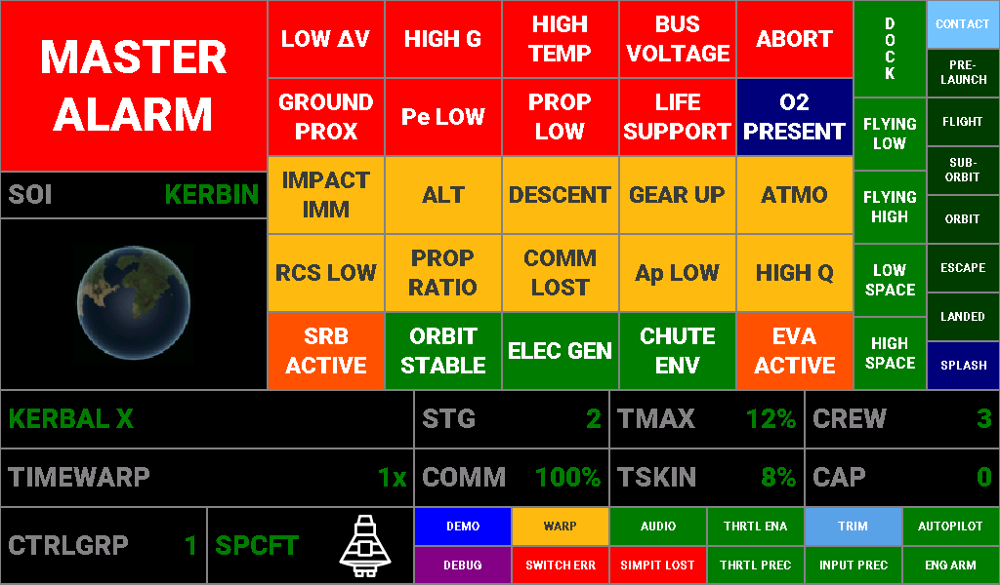
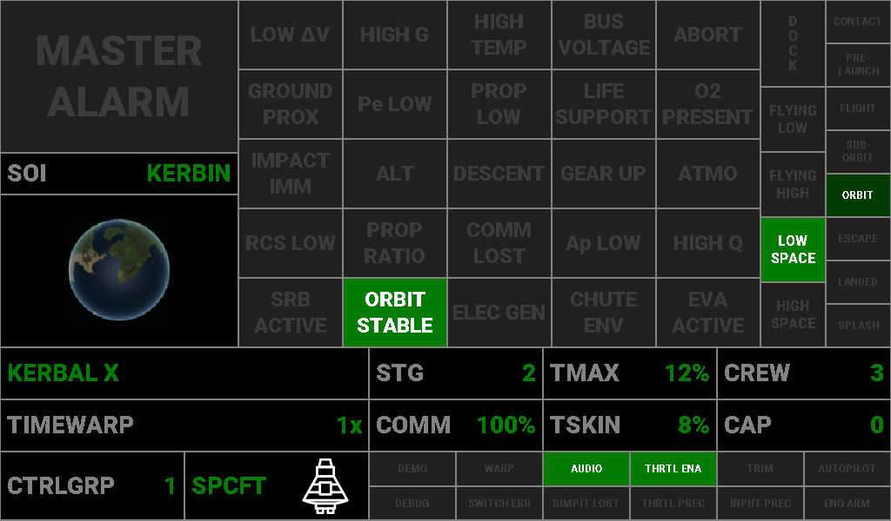
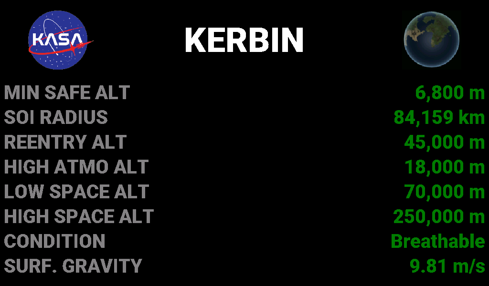

# Annunciator — Caution & Warning Reference

**Document type:** User
**Location:** `Documents/User/Annunciator_Caution_Warning_Reference.md`
**Applies to:** KCMk1_Annunciator firmware 3.7.0

The Caution & Warning (C&W) panel is the 5 × 5 grid of indicator tiles on the Annunciator's
Main screen, to the right of the MASTER ALARM button. Every tile is evaluated continuously
from live KerbalSimpit telemetry; the table below is derived from that logic
(`CautionWarning.ino`, `Audio.ino`, `ScreenMain.ino`) and the thresholds in `AAA_Config.ino`
and `KCMk1_SystemConfig.h`.

*Lamp test: every tile in its ON colour. The two-tier tiles (Pe LOW, PROP LOW, LIFE SUPPORT)
and CHUTE ENV show their most severe colour here.*

## How to read the tiles

| Appearance | Meaning |
|---|---|
| Dim grey label on near-black | Condition not present (tile OFF) |
| White on **red** | **Warning** — illuminates MASTER ALARM and sounds the master-alarm tone |
| Dark grey on **yellow** | **Caution** — advisory; some sound a short caution cue, none trip MASTER ALARM |
| White on **green** | Positive / safe state |
| White on **orange** | Active-state indicator (something is happening, no action implied) |
| White on **blue** | Information |

**MASTER ALARM.** The large button top-left lights red whenever any *warning* condition
(red tier) is present, and the master-alarm tone starts. Touching the button silences the
tone while leaving the button and the warning tiles lit. A *new* warning arriving while
silenced restarts the tone; when every warning clears, the tone stops and the silence
latch resets. Master-alarm audio is serviced on every screen, not just Main.

**Audio cues.** All audio is gated by the panel's `audioEnabled` setting (the AUDIO tile in
the bottom-right grid shows its state). Cues fire on the *transition* into a condition, not
continuously, except the master alarm which runs until silenced or cleared.

| Cue | Sound | Used by |
|---|---|---|
| Master alarm | 375 Hz / 1000 Hz alternating at 2.5 Hz (Shuttle-style), continuous | All red-tier warnings |
| Caution tone | 1000 Hz steady, 1.2 s | ALT, IMPACT IMM |
| Caution chirp | Two-note descending tritone, 1200 → 849 Hz, 120 ms each | DESCENT, ATMO, GEAR UP |
| Alert chirp | Two-note ascending, 880 → 1109 Hz, 120 ms each | Not a C&W tile — fires on entering ORBIT, on climbing through 3,500 m or 100 m/s surface speed, and on Ap rising through the body's minimum safe altitude |

## Indicator table

Grid position is row × column, reading left to right from the top-left tile.

| Tile | Definition | Colour / triggering condition | Audio cue |
|---|---|---|---|
| **LOW ΔV** (1×1) | Current stage is nearly spent. | **Red:** stage ΔV below 150 m/s *or* stage burn time below 60 s, while in flight with the throttle open. Suppressed on the pad, with throttle at zero, and for 1.5 s after throttle-up (burn-time estimate is unreliable at ignition). | Master alarm |
| **HIGH G** (1×2) | Acceleration outside the safe envelope. | **Red:** g-load above +9 g or below −5 g. | Master alarm |
| **HIGH TEMP** (1×3) | A part is approaching its thermal limit. | **Red:** hottest part temperature *or* skin temperature above 90 % of its limit. (The TMAX / TSKIN readouts turn yellow from 50 % and red at the same 90 % point.) | Master alarm |
| **BUS VOLTAGE** (1×4) | Electric charge critically low. | **Red:** electric charge below 5 % of total capacity. Requires the Alternate Resource Panel mod; without it the indicator never fires (and never false-triggers). | Master alarm |
| **ABORT** (1×5) | Abort action group has been activated. | **Red:** Abort action group active. | Master alarm |
| **GROUND PROX** (2×1) | Impact imminent. | **Red:** airborne and descending with less than 10 s to the surface at the current descent rate. Gear position is deliberately ignored — a powered landing at this rate still warrants the alarm. | Master alarm |
| **Pe LOW** (2×2) | Periapsis is inside the atmosphere / below terrain. | **Red:** Pe below the body's re-entry altitude (atmospheric bodies, e.g. 45 km at Kerbin) — committed re-entry — or below the body's minimum safe altitude (airless bodies). **Yellow:** atmospheric bodies only — Pe inside the atmosphere but above the re-entry altitude (aerobrake zone). | Master alarm (red tier only) |
| **PROP LOW** (2×3) | Stage propellant running low. | Monitors the lower of liquid-fuel and oxidizer fraction on the current stage. **Yellow:** below 20 %. **Red:** below 5 %. Suppressed when the stage carries no LF/OX tanks. | Master alarm (red tier only) |
| **LIFE SUPPORT** (2×4) | Crew consumables or waste capacity at risk (TAC Life Support). | Time remaining per resource at TAC-LS default rates × crew. **Yellow:** food < 72 h, water < 12 h, oxygen < 30 min, or any waste tank (CO₂, waste, waste water) > 80 % full. **Red:** food < 24 h, water < 4 h, oxygen < 10 min, or any waste tank > 95 % full. Worst resource wins. Crewed vessels only. | Master alarm (red tier only) |
| **O2 PRESENT** (2×5) | Breathable atmosphere. | **Blue:** inside an atmosphere that contains oxygen (jets work, helmets off). | None |
| **IMPACT IMM** (3×1) | Impact approaching. | **Yellow:** airborne and descending with less than 60 s to the surface at the current descent rate. Stays lit alongside GROUND PROX in the final 10 s. | Caution tone |
| **ALT** (3×2) | Low altitude. | **Yellow:** airborne with surface altitude below 200 m. | Caution tone |
| **DESCENT** (3×3) | Vessel is descending. | **Yellow:** airborne with negative vertical speed. | Caution chirp |
| **GEAR UP** (3×4) | Landing gear not deployed near the ground. | **Yellow:** airborne, descending, below 200 m surface altitude, gear retracted. | Caution chirp |
| **ATMO** (3×5) | In atmosphere. | **Yellow:** vessel is inside an atmosphere. | Caution chirp |
| **RCS LOW** (4×1) | Monopropellant running low. | **Yellow:** total vessel monopropellant below 20 %. Suppressed when the vessel has no monopropellant tanks. | None |
| **PROP RATIO** (4×2) | Fuel / oxidizer imbalance on the stage. | **Yellow:** stage LF : OX ratio deviates more than 10 % from the nominal 9 : 11. Only evaluated when the stage carries both. | None |
| **COMM LOST** (4×3) | No CommNet connection. | **Yellow:** CommNet signal strength 0 % while in flight (not on the pad). Also lights during a re-entry plasma blackout. | None |
| **Ap LOW** (4×4) | Apoapsis too low for a sustainable orbit. | **Yellow:** sub-orbital or orbital situation with apoapsis below the atmosphere top (70 km at Kerbin) or, on airless bodies, below the minimum safe altitude. Not evaluated in solar orbit. | None |
| **HIGH Q** (4×5) | Dynamic pressure high. | **Yellow:** dynamic pressure above the body's calibrated threshold. *The threshold is currently 0 (suppressed) for every body in the shared body table, so this tile does not light until thresholds are calibrated from flight test.* | None |
| **SRB ACTIVE** (5×1) | A solid rocket stage is burning. | **Orange:** stage solid fuel is decreasing and between 0.5 % and 99 % full. Holds 3 s after the last decrease; clears when exhausted, when a fresh full stage appears, or if the reading rises. | None |
| **ORBIT STABLE** (5×2) | Orbit clears the atmosphere and stays inside the SOI. | **Green:** situation is ORBIT, both Pe and Ap above the atmosphere top (or minimum safe altitude on airless bodies), and Ap inside the body's sphere of influence. | None (the alert chirp sounds on entering the ORBIT situation) |
| **ELEC GEN** (5×3) | Batteries are charging. | **Green:** electric charge rose on its last reading. Holds 5 s after the last rise, so a full battery does not read as charging. Clears on a falling reading. | None |
| **CHUTE ENV** (5×4) | Parachute deployment envelope (by dynamic pressure, so it is altitude- and body-correct). | Off outside the atmosphere. **Green:** safe for main chutes (below ≈ 250 m/s at Kerbin sea level). **Yellow:** drogue only (≈ 250–500 m/s at Kerbin sea level). **Red:** too fast for any chute. | None |
| **EVA ACTIVE** (5×5) | A Kerbal is on EVA. | **Orange:** the active vessel is a Kerbal on EVA. | None |

## Telemetry readouts (bottom zone)

The strip under the C&W grid carries the vessel readouts. Labels are grey; the value
carries the colour. Unless a threshold is listed the value is always green.

| Label | Full name / description | Source | Colour thresholds |
|---|---|---|---|
| *(vessel name)* | Name of the active vessel, left-aligned in the top-left cell. | KSP vessel name | Green always |
| **TIMEWARP** | Current time-warp rate. Shows `1x`, `5x`, `10x`, `50x`, `100x`, `1,000x`, `10,000x`, `100,000x` for on-rails warp, or `PHYS-2x` / `PHYS-3x` / `PHYS-4x` for physics warp. | KSP flight status | Green always |
| **STG** | Current stage number — the stage KSP will fire on the next staging command. | KSP flight status | Green always |
| **TMAX** | Maximum part temperature, as a percentage of the hottest part's thermal limit. | KSP temperature limits | **Green** 0–49 %. **Yellow** 50–90 %. **White on red** above 90 %, the same point at which the HIGH TEMP tile lights and MASTER ALARM sounds. |
| **CREW** | Number of Kerbals aboard. | KSP flight status | Green always |
| **COMM** | CommNet signal strength to the control point, in percent. | KSP flight status | **Red** 0–24 %. **Yellow** 25–74 %. **Green** 75–100 %. (The COMM LOST tile lights only at 0 %.) |
| **TSKIN** | Maximum skin temperature, as a percentage of the hottest part's skin limit. | KSP temperature limits | Same as TMAX: **green** below 50 %, **yellow** 50–90 %, **white on red** above 90 % (lights HIGH TEMP). |
| **CAP** | Reserved readout relayed from the master controller (byte 5 of the rev-2 I2C command). | Master controller | Green always. *The current master firmware does not send this byte, so the readout stays at 0.* |
| **CTRLGRP** | Active custom-action control group, 1–6, as selected by the control-group rotary switch on the master. | Master controller | Green always |
| **SPCFT / PLN / RVR** | Control mode selected on the master's control-mode switch — Spacecraft, Plane or Rover — with the active vessel's type icon beside it. | Master controller + KSP vessel type | **Green** when the mode suits the vessel type: SPCFT for probe, relay, lander, ship or station; PLN for a plane; RVR for a rover. **Red** when it does not (e.g. PLN selected while flying a ship). Other vessel types (debris, EVA, flag, base, parts) never flag a mismatch. |

TMAX, TSKIN and COMM use the panel's three-band threshold colouring. The temperature
bands are anchored to the same `tempAlarm` setting (default 90 %) that drives the HIGH
TEMP tile, so the readout and the tile can never disagree. The COMM bands are fixed at
25 % and 75 %.

## Panel condition block (bottom-right 6 × 2 grid)

The twelve small tiles under the readouts report the state of the **controller
system** rather than the vessel: which panel modes are on, whether the master's inputs
are live, and whether anything in the chain has failed. They are driven by the
`modeFlags` word the master sends in bytes 3–4 of its extended I2C command; each tile
lights when its bit is set. None of them sound an audio cue.

> **Status of this block.** The Annunciator draws all twelve tiles, but the current
> master firmware only sends the legacy 3-byte command, so in production the whole
> block stays OFF. The firmware header marks the labels and colours as provisional
> pending the final master protocol. In the panel's demo mode, DEMO / AUDIO / DEBUG
> reflect the panel's own settings and the remaining tiles cycle for inspection. The
> meanings below are the intended ones, matched to the master's state variables.

| Tile | Definition | Colour when lit | Bit |
|---|---|---|---|
| **DEMO** (1×1) | The system is running in demo mode — panel values are generated internally rather than taken from KSP. | White on **blue** | 0 |
| **WARP** (1×2) | Time warp is active (rate above 1×). | Dark grey on **yellow** | 1 |
| **AUDIO** (1×3) | Audio cues are enabled on the Annunciator (`audioEnabled`). Off means the panel is silent, including the master alarm. | White on **green** | 2 |
| **THRTL ENA** (1×4) | Throttle input from the throttle module is enabled and being sent to KSP. | White on **green** | 3 |
| **TRIM** (1×5) | Rotation-stick trim mode is engaged (stick input is being applied as trim). | White on **aqua** | 4 |
| **AUTOPILOT** (1×6) | An autopilot mode on the master (ascent, hold, burn, landing or mission) is engaged. | White on **green** | 5 |
| **DEBUG** (2×1) | Serial debug output is enabled on the panel. | White on **purple** | 6 |
| **SWITCH ERR** (2×2) | A control-mode / switch-state error has been detected by the master (e.g. a switch position the master could not reconcile). | White on **red** | 7 |
| **SIMPIT LOST** (2×3) | The KerbalSimpit link to KSP has dropped — no telemetry is arriving. | White on **red** | 8 |
| **THRTL PREC** (2×4) | Throttle module is in precision mode (slider centred, fine authority). | White on **green** | 9 |
| **INPUT PREC** (2×5) | Precision switch is on for the translation and rotation sticks (precision factor applied). | White on **green** | 10 |
| **ENG ARM** (2×6) | The ENGINE SAFE / ARM switch is in ARM (throttle module active). SAFE inhibits throttle input. | White on **green** | 11 |

## Vessel situation and flight regime columns (right edge)

The two narrow columns to the right of the C&W grid describe the vessel's situation
as KSP reports it. They are informational: none trips MASTER ALARM. Column
positions are given top to bottom.

**Outer column — vessel situation.** One or more can be lit; KSP reports exactly one
situation, and CONTACT is derived.

| Tile | Definition | Colour when lit | Audio cue |
|---|---|---|---|
| **CONTACT** | Vessel is in contact with the surface — lit whenever LANDED or SPLASH is lit. | White on **sky blue** | None |
| **PRE-LAUNCH** | On the launch pad or runway, not yet released. | White on **jungle green** | None |
| **FLIGHT** | Flying inside the atmosphere. | White on **jungle green** | None |
| **SUB-ORBIT** | Sub-orbital trajectory (Ap above the surface, Pe below it). | White on **jungle green** | None |
| **ORBIT** | In a closed orbit. | White on **jungle green** | Alert chirp on entry |
| **ESCAPE** | On an escape trajectory out of the current sphere of influence. | White on **jungle green** | None |
| **LANDED** | Landed on solid ground. | White on **jungle green** | None |
| **SPLASH** | Splashed down in liquid. | White on **navy** | None |

**Inner column — DOCK and flight regime.** DOCK is independent; the four regime tiles
are mutually exclusive and are all dark when the vessel is not aloft (pad, landed or
splashed).

| Tile | Definition | Colour when lit | Audio cue |
|---|---|---|---|
| **DOCK** (vertical) | The vessel is docked to another vessel. Set on a docking event, cleared on undocking. | White on **green** | None |
| **FLYING LOW** | Aloft, inside the atmosphere, below the body's high-atmosphere boundary (18 km at Kerbin). | White on **green** | None |
| **FLYING HIGH** | Aloft, inside the atmosphere, above the high-atmosphere boundary. | White on **green** | None |
| **LOW SPACE** | Aloft, outside the atmosphere, below the body's high-space boundary (250 km at Kerbin). | White on **green** | None |
| **HIGH SPACE** | Aloft, outside the atmosphere, above the high-space boundary. | White on **green** | None |

The regime boundaries are the KSP science-biome altitudes from the shared body table,
so the lit tile always matches the biome KSP would credit an experiment to.

## SOI detail screen

Touching the SOI label or globe on the Main screen opens the SOI detail screen for the
body whose sphere of influence the vessel is in; touching anywhere on it returns to Main.
The screen shows the KASA meatball, the body's name and globe, and up to eight data rows.
The three atmosphere rows appear only for bodies that have an atmosphere (Kerbin, Eve,
Duna, Laythe, Jool and Kerbol), so airless bodies show five rows. Values come from the
shared celestial-body table (`Software/Common/body_params.h`), which is sourced from the
KSP wiki; altitudes are formatted with a unit that suits their size (m, km, Mm, Gm).

| Field name | Full name | What it represents |
|---|---|---|
| **MIN SAFE ALT** | Minimum safe altitude | The highest point of the body's terrain above its datum (sea level). An orbit with periapsis above this cannot strike the surface. For Jool it is the crush depth and for Kerbol the plasma altitude, since neither has a landable surface. Used by Pe LOW, Ap LOW and ORBIT STABLE on airless bodies. |
| **SOI RADIUS** | Sphere-of-influence radius | Distance from the body's centre at which its gravitational influence hands over to its parent body. Above this altitude the vessel has escaped the body. ORBIT STABLE requires apoapsis inside this radius. |
| **REENTRY ALT** | Committed re-entry altitude | *(Atmospheric bodies only.)* The periapsis altitude below which the atmosphere will capture the vessel on the next pass rather than merely slow it. Pe below this turns Pe LOW red; Pe between this and the atmosphere top is the yellow aerobrake zone. An engineering estimate, not a KSP constant. |
| **HIGH ATMO ALT** | High-atmosphere boundary | *(Atmospheric bodies only.)* The altitude dividing KSP's "flying low" and "flying high" science biomes. The FLYING LOW / FLYING HIGH regime tiles switch here. |
| **LOW SPACE ALT** | Atmosphere top / low-space boundary | *(Atmospheric bodies only.)* The altitude at which the atmosphere ends and "in space low" begins. Above it the vessel is in vacuum; Ap LOW and ORBIT STABLE use it as the lower bound for a sustainable orbit on atmospheric bodies. |
| **HIGH SPACE ALT** | High-space boundary | The altitude dividing KSP's "in space low" and "in space high" science biomes. The LOW SPACE / HIGH SPACE regime tiles switch here. |
| **CONDITION** | Atmospheric condition | What surrounds a vessel near the surface: **Vacuum** (no atmosphere), **Atmosphere** (air, but no oxygen — jet engines will not run, helmets stay on), **Breathable** (oxygen present — jets work, Kerbals can remove helmets; Kerbin and Laythe), or **Plasma** (Kerbol — no survivable surface). |
| **SURF. GRAVITY** | Surface gravity | Gravitational acceleration at the body's surface, in m/s². Kerbin is 9.81 m/s²; the value sets how much thrust-to-weight a lander needs and how fast an unpowered descent accelerates. |

Two display quirks worth knowing:

- The SURF. GRAVITY unit is written as m/s² in the firmware, but the panel font has no
  superscript-two glyph, so the screen shows "m/s".
- For Kerbol the SOI radius is unbounded (there is no parent body), which the body table
  records as an infinite value. The altitude formatter cannot represent that and the row
  currently prints `-9,223,372,036,854,775,808 Gm`. The other seven Kerbol rows are correct.

## Shared celestial-body table

Every body-dependent number on the Annunciator (the SOI screen rows, the Pe LOW / Ap LOW /
ORBIT STABLE bounds, the flight-regime boundaries) comes from one table,
`Software/Common/body_params.h`, which the master controller's autopilots also use.
Values are from the KSP wiki; the re-entry altitude is an engineering estimate. A dash
means the field does not apply (airless bodies have no atmosphere boundaries; some
bodies have no synchronous orbit inside their SOI).

**Altitude boundaries** (above the body's datum; these are what the panel's logic reads)

| Body | Condition | Landable | Min safe alt | High atmo alt | Low space alt (atmo top) | High space alt | Re-entry alt | SOI radius |
|---|---|---|---|---|---|---|---|---|
| **Kerbol** | Plasma | no | 1 Mm | 18 km | 600 km | 1 Gm | 600 km | unbounded |
| **Moho** | Vacuum | yes | 6.9 km | — | — | 80 km | — | 9.6467 Mm |
| **Eve** | Atmosphere | yes | 7.6 km | 22 km | 90 km | 400 km | 57 km | 85.109 Mm |
| **Gilly** | Vacuum | yes | 7.5 km | — | — | 6 km | — | 126.12 km |
| **Kerbin** | Breathable | yes | 6.8 km | 18 km | 70 km | 250 km | 45 km | 84.159 Mm |
| **Mun** | Vacuum | yes | 7.1 km | — | — | 60 km | — | 2.4296 Mm |
| **Minmus** | Vacuum | yes | 5.8 km | — | — | 30 km | — | 2.2474 Mm |
| **Duna** | Atmosphere | yes | 8.3 km | 12 km | 50 km | 140 km | 20 km | 47.922 Mm |
| **Ike** | Vacuum | yes | 12.8 km | — | — | 50 km | — | 1.0496 Mm |
| **Dres** | Vacuum | yes | 5.7 km | — | — | 25 km | — | 32.833 Mm |
| **Jool** | Atmosphere | no | 120 km | 120 km | 200 km | 4 Mm | 150 km | 2.456 Gm |
| **Laythe** | Breathable | yes | 6.1 km | 10 km | 50 km | 200 km | 38 km | 3.7236 Mm |
| **Vall** | Vacuum | yes | 8 km | — | — | 90 km | — | 2.4064 Mm |
| **Tylo** | Vacuum | yes | 13 km | — | — | 250 km | — | 10.857 Mm |
| **Bop** | Vacuum | yes | 21.8 km | — | — | 25 km | — | 1.2211 Mm |
| **Pol** | Vacuum | yes | 4.9 km | — | — | 22 km | — | 1.0421 Mm |
| **Eeloo** | Vacuum | yes | 3.8 km | — | — | 60 km | — | 119.08 Mm |

**Physical and orbital properties**

| Body | Radius | Surface gravity | Escape velocity | Synchronous orbit alt | Synodic period vs Kerbin | Inclination vs Kerbin equator |
|---|---|---|---|---|---|---|
| **Kerbol** | 261.6 Mm | 17.10 m/s² | 94,672 m/s | 1.508 Gm | — | 0° |
| **Moho** | 250 km | 2.70 m/s² | 1,161 m/s | — | 135.1 Kerbin days | 7° |
| **Eve** | 700 km | 16.70 m/s² | 4,832 m/s | 10.328 Mm | 680.0 Kerbin days | 2.1° |
| **Gilly** | 13 km | 0.05 m/s² | 36 m/s | 42.138 km | 19.3 Kerbin days | 12° |
| **Kerbin** | 600 km | 9.81 m/s² | 3,431 m/s | 2.8633 Mm | — | 0° |
| **Mun** | 200 km | 1.63 m/s² | 807 m/s | — | 6.5 Kerbin days | 0° |
| **Minmus** | 60 km | 0.49 m/s² | 243 m/s | 357.94 km | 56.5 Kerbin days | 6° |
| **Duna** | 320 km | 2.94 m/s² | 1,372 m/s | 2.88 Mm | 909.5 Kerbin days | 0.06° |
| **Ike** | 130 km | 1.10 m/s² | 534 m/s | — | 3.0 Kerbin days | 0.2° |
| **Dres** | 138 km | 1.13 m/s² | 558 m/s | 732.24 km | 527.4 Kerbin days | 5° |
| **Jool** | 6 Mm | 7.85 m/s² | 9,704 m/s | 15.01 Mm | 467.2 Kerbin days | 0.05° |
| **Laythe** | 500 km | 7.85 m/s² | 2,801 m/s | — | 2.5 Kerbin days | 0° |
| **Vall** | 300 km | 2.31 m/s² | 1,176 m/s | — | 4.9 Kerbin days | 0° |
| **Tylo** | 600 km | 7.85 m/s² | 3,069 m/s | — | 9.8 Kerbin days | 0.025° |
| **Bop** | 65 km | 0.59 m/s² | 277 m/s | — | 25.3 Kerbin days | 15° |
| **Pol** | 44 km | 0.37 m/s² | 181 m/s | — | 42.1 Kerbin days | 4.25° |
| **Eeloo** | 210 km | 1.69 m/s² | 842 m/s | 683.69 km | 452.6 Kerbin days | 6.15° |

Notes:

- *Condition* is what surrounds a vessel near the surface: Vacuum, Atmosphere (no oxygen),
  Breathable (oxygen), or Plasma. Kerbol and Jool are not landable; their "min safe"
  altitude is the plasma / crush altitude instead of a terrain height.
- *Synodic period* is the time between successive identical alignments with Kerbin, in
  Kerbin days of 6 hours; for Kerbin's own moons the table carries their orbital period.
- The table also holds a per-body dynamic-pressure threshold for the HIGH Q tile. It is
  0 (suppressed) for all seventeen bodies at present, so it is omitted here.

## Notes for the manual

- Nine tiles feed MASTER ALARM: LOW ΔV, HIGH G, HIGH TEMP, BUS VOLTAGE, ABORT, GROUND PROX,
  and the red tiers of Pe LOW, PROP LOW and LIFE SUPPORT. No yellow, green, orange or blue
  state ever trips it.
- GROUND PROX and IMPACT IMM cascade on purpose: IMPACT IMM comes up at 60 s to impact and
  stays up while GROUND PROX adds the master alarm inside 10 s.
- Pe LOW, PROP LOW and LIFE SUPPORT each occupy one tile with two severities. The yellow tier
  is advisory; only the red tier sounds or lights MASTER ALARM.
- Thresholds shared with the Info Display (ground-proximity time, g limits, low-ΔV and
  low-burn-time limits, chute limits) are defined once in `KCMk1_SystemConfig.h`, so the
  Annunciator tile and the Info Display readout always change colour at the same point.
- All thresholds quoted here are the firmware defaults and are tunable in `AAA_Config.ino`.
