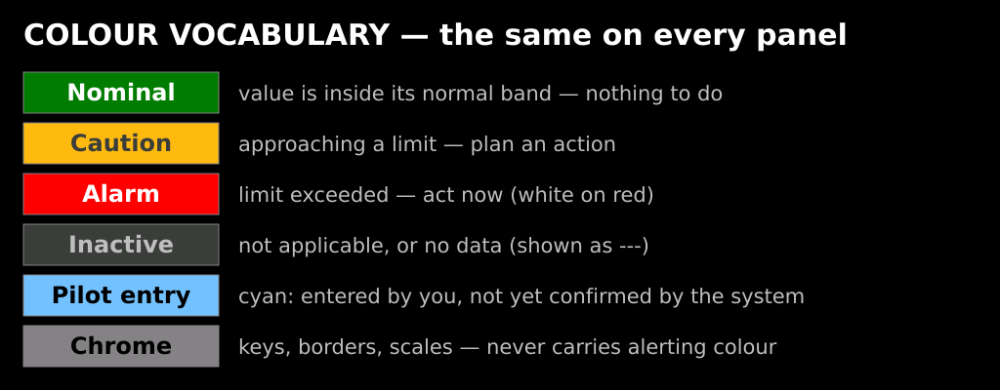
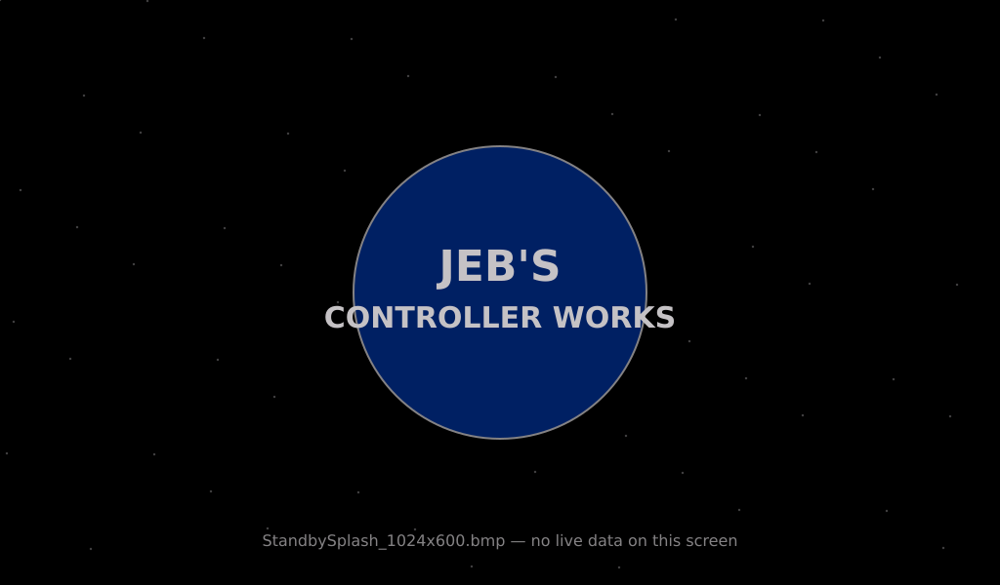

# KCMk1 Display Reference

**Document type:** User
**Location:** `Documents/User/Display_Reference.md`
**Applies to:** hardware rev 2 — Annunciator v3.5.4, Information Display v1.11.5,
Resource Display v3.2.1

---

This is the pilot's guide to the four glass panels on the Kerbal Controller Mk1: what
each screen is for, what every field, lamp, gauge and key on it means, how to read it,
and where the colour changes. It is the companion to
[`Panel_Operating_Guide.md`](Panel_Operating_Guide.md), which covers the physical
switches, buttons and joysticks.

## The panels

| Panel | Display | Console position | What it answers |
|---|---|---|---|
| A1 | **Annunciator** | left, outboard | *Is anything wrong, and where am I?* |
| A1 | **Information Display 1** | left, inboard | *What am I flying?* — the PFD family |
| B1 | **Resource Display** | right, outboard | *What have I got left?* |
| B1 | **Information Display 2** | right, inboard | *What phase am I in?* |

All four are 1024 × 600 capacitive touchscreens driven by their own Teensy 4.1, fed
live telemetry from KSP through the KerbalSimpit plugin, and coordinated by the master
controller over I2C. The two Information Displays run identical firmware and every
screen is reachable from either one — losing a display never costs you a screen class.

**Per-panel guides**

- [Annunciator Panel](Displays/Annunciator_Panel.md) — Master Alarm, the 25-lamp
  Caution & Warning matrix, vessel situation, mode grid, SOI screen, GPWS voice
- [Information Display](Displays/Information_Display.md) — all fourteen flight screens
- [Resource Display](Displays/Resource_Display.md) — bar graph, resource selection,
  per-resource detail, EVA mode

---

## Colour vocabulary

Every panel speaks the same colour language. Learn it once and it holds everywhere.



| Colour | Meaning | Typical use |
|---|---|---|
| **Dark green** | Nominal — inside the normal band | almost every readout, most of the time |
| **Yellow** | Caution — approaching a limit, plan an action | `Q` past 20 kPa, `Alt.Rdr` under 500 m |
| **White on red** | Alarm — a limit is exceeded, act now | `G` past 9 g, `ΔV.Stg` under 150 m/s |
| **Cyan / sky** | Pilot-entered, not yet confirmed by the system | Ascent Autopilot edits, `TRIM` engaged |
| **Violet** | Target-related | target bearing marker, `BRG` on NAVIGATION |
| **Neon green** | Velocity-related | prograde / ground-track / closure markers |
| **Grey, dark grey** | Inactive, not applicable, or no data | unlit lamps, dashed-out rows |
| **Achromatic (white on black / black on grey)** | Chrome — keys, borders, scales | the sidebars on all four panels |

Two conventions worth stating outright:

- **`---` means the panel has no value to show**, not a value of zero. A dashed
  `Dist:` row means no target is selected; a dashed `T+Ign:` means no node is planned.
- **The sidebars never carry alerting colour.** Keys are chrome. The one exception is
  the Information Display's `ASC` key, which turns dark green while the Ascent
  Autopilot is armed — that is live state, not decoration.

---

## Shared limits

These thresholds are defined once (`KCMk1_SystemConfig.h`) and used by every panel, so
a lamp on the Annunciator and a red readout on an Information Display always agree.

| Quantity | Caution (yellow) | Alarm (white on red) | Seen on |
|---|---|---|---|
| Time to ground (`T.Grnd`) | 30 s (gear up) | **10 s** | Annunciator `GROUND PROX`, POWERED DESCENT |
| G load | **+4 g / −2 g** | **+9 g / −5 g** | Annunciator `HIGH G`, PFD, ASCENT, RE-ENTRY |
| Stage ΔV | 300 m/s | **150 m/s** | Annunciator `LOW ΔV`, PFD, ASCENT |
| Stage burn time | 120 s | **60 s** | Annunciator `LOW ΔV`, ASCENT, CIRCULARISATION |
| Part temperature | 75 % of limit | **90 % of limit** | Annunciator `HIGH TEMP`, `Tmax` / `Tskin` |
| Electric charge | 20 % | **5 %** | Annunciator `BUS VOLTAGE`, ROVER, EVA PFD |
| Angle of attack | 10° | **20°** | AIRCRAFT AoA arc, GPWS `STALL` callout |
| Main chute deploy | — | q > **38 300 Pa** (≈250 m/s at Kerbin sea level) | Annunciator `CHUTE ENV`, RE-ENTRY |
| Drogue chute deploy | — | q > **153 000 Pa** (≈500 m/s at Kerbin sea level) | Annunciator `CHUTE ENV`, RE-ENTRY |

Chute limits are expressed as dynamic pressure rather than speed, because that is what
actually rips a canopy. The safe deploy *speed* therefore rises with altitude — the
same q is reached at a much higher speed in thin air.

---

## Chrome common to every panel

### Boot

Each panel runs its own themed boot sequence, then holds until the master controller
releases it. The header of every boot screen carries the live firmware version string —
that is how you tell three separately-flashed boards apart.

| Panel | Boot theme |
|---|---|
| Annunciator | terminal-aesthetic BIOS POST |
| Information Display | one of three KSP themes, chosen at random: Jeb's Mission Log, KSP Loading Tips, Gene's Pre-Flight Checklist |
| Resource Display | Jurassic Park terminal |

If a panel sits on its boot screen, the master has not sent `PROCEED` — check the I2C
loom before suspecting the panel.

### Standby



The Annunciator and Resource Display show a full-screen splash whenever KSP is not in a
flight scene. There is no live data on this screen and no touch response — the panel
leaves it on its own when a flight begins. A panel that boots into a *running* flight
also picks the scene up from the first telemetry frame, so it will not sit on standby
waiting for a scene change that already happened.

### Touch

All four panels use the same touch filter, and it matters when a press seems not to
register:

- **One finger only.** Any frame reporting two or more contacts is discarded, so
  resting a second finger on the glass makes the panel unresponsive.
- **500 ms debounce** between accepted taps (200 ms for a repeat press on the
  Information Display sidebar, so mode cycling stays quick).
- Each tap is re-read 8 ms later and rejected if the position has moved more than
  20 px — press cleanly rather than sliding.
- The panel must be seen untouched once after boot before it will accept any tap.

### What is *not* touchable

Only a small number of things on the glass are controls. On the Information Display the
sidebar keys, the reference chip, the pre-launch board and the Ascent Autopilot console
are the entire touch surface — the `RCS`, `SAS`, `GEAR`, `BRAKES` and `AIRBRK` tiles on
those screens are **indications, not buttons**. Fly the vessel from the physical panel;
read it from the glass.

---

## Mod requirements

Several readouts depend on KSP mods, and will simply read zero or stay dark without
them.

| Mod | What needs it |
|---|---|
| **KerbalSimpit** (2.4.0) | everything — this is the telemetry link |
| **Alternate Resource Panel (ARP)** | most Resource Display channels, and the Annunciator `BUS VOLTAGE` lamp |
| **TAC Life Support** | Oxygen, Water, Food, Waste, Liquid Waste, CO₂; the `LIFE SUPPORT` lamp |
| **Community Resource Pack (CRP)** | LH2, LMe, Li, Intake Air, Enriched Uranium, Depleted Fuel, Fertilizer, Stored Charge |

The Annunciator's `BUS VOLTAGE` lamp cannot false-trigger without ARP — it is guarded
on a non-zero total capacity — it simply never fires.

---

## Regenerating the screen renderings

The mockups in these guides are generated from the firmware's own layout constants by
[`Displays/tools/make_mockups.py`](Displays/tools/make_mockups.py):

```
python3 Documents/User/Displays/tools/make_mockups.py
```

It writes SVGs into `Documents/User/Displays/images/`. If a screen is relaid out in
firmware, update the constants at the top of the corresponding function there so the
guide and the glass stay in step.
