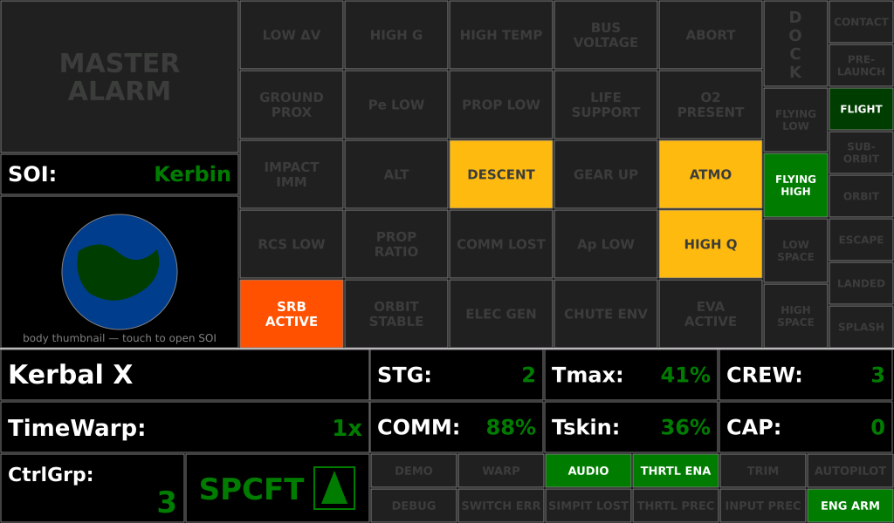
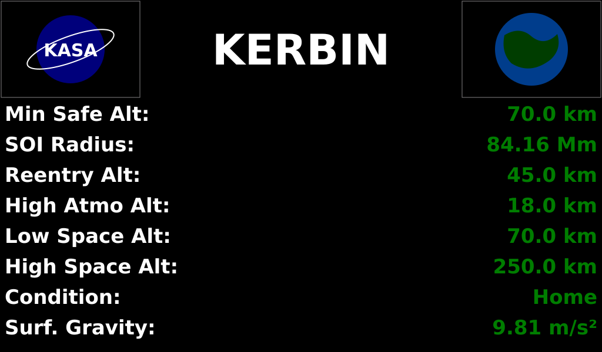

# Annunciator Panel — Operating Guide

**Document type:** User · **Panel:** A1, outboard · **Firmware:** KCMk1_Annunciator v3.5.4

The Annunciator is the controller's caution & warning station. It answers two questions
continuously — *is anything wrong?* and *where am I?* — and it is the only panel that
makes noise: the master alarm tone, the caution chirps, and the GPWS voice callouts all
come from here.

It has three screens. **Main** is where you will spend the flight; **SOI** is a
reference page for the body you are orbiting; **Standby** is what it shows when KSP is
not in a flight scene.

- [Main screen](#main-screen)
- [Caution & Warning matrix](#caution--warning-matrix)
- [Vessel situation and regime columns](#vessel-situation-and-regime-columns)
- [Mode / status grid](#mode--status-grid)
- [Bottom telemetry](#bottom-telemetry)
- [SOI screen](#soi-screen)
- [Audio](#audio)
- [GPWS voice callouts](#gpws-voice-callouts)

---

## Main screen

The example above is a rocket a minute or so off the pad on Kerbin: `DESCENT` is out,
`ATMO` and `HIGH Q` are lit yellow, a solid booster is burning, the regime column reads
`FLYING HIGH`, the situation column reads `FLIGHT`, and the mode grid shows audio
enabled, throttle enabled and engines armed.

The screen is five zones, laid out so severity increases to the left and upward:

| # | Zone | Position | Contents |
|---|---|---|---|
| 1 | **MASTER ALARM** | top-left, 274 × 176 | one big lamp; **touch to silence** |
| 2 | **SOI label + globe** | left, below the alarm | current body name and thumbnail; **touch to open the SOI screen** |
| 3 | **Caution & Warning matrix** | centre, 5 × 5 | the 25 annunciator lamps |
| 4 | **Regime + situation columns** | right edge | where the vessel is, and what it is doing |
| 5 | **Telemetry and mode band** | bottom 200 px | vessel name, warp, stage/temp/crew/comm, control mode, 12 mode tiles |

### MASTER ALARM

Dark and grey normally; **solid red with white legend** when any warning-class lamp is
set. It is a summary lamp, not a lamp of its own — it never lights for a reason that is
not already visible somewhere in the matrix.

**Touching it silences the audio, not the condition.** The lamp stays red until the
underlying condition clears. If a silenced condition clears and then re-triggers, the
alarm re-arms and sounds again — a silenced alarm does not stay silent through a new
event.

The lamp is driven by nine of the twenty-five bits: `GROUND PROX`, `HIGH G`,
`BUS VOLTAGE`, `HIGH TEMP`, `LOW ΔV`, `ABORT`, `Pe LOW`, `PROP LOW`, `LIFE SUPPORT`.

### SOI label and globe

The label reads the body whose sphere of influence you are in; the tile below shows its
thumbnail. Touch either to open the [SOI screen](#soi-screen).

---

## Caution & Warning matrix

Twenty-five lamps in five rows. A lamp is dark grey on off-black when clear, and lights
in its own colour when set. The rows are ordered by severity: rows 0–1 are warnings and
red, rows 2–3 are cautions and yellow, row 4 is positive and state information.

**Reading a lamp:** unlit means *the condition is not present*, not *the system is not
being watched*. There is no lamp test on this screen — a full lamp exercise is part of
the panel's serial test mode.

### Row 0 — Warnings (red, drive MASTER ALARM)

| Lamp | Lights when | Range / threshold |
|---|---|---|
| `LOW ΔV` | the current stage cannot do much more | stage ΔV **< 150 m/s** *or* stage burn time **< 60 s**; suppressed briefly after a throttle change |
| `HIGH G` | crew/structural G limit exceeded | **> +9 g** or **< −5 g** |
| `HIGH TEMP` | a part is close to failing | core or skin temperature **≥ 90 %** of its limit |
| `BUS VOLTAGE` | the electrical bus is nearly flat | electric charge **< 5 %** of capacity (needs the ARP mod) |
| `ABORT` | the abort action group has been fired | — |

### Row 1 — Warnings and one info lamp

| Lamp | Lights when | Range / threshold |
|---|---|---|
| `GROUND PROX` | descending onto terrain | descending and time-to-ground **< 10 s** |
| `Pe LOW` | periapsis is inside something | **red:** Pe below the body's re-entry altitude (atmospheric) or below minimum safe altitude (airless). **Yellow:** Pe is in the aerobrake band |
| `PROP LOW` | stage propellant is running out | **red:** stage propellant **< 5 %**. **Yellow:** **< 20 %** |
| `LIFE SUPPORT` | a TAC-LS resource is short | **red:** critical. **Yellow:** caution (needs TAC-LS) |
| `O2 PRESENT` | *(navy, informational)* the outside air is breathable | — |

### Row 2 — Cautions (yellow)

| Lamp | Lights when | Range / threshold |
|---|---|---|
| `IMPACT IMM` | you are going to hit something soon | time to impact **< 60 s** |
| `ALT` | low above the surface | surface altitude **< 200 m** |
| `DESCENT` | vertical velocity is negative | any descent |
| `GEAR UP` | low, descending, and no gear | surface altitude **< 200 m**, descending, gear up |
| `ATMO` | you are inside an atmosphere | — |

### Row 3 — Cautions (yellow)

| Lamp | Lights when | Range / threshold |
|---|---|---|
| `RCS LOW` | monopropellant is short | MonoProp **< 20 %** |
| `PROP RATIO` | LF and LOx are draining unevenly | ratio deviates from the nominal 9 : 11 |
| `COMM LOST` | CommNet signal is gone | — |
| `Ap LOW` | apoapsis will not clear the atmosphere | Ap below the top of the atmosphere (or below minimum safe altitude on an airless body) |
| `HIGH Q` | structural dynamic pressure | above the body's own high-q threshold (some bodies have none, and the lamp is then suppressed) |

### Row 4 — Positive and state (not alarms)

| Lamp | Colour | Meaning |
|---|---|---|
| `SRB ACTIVE` | international orange | solid fuel is decreasing — a booster is burning and cannot be throttled or shut down |
| `ORBIT STABLE` | dark green | Pe and Ap are both above the atmosphere, Ap is inside the SOI, and the situation is ORBIT |
| `ELEC GEN` | dark green | electric charge is increasing — you are net charging |
| `CHUTE ENV` | **dynamic** | **green:** safe to deploy mains. **Yellow:** drogue only. **Red:** too fast for any chute |
| `EVA ACTIVE` | international orange | a Kerbal is outside |

`CHUTE ENV` is the one lamp whose colour is the message rather than the severity — read
the colour, not the fact that it is lit.

---

## Vessel situation and regime columns

Two narrow columns on the right edge. Together they say where the vessel physically is.

**Inner column (regime)** — the `DOCK` vertical-text indicator sits on top, then four
tiles of which exactly one is ever lit:

| Tile | Meaning |
|---|---|
| `FLYING LOW` | in atmosphere, below the body's low/high atmosphere boundary |
| `FLYING HIGH` | in atmosphere, above it |
| `LOW SPACE` | out of atmosphere, inside the low-space boundary |
| `HIGH SPACE` | above the high-space boundary |

`DOCK` lights when the vessel is docked (reported separately from the situation, on a
vessel-change event).

**Outer column (situation)** — eight tiles, top to bottom:

| Tile | Colour when lit | Meaning |
|---|---|---|
| `CONTACT` | sky blue | **lit whenever `LANDED` or `SPLASH` is** — a summary "we are touching something" |
| `PRE-LAUNCH` | jungle green | on the pad, clamps attached |
| `FLIGHT` | jungle green | flying |
| `SUB-ORBIT` | jungle green | ballistic |
| `ORBIT` | jungle green | orbiting |
| `ESCAPE` | jungle green | on an escape trajectory |
| `LANDED` | jungle green | on the ground |
| `SPLASH` | navy | in the water |

More than one of these can be lit at once — `CONTACT` always accompanies `LANDED` or
`SPLASH`.

---

## Mode / status grid

Twelve 100 × 40 tiles at the bottom right, driven entirely by the master controller.
These report the state of the *controller*, not the vessel.

| Tile | Colour when lit | Meaning |
|---|---|---|
| `DEMO` | blue | panel is in demo mode — the numbers are synthetic |
| `WARP` | yellow | time warp is active |
| `AUDIO` | dark green | audio output is enabled |
| `THRTL ENA` | dark green | the physical throttle lever is enabled |
| `TRIM` | cyan | trim hold is engaged |
| `AUTOPILOT` | dark green | the ascent autopilot is armed |
| `DEBUG` | purple | serial debug output is on |
| `SWITCH ERR` | red | a physical switch is in a position the controller could not reconcile |
| `SIMPIT LOST` | red | the telemetry link to KSP has dropped |
| `THRTL PREC` | dark green | throttle precision (fine) mode |
| `INPUT PREC` | dark green | joystick precision (fine) mode |
| `ENG ARM` | dark green | engine arming interlock is satisfied |

`SIMPIT LOST` is the one to check first when every number on every panel freezes.

---

## Bottom telemetry

| Field | Meaning |
|---|---|
| *(top-left, 424 px)* | active vessel name |
| `TimeWarp:` | current warp factor |
| `STG:` | current stage number |
| `Tmax:` | hottest **core** temperature on the vessel, as a percentage of that part's limit — yellow at 75 %, alarm at 90 % |
| `CREW:` | crew aboard |
| `COMM:` | CommNet signal strength, % |
| `Tskin:` | hottest **skin** temperature, same scale as `Tmax` |
| `CAP:` | the "cap" value reported by the master controller |
| `CtrlGrp:` | active custom action group, 1–10 |
| control-mode tile | `SPCFT`, `PLN` or `RVR` with a vessel-type icon. **Green legend = the control mode matches the vessel type; red = mismatch** — you are flying a rover with spacecraft controls, or similar |

The control-mode tile is worth a habit: a red legend there explains most "my inputs do
nothing sensible" moments.

---

## SOI screen

Reference data for the body you are currently orbiting. **Touch anywhere to return to
Main.** The rows change with the body — the three atmospheric rows are omitted for
airless bodies, so a Mun page is five rows and a Kerbin page is eight.

| Row | Meaning |
|---|---|
| `Min Safe Alt:` | lowest altitude at which an orbit clears terrain (and atmosphere, where there is one) |
| `SOI Radius:` | radius of this body's sphere of influence |
| `Reentry Alt:` | *(atmospheric only)* altitude at which re-entry heating begins to matter |
| `High Atmo Alt:` | *(atmospheric only)* the low/high atmosphere science boundary |
| `Low Space Alt:` | *(atmospheric only)* top of the atmosphere — the lowest sustainable orbit |
| `High Space Alt:` | the low/high space boundary |
| `Condition:` | the body's classification |
| `Surf. Gravity:` | surface gravity in m/s² |

`Min Safe Alt` and `Low Space Alt` are the two numbers the rest of the system uses:
"orbit-safe altitude" everywhere else on the controller means the larger of the two.

---

## Audio

Audio is **off by default** and must be enabled — either in the panel's configuration
or by the master controller. The `AUDIO` tile on the mode grid tells you which it is.

There are two independent audio paths, and they can sound at the same time:

**1. The `tone()` master alarm and cues**

| Event | Sound |
|---|---|
| any warning-class lamp newly set | master alarm starts |
| all warning-class lamps cleared | master alarm stops, and the silence latch resets |
| `ALT` or `IMPACT IMM` newly set | caution tone |
| `DESCENT`, `ATMO` or `GEAR UP` newly set | caution chirp |
| climbing through the alert-altitude threshold | alert chirp |
| accelerating through the alert-velocity threshold | alert chirp |
| entering orbit | alert chirp |
| apoapsis rising through minimum safe altitude | alert chirp |

**2. The GPWS voice**, below.

---

## GPWS voice callouts

The Annunciator runs a full Ground Proximity Warning System that speaks through a
DFPlayer module. It is configured from the **GPWS Input Panel** module (panel A2), not
from this screen — the master relays the setting here.

### What the panel switch selects

| GPWS panel state | What you will hear |
|---|---|
| **OFF** | nothing |
| **GREEN (ACTIVE)** | everything — all warning modes, altitude callouts, `RETARD`, and the threshold-bug call |
| **AMBER + prox alarm** | altitude callouts, `RETARD` and the bug call only — no warnings |
| **AMBER + rendezvous radar** | target *distance* callouts and the bug tone only |

The two amber sub-modes are mutually exclusive.

### The threshold bug

The encoder on the GPWS panel sets a bug from 0 to 9999 m. What happens when you
descend through it depends on gear, vessel type and how high the bug is set:

| Situation | At the bug |
|---|---|
| **Gear up** (aircraft or lander) | "GROUND PROXIMITY" |
| **Gear down**, aircraft, bug **≥ 300 m** | a plain tone — a high bug is just a level marker |
| **Gear down**, aircraft, bug **< 300 m** | a real decision height: "APPROACHING MINIMUMS" ≈100 ft above, then "MINIMUMS" at the bug |
| **Gear down**, lander | a plain tone, at any bug height |
| **Rendezvous radar** | the bug is a *range*; closing through it plays a tone |

The numeric callout at the bug altitude is always suppressed so it cannot double with
whatever the bug itself plays.

### Two profiles

**Aircraft** (`type_Plane` only) gets the full EGPWS suite. **Everything else** —
rockets, landers, probes — gets the lander profile. Priority runs highest first; only
one clip sounds per frame.

**Aircraft profile, in priority order**

| Callout | Fires when |
|---|---|
| `STALL` | airborne in atmosphere, angle of attack **> 20°**, above the minimum stall speed. Sounds as a continuous buzzer |
| `WHOOP WHOOP PULL UP` / `TERRAIN, TERRAIN` | excessive descent rate below ~2450 ft, or terrain closing over the Mode-2 boundary. Gear-down uses a desensitised envelope so a normal approach over rising ground does not nuisance-trip |
| `TERRAIN, TERRAIN` *(post-warning)* | repeats after PULL UP exits while terrain clearance is still shrinking |
| bug tone | threshold-bug crossing |
| `MINIMUMS` | at the bug, **gear down only** |
| `TOO LOW, TERRAIN` | gear up below 1000 ft at speed, or sinking below 75 % of the post-takeoff peak altitude |
| `RETARD` | descending, gear down, in atmosphere, below ~20 ft, **and throttle still commanded** — it stops when you pull to idle |
| altitude callouts | 2500, 1000, 500, 400, 300, 200, 100, 90, 80, 70, 60, 50, 40, 30, 20, 10, 5 ft |
| `TOO LOW, GEAR` | airborne below 500 ft with gear up — inhibited for ~15 s after liftoff so the climb-out is silent |
| `SINK RATE` | excessive descent rate, floored so a normal flare stays quiet |
| `DON'T SINK` | net altitude loss after takeoff. Spoken twice, then only if the loss deepens by a further 20 % |
| `BANK ANGLE` | roll beyond an altitude-ramped limit: ±10° at 30 ft, ±40° by 150 ft, ±55° by 2450 ft and above |
| `V1` / `ROTATE` | on the takeoff roll at fixed speeds (55 / 65 m/s by default — **set these to the aircraft you fly**) |
| `GEAR UP` | a retract reminder ~6 s after a positive climb is established |

**Lander / rocket profile**

Every warning requires *airborne and descending*, so a parked or rolling craft is
silent.

| Callout | Fires when |
|---|---|
| `SINK RATE` | time-to-impact **< 10 s** *and* descending faster than **6 m/s**. The 10 s figure is the same one the `GROUND PROX` lamp uses, so voice and lamp always agree. Stock landing legs survive to about 12 m/s, so a gentle touchdown stays quiet |
| `HORIZONTAL SPEED` | lateral speed above an altitude-ramped limit below 400 m — tip-over and skid risk |
| bug tone / `GROUND PROXIMITY` | threshold-bug crossing, gear down / gear up respectively |
| `RETARD` | thrust still commanded below 15 m |
| altitude callouts | **metres**: 2500, 1000, 500, 100, 50, 40, 30, 20, 10 m |

There is no terrain closure, don't-sink, bank angle, stall or minimums in this
profile — none of them describe a vertical rocket landing.

### What is deliberately not modelled

Below-glideslope (Mode 5) and windshear (Mode 7) need data KSP does not provide, and
there is no forward-looking terrain database — Mode 2 infers terrain closure from how
fast your radar altitude is shrinking, which catches ground rising under you but cannot
see a ridge ahead.

---

## Quick troubleshooting

| Symptom | Look at |
|---|---|
| Panel stuck on the boot screen | the master has not sent `PROCEED` — check the I2C loom |
| Every number frozen | `SIMPIT LOST` on the mode grid |
| `BUS VOLTAGE` never fires | needs the Alternate Resource Panel mod |
| `LIFE SUPPORT` never fires | needs TAC Life Support |
| No sound at all | `AUDIO` tile on the mode grid is dark |
| Voice callouts silent but tones work | GPWS panel is OFF, or the DFPlayer card is missing its clips |
| Controls feel wrong | control-mode tile legend is **red** — mode does not match the vessel type |
