# Information Display — Operating Guide

**Document type:** User · **Panels:** A1 inboard (unit 1) and B1 inboard (unit 2)
**Firmware:** KCMk1_InfoDisp v1.11.5

The two Information Displays are the controller's flight instruments. They run the same
firmware and hold the same fourteen screens, but they have different jobs and different
resting states, and they sit inboard on their own half of the console so their content
areas meet at the centreline and read as one field.

| | **Info Display 1** (panel A1) | **Info Display 2** (panel B1) |
|---|---|---|
| Role | vehicle type — *what am I flying?* | mission phase — *what phase am I in?* |
| Resting screen | SPACECRAFT (PFD) | ORBIT |
| Home screen (boot, standby, demo) | SPACECRAFT | LAUNCH |
| Sidebar edge | **left** (outboard on A1) | **right** (outboard on B1) |
| Sixth key | `VEH` — Vehicle Info | `ASC` — Ascent Autopilot |
| Ascent Autopilot | cannot command it | **sole owner of the command channel** |

Both units carry keys 0–4 identically, so every screen stays reachable from either
panel. Only the sixth key differs.

## Contents

**Using the panel** · [Common chrome](#common-chrome) · [The sidebar](#the-sidebar) ·
[AUTO and MAN](#auto-and-man-the-context-ladders) · [Touch targets](#touch-targets)

**The screens**

| Key | Screen | |
|---|---|---|
| `PFD` | [SPACECRAFT](#spacecraft-pfd) · [AIRCRAFT](#aircraft) · [ROVER](#rover) | attitude and vehicle instruments |
| `LNCH` | [PRE-LAUNCH](#launch--pre-launch-board) · [ASCENT](#launch--ascent) · [CIRCULARISATION](#launch--circularisation) | the launch arc |
| `ORB` | [ORBIT](#orbit) · [ORBIT ADVANCED](#orbit-advanced) · [MANEUVER](#maneuver) | orbital mechanics |
| `TGT` | [TARGET](#target) · [DOCKING](#docking) · [NAVIGATION](#navigation) | rendezvous and navigation |
| `DESC` | [POWERED DESCENT](#powered-descent) · [RE-ENTRY](#re-entry) | getting down |
| `VEH` / `ASC` | [VEHICLE INFO](#vehicle-info) · [ASCENT AUTOPILOT](#ascent-autopilot) | unit-specific |

---

## Common chrome

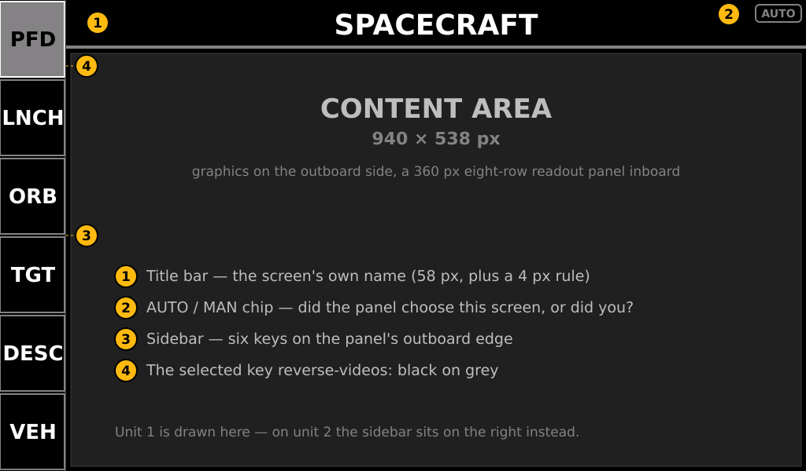

Every screen has the same frame:

| # | Element | Meaning |
|---|---|---|
| 1 | **Title bar** | the screen's own name, in the centre of the content area. 58 px plus a 4 px rule |
| 2 | **AUTO / MAN chip** | who chose this screen — see [below](#auto-and-man-the-context-ladders) |
| 3 | **Sidebar** | six keys down the panel's outboard edge |
| 4 | **Selected key** | reverse-videoed, black on grey |

The content area is 940 × 538 px. Most screens split it as a graphical left region and a
**360 px readout panel** on the inboard side, divided into eight rows — once you have
read one of those panels you can read all of them.

### Reading a readout row

A row is a label on the left and a value right-aligned against the panel edge. Some rows
are **split**, carrying two label/value pairs side by side (`Ma:` / `G:` on AIRCRAFT,
`Fwd:` / `Lat:` on POWERED DESCENT). The value's colour is the whole warning system:
dark green nominal, yellow caution, white-on-red alarm, grey dashes when there is
nothing to show.

**Some row labels change with the phase.** That is deliberate — the row is a slot for
"the number that matters here", not a fixed field. Where a label swaps, this guide says
so.

---

## The sidebar

Six keys, top to bottom. **A first press jumps to that key's context or primary screen.
Pressing the key that already owns the active screen cycles that key's modes**, and the
key's caption changes to name the mode you are on.

| Key | Caption cycles | First press lands on |
|---|---|---|
| 0 | `SPC` → `ACFT` → `ROVR` (→ `VEH` on unit 2) | the PFD the ladder picks for this vessel |
| 1 | `PRE` / `ASC` ↔ `CIRC` | the pre-launch board on the pad; otherwise ascent or circularisation |
| 2 | `ORB` → `ORB+` → `MNVR` | ORBIT (apsides) |
| 3 | `TGT` → `DOCK` → `NAV` | DOCKING if a target is inside 200 m, else TARGET |
| 4 | `DESC` ↔ `ENTR` | POWERED DESCENT |
| 5 | `VEH` *(unit 1)* / `ASC` *(unit 2)* | single-mode |

The keys are achromatic — chrome, not data. The single exception is unit 2's `ASC` key,
which **turns dark green while the Ascent Autopilot is armed**, so you can see the
autopilot's state from any screen.

Title-bar taps do nothing. Navigation is the sidebar.

---

## AUTO and MAN — the context ladders

Both panels choose their own screen as the flight develops, and the chip at the right of
the title bar tells you who is driving:

- **`AUTO`** (grey outline) — the panel's context ladder picked this screen.
- **`MAN`** (dark green outline) — you picked it, and the panel is holding it.

A sidebar press that lands somewhere other than the ladder's current choice **latches**
that choice. The latch means *not this, now* — not *never again*. It releases three
ways: when the ladder's own answer changes, when you press the key owning the screen the
ladder currently wants (an explicit return to automatic), or on a vessel change or scene
entry.

Both ladders are evaluated continuously, with two guards against flapping: every numeric
rule has a **release band** wider than its entry threshold (station-keeping at 200 m
cannot oscillate the panel between TARGET and DOCKING), and there is a minimum dwell
between automatic switches.

### Info Display 1 — vehicle type

| Priority | Condition | Screen |
|---|---|---|
| 1 | rover | ROVER |
| 2 | plane in the atmosphere | AIRCRAFT |
| 3 | everything else | SPACECRAFT |

This panel admits no exceptions: the answer is always an instrument for the vehicle.

### Info Display 2 — mission phase

| Priority | Condition | Screen |
|---|---|---|
| 1 | pre-launch — every vessel type, spaceplanes included | LAUNCH (pre-launch board) |
| 2 | descending, periapsis inside the atmosphere, and above it or past Mach 3 | RE-ENTRY |
| 3 | descending faster than 5 m/s below 10 km radar altitude (planes excluded) | POWERED DESCENT |
| 4 | an aircraft flying in atmosphere with apoapsis below the top of it | NAVIGATION |
| 5 | target within 200 m | DOCKING |
| 6 | landed or splashed | TARGET if one is set, else VEHICLE INFO |
| 7 | climbing with periapsis below orbit-safe altitude | LAUNCH (ascent / circularisation) |
| 8 | node planned and ignition less than 10 minutes away — including during the burn | MANEUVER |
| 9 | target between 200 m and 2000 m | TARGET |
| 10 | on EVA | TARGET |
| 11 | everything else | ORBIT |

Two things follow from this that are worth knowing in the cockpit:

- **Rule 4 fires if and only if Info Display 1 is showing the aircraft PFD.** The two
  panels are the standard airliner pair, or they are not paired at all.
- **An aircraft must be typed as an aircraft in KSP.** Both the AIRCRAFT PFD and
  NAVIGATION key off the vessel type, so a plane KSP thinks is a Probe gets SPACECRAFT
  and ORBIT. That is a deliberate rule — the vessel type is your declaration of what you
  are flying — not a bug to work around.

---

## Touch targets

Only four things on these panels accept a touch:

1. **The sidebar keys.**
2. **The reference chip** on SPACECRAFT and AIRCRAFT (see those sections).
3. **Anywhere in the content area of the pre-launch board**, which dismisses it.
4. **The Ascent Autopilot console** — its fields, keypad and ARM button.

Everything else is an indication. The `RCS`, `SAS`, `GEAR`, `BRAKES` and `AIRBRK` tiles
report state; they do not command it. The attitude ball is deliberately not a touch
target — a stray touch changing your velocity reference mid-burn is a bad way to find
out the glass is live.

---

# The screens

## SPACECRAFT (PFD)

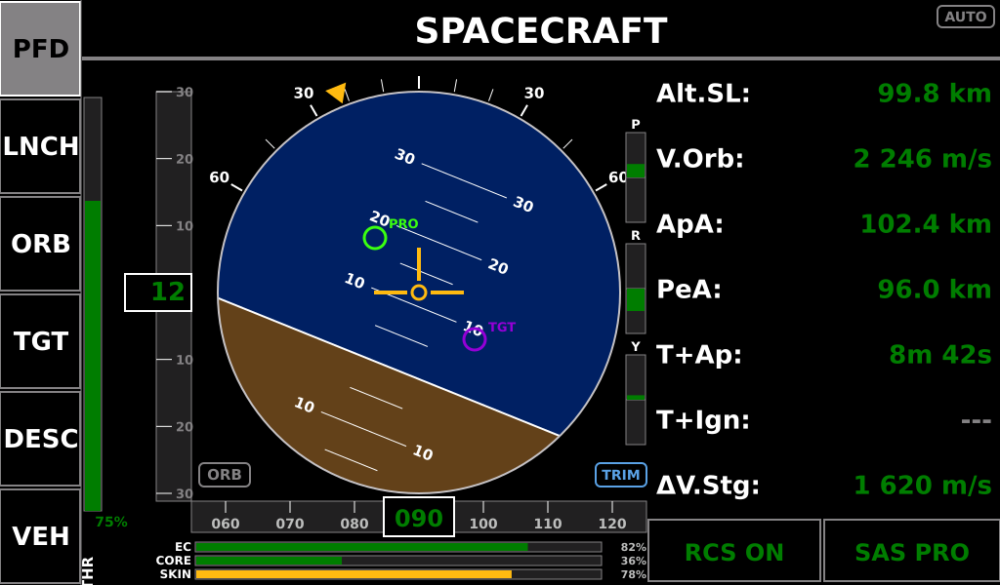

The primary flight display, and the screen you return to from anywhere. Unit 1's entire
job.

**The ball** is a full EADI: blue sky over brown ground, a white horizon, a pitch ladder
graduated every 5° (labelled every 10°), and a fixed yellow boresight symbol at the
centre. The ball rotates with roll; the yellow pointer on the outer scale reads bank
against ticks at 0, ±10, ±20, ±30, ±45 and ±60°. Beyond about 32° of bank a pair of
chevrons appear pointing the short way back to level.

Navball markers ride on the ball: **prograde/retrograde**, **target**, and **manoeuvre
node**, each in the colour that quantity carries everywhere on the controller.

**Around the ball**

| Element | Reading |
|---|---|
| Left vertical strip, `THR` | commanded throttle, 0–100 % |
| Pitch tape, left of the ball | pitch in degrees; the boxed value is the current pitch |
| Heading tape, under the ball | heading, ±35° visible; the boxed value is the current heading |
| Rate bars `P`, `R`, `Y` | pitch, roll and yaw rates, full scale ±10 °/s each way from centre |
| `EC` / `CORE` / `SKIN` strip | electric charge, hottest core temperature, hottest skin temperature — each as a percentage bar |
| **Reference chip** (`ORB` / `SRF`) | which velocity reference row 1 is showing. **Grey = automatic, dark green = you have pinned it.** Tap it to pin the other reference or drop back to automatic |
| `TRIM` chip | cyan when trim hold is engaged |

Left to itself, the panel switches to the orbital reference above about 6 % of the
body's radius and back below 5.5 % — hysteresis so it cannot chatter at the boundary.

**The readout panel**

| Row | Label | Notes |
|---|---|---|
| 0 | `Alt.SL:` | altitude above sea level |
| 1 | `V.Orb:` / `V.Srf:` | **label swaps with the reference** — orbital or surface velocity |
| 2 | `ApA:` | apoapsis |
| 3 | `PeA:` | periapsis |
| 4 | `T+Ap:` | time to apoapsis |
| 5 | `V.Vrt:` / `T+Ign:` / `ΔV.Rem:` | **context row.** Vertical speed in the surface phase; time to ignition when a node is pending; ΔV remaining on the node once the burn has started |
| 6 | `ΔV.Stg:` | stage ΔV — yellow under 300 m/s, white-on-red under **150 m/s** |
| 7 | `RCS` / `SAS` | state tiles. SAS shows its navball mode |

### On EVA

The ball is unchanged — you do orient on EVA — but rows 1–6 swap to the numbers a
Kerbal actually has:

| Row | Label | Notes |
|---|---|---|
| 0 | `Alt.SL:` | unchanged |
| 1 | `V.Orb:` | **pinned**, so `V.Orb` and `V.Srf` are both always present — that pair is how you tell station-keeping from drifting |
| 2 | `Alt.Rdr:` | radar altitude |
| 3 | `V.Srf:` | surface velocity |
| 4 | `Dist:` | to target; dashed when none |
| 5 | `V.Close:` | closure rate; dashed when none |
| 6 | `EC:` | **suit charge** — yellow at 20 %, white-on-red at 5 %. This is the number that ends an EVA |

`RCS` and `SAS` stay: both are exactly as meaningful for a Kerbal on a jetpack.

---

## AIRCRAFT

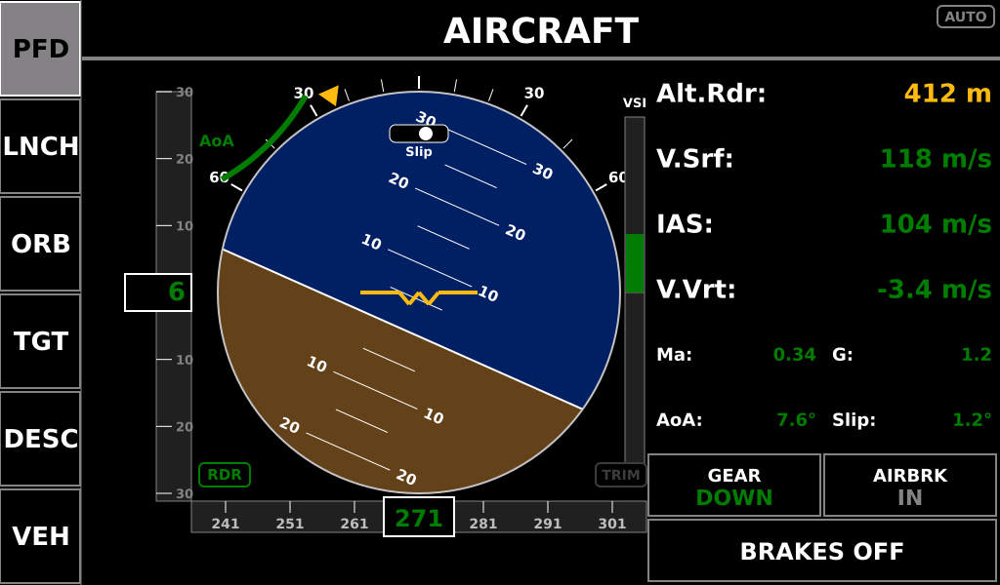

The same EADI ball with an aircraft boresight symbol, plus the instruments a plane needs
and a spacecraft does not.

| Element | Reading |
|---|---|
| Slip ball, under the roll pointer | sideslip — yellow past **5°**, white-on-red past **15°** |
| AoA arc, around the ball | angle of attack — dark green, yellow past **10°**, red past **20°**. 20° is the same figure the Annunciator's GPWS `STALL` callout uses |
| `VSI` strip, right of the ball | vertical speed, centred on zero |
| Roll | yellow past **60°**, white-on-red past **90°** (inverted / structural) |
| **Reference chip** (`RDR` / `SL`) | which altitude row 0 is showing. Left automatic it takes radar altitude below 750 m and hands it back to barometric above 850 m. Tap to pin |

**The readout panel**

| Row | Label | Colour bands |
|---|---|---|
| 0 | `Alt.Rdr:` / `Alt.SL:` | radar altitude yellow under **500 m**, white-on-red under **50 m** |
| 1 | `V.Srf:` | surface velocity |
| 2 | `IAS:` | indicated airspeed |
| 3 | `V.Vrt:` | vertical speed |
| 4 | `Ma:` / `G:` | split row. G yellow past +4 / −2 g, white-on-red past **+9 / −5 g** |
| 5 | `AoA:` / `Slip:` | split row, bands as above |
| 6 | `GEAR` / `AIRBRK` | GEAR turns **yellow when down above 160 m/s**. AIRBRK reads `IN` or cyan `OUT` |
| 7 | `BRAKES` | on / off |

`Ma:` is the one place on the panel where a quantity carries a short name — the cell is
180 px and `Mach:` does not fit. It means the same thing as `Mach:` on ASCENT and
RE-ENTRY.

---

## ROVER

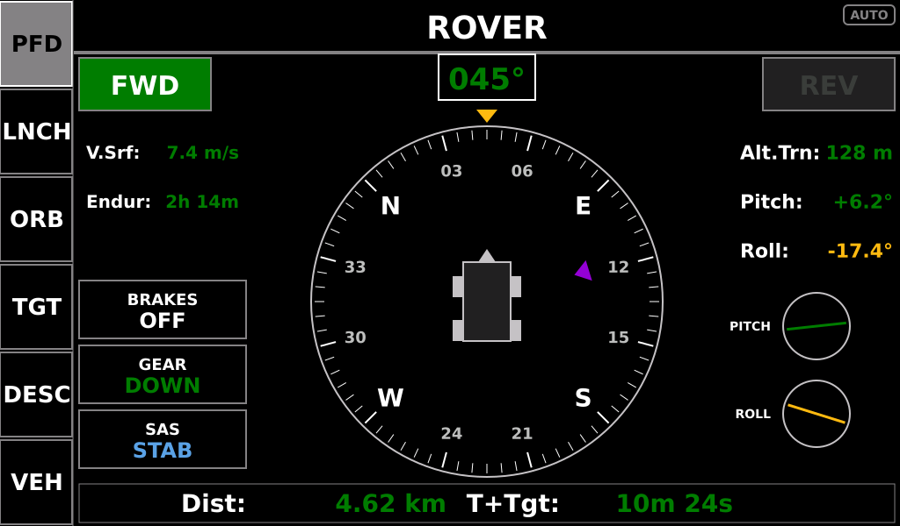

A ground-vehicle instrument. The compass card rotates so that **the nose is always at
12 o'clock**, under a fixed yellow index; the boxed heading above it is the number.

| Element | Reading |
|---|---|
| Compass card | heading-up rose with cardinal letters and 10° numerics |
| Violet triangle | bearing to target, when one is set |
| `FWD` / `REV` blocks, top corners | drive state from wheel throttle. **Both muted = NEUTRAL** |
| `V.Srf:` | signed ground speed, coloured by direction |
| `Endur:` | **how long the charge will last at the present draw** — yellow under **1 hour**, white-on-red under **10 minutes** |
| `BRAKES` / `GEAR` / `SAS` | state tiles; SAS shows its navball mode |
| `Alt.Trn:` | terrain elevation (sea-level altitude minus radar altitude) |
| `Pitch:` and its dial | yellow past **20°**, white-on-red past **30°** — rollover risk |
| `Roll:` and its dial | yellow past **15°**, white-on-red past **25°** — rollover imminent |
| Bottom strip | `Dist:` and `T+Tgt:` — shown only when a target is set |

**There is no state-of-charge percentage on this screen, and that is deliberate.** On a
Mun rover "20 %" tells you nothing about whether that is four minutes or forty, so this
cell carries the time instead — and it is **coloured by time, not by percentage**, so
40 % under a heavy load reads red beside "4m" while 19 % coasting reads green. The
percentage itself lives on the Resource Display, and the Annunciator owns the
low-charge alarm.

Three readings are not times:

| Reading | Meaning |
|---|---|
| `CHG` | net charge rate is positive — solar panels are outpacing the draw |
| `---` | the drain is below the useful floor (beyond about ten hours), or the rover is parked and the rate is noise |
| a time | estimated from a rolling window tens of seconds long, not frame to frame, so it settles rather than flickering |

The two tilt dials are the ones to watch on a slope: the numbers give you the angle, the
dials give you the rate of change.

---

## VEHICLE INFO

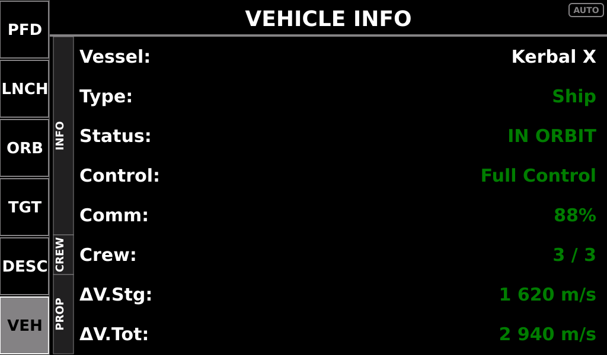

*(Unit 1's sixth key; unit 2's ladder routes to it for a landed vessel with no target.)*

A status summary rather than an instrument — what you want when deciding whether to
recover.

| Section | Row | Meaning |
|---|---|---|
| **INFO** | `Vessel:` | active vessel name |
| | `Type:` | Ship, Probe, Relay, Rover, Lander, Plane, Station, Base, EVA, Debris… |
| | `Status:` | `PRE-LAUNCH`, `IN FLIGHT`, `SUB-ORBITAL`, `IN ORBIT`, `ESCAPE ORBIT`, `LANDED`, `SPLASHED`, `DOCKED`, or `RECOVERABLE` |
| | `Control:` | `No Control`, `Limited Probe`, `Limited Manned`, `Full Control` |
| | `Comm:` | CommNet signal strength — yellow under **50 %** |
| **CREW** | `Crew:` | aboard / capacity |
| **PROP** | `ΔV.Stg:` | stage ΔV, bands as everywhere |
| | `ΔV.Tot:` | vessel total ΔV — yellow under **500 m/s** |

---

## LAUNCH — pre-launch board

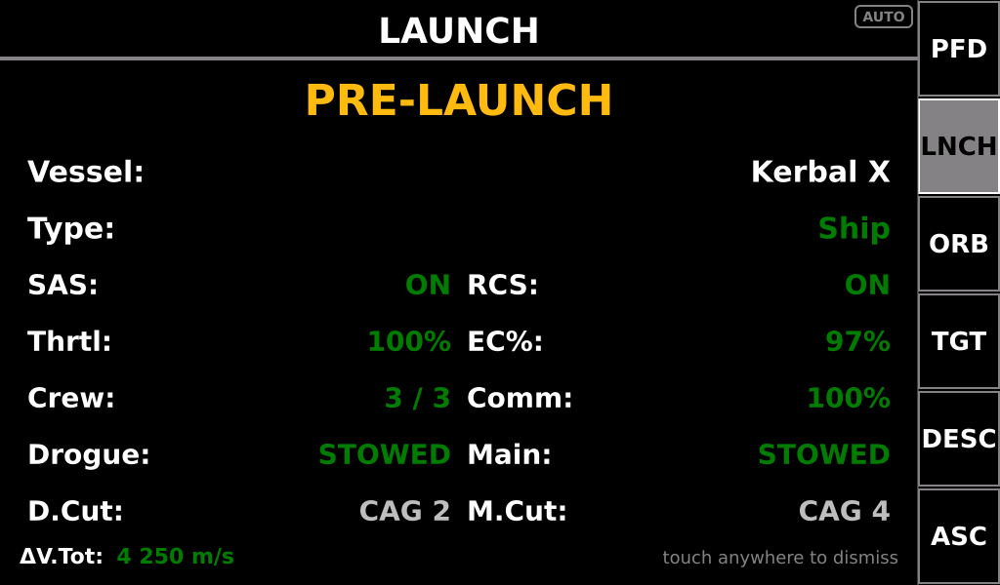

Shown automatically on the pad. **Tap anywhere in the content area — or press `LNCH` —
to dismiss it into the ascent view**; it will not come back for this launch.

| Field | What to check |
|---|---|
| `Vessel:` / `Type:` | you are flying what you think you are |
| `SAS:` / `RCS:` | armed as intended |
| `Thrtl:` | throttle set before you release the clamps |
| `EC%:` | **green at 90 % and above, yellow down to 75 %, white-on-red below** — a rocket that leaves the pad low on charge does not come back |
| `Crew:` / `Comm:` | souls aboard, link established |
| `Drogue:` / `Main:` | parachute states — `STOWED` before launch |
| `D.Cut:` / `M.Cut:` | which custom action groups cut the drogue and main. Configured in firmware (defaults: deploy 1 and 3, cut 2 and 4); a `0` disables the readout and the chute shows `STOWED` permanently |
| `ΔV.Tot` | total mission ΔV before you commit |

The board is bypassed for planes and rovers on unit 2's ladder — they get their own
instruments instead — but is still reachable from the `LNCH` key.

---

## LAUNCH — ascent

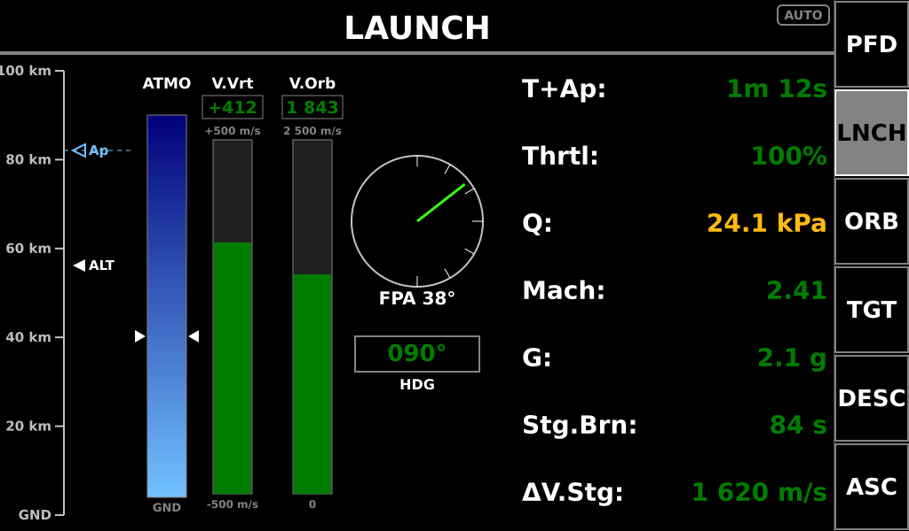

The powered ascent. Pictures on the left, numbers on the right, and nothing duplicated
between them.

**Left region**

| Instrument | Reading |
|---|---|
| **Altitude ladder** | a labelled tick scale with two markers: **`ALT` filled** (the vessel) and **`Ap` hollow** (apoapsis), with a dashed reference line at the apoapsis. Watch the gap close |
| **ATMO gauge** | a sky-to-navy gradient with a triangle on each side. **It has no digits, deliberately** — it plots the fourth root of relative density so the thin upper atmosphere stays visible, where raw density would read `0.00` from 30 km up with the triangle still a quarter of the way from the bottom. It answers "atmosphere, and how deep", and `Q` in the right column is the atmospheric number that earns digits |
| **`V.Vrt` bar** | vertical speed, ±500 m/s full scale, with its own value in a boxed window between the name and the top label |
| **`V.Orb` bar** | orbital velocity, same treatment |
| **FPA dial** | flight path angle — the angle between where you are pointing and where you are going |
| **Heading tape** | current heading |

The three bar gauges each carry their own digits in a window, so a bar and its number
read as one instrument. The atmosphere column is the exception, for the reason above.

**Right column — seven rows, all numbers**

| Row | Meaning | Bands |
|---|---|---|
| `T+Ap:` | time to apoapsis | yellow under **30 s** during the burn |
| `Thrtl:` | commanded throttle | — |
| `Q:` | dynamic pressure ½ρv², kPa | yellow past **20 kPa**, white-on-red past **40 kPa** |
| `Mach:` | Mach number | — |
| `G:` | G load | yellow past +4 / −2 g, red past **+9 / −5 g** |
| `Stg.Brn:` | seconds of thrust left in the stage | yellow under **120 s**, white-on-red under **60 s** |
| `ΔV.Stg:` | stage ΔV | yellow under 300 m/s, white-on-red under **150 m/s** |

`Q` is the one structural event of an ascent. Density falls monotonically from the pad,
but Q rises to a peak around 5–8 km (typically 10–15 kPa on a Kerbin launch) and then
falls again. The ATMO gauge cannot show that; this row can.

### When ASCENT becomes CIRCULARISATION

The switch is on the **engine, not the altitude**. Two conditions start it: **throttle
at or below 2 %**, and **apoapsis already at or above orbit-safe altitude** — the second
so a throttle-down through max Q or a staging gap does not read as a coast a minute
after liftoff.

It then **latches**, because the circularisation burn re-opens the throttle and a live
test would drop back to ASCENT for the one burn CIRCULARISATION exists to fly. The latch
clears on the surface and whenever apoapsis falls back below the line.

---

## LAUNCH — circularisation

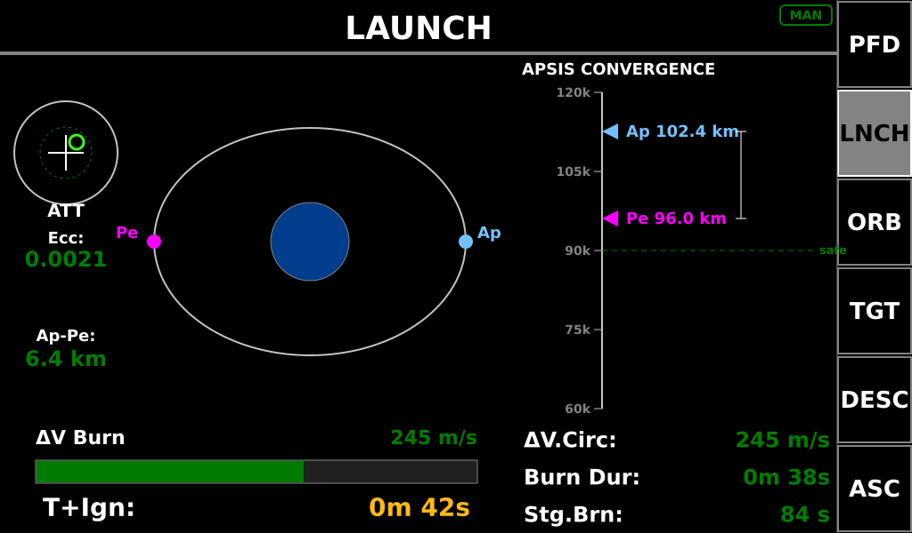

The coast and the insertion burn.

**Left half**

| Instrument | Reading |
|---|---|
| **Attitude alignment disc** (`ATT`) | your attitude against the burn vector; the inner ring is the good zone |
| `Ecc:` | orbital eccentricity — the shape of the orbit, beside the picture of it |
| `Ap-Pe:` | the gap between the apsides |
| **Orbit diagram** | the orbit with **cyan `Ap`** and **magenta `Pe`** dots |
| **ΔV Burn bar** | the burn remaining, against the stage's capability |
| `T+Ign:` | time to ignition — yellow at **60 s**, white-on-red at **10 s** |

**Right third — the apsis convergence tape**

A vertical altitude scale with **apoapsis fixed near the top** and **periapsis climbing
to meet it**, bracketed together, with the orbit-safe altitude drawn as the floor the
orbit must clear.

The two markers are **cyan for Ap and magenta for Pe — the same two colours the orbit
diagram gives its dots**, so a marker on the tape and a dot on the diagram read as the
same apsis. State is annunciated by *form*, not hue: **a marker draws hollow while its
value is off the bottom of the scale.** A suborbital periapsis is hundreds of kilometres
below the surface and cannot be framed with the apoapsis, so its marker clamps to the
bottom and stays hollow until the burn brings it into view.

The scale quantises its ends to whole tick steps, so the frame holds still while the
marker moves — expect roughly one rescale across an entire Kerbin circularisation.

Beneath the tape, three rows that answer one question together — *can this stage finish
this burn?*

| Row | Meaning |
|---|---|
| `ΔV.Circ:` | velocity change still needed, from vis-viva |
| `Burn Dur:` | how long the planned burn runs |
| `Stg.Brn:` | seconds of thrust left in the stage |

---

## ASCENT AUTOPILOT

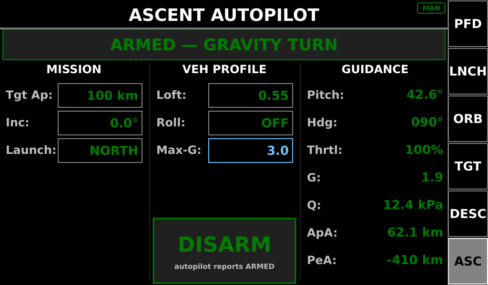

*(Unit 2 only — it is the sole owner of the autopilot command channel. Two consoles
driving one autopilot is an ambiguity better designed out than discovered during a
gravity turn.)*

The autopilot itself runs on the master controller; this is its console. Three columns:

| Column | Fields |
|---|---|
| **MISSION** *(inputs)* | `Tgt Ap:` target apoapsis · `Inc:` inclination · `Launch:` north or south |
| **VEH PROFILE** *(inputs)* | `Loft:` loft exponent · `Roll:` roll hold · `Max-G:` G limit — plus the ARM / DISARM button |
| **GUIDANCE** *(outputs)* | `Pitch:` and `Hdg:` commanded · `Thrtl:` · `G:` · `Q:` · `ApA:` · `PeA:` |

**Boxed fields are editable.** Tap one to open an on-screen numeric keypad (or, for
`Launch:` and `Roll:`, a toggle); `ENT` commits, `CLR` and `DEL` edit, `CANCEL` backs
out. Fields can be edited at any time, armed or not.

**Nothing on this console shows you your own tap.** A pilot edit displays in **cyan
until the autopilot echoes the accepted value back**, at which point it turns dark green.
Likewise the ARM button, the phase banner and the sidebar `ASC` key all annunciate the
autopilot's *reported* state: a tap raises a pending cue — cyan border, `ARMING…` /
`DISARMING…`, and `...` on the banner — and the state changes only when the master
confirms it. If a value stays cyan, the command did not land.

**Phase banner** — the autopilot's own phase, with the ARM button coloured to match:

`IDLE` → `VERTICAL` → `GRAVITY TURN` → `COAST` → `CIRCULARIZE` → `COMPLETE`, plus
`ABORT`.

---

## ORBIT

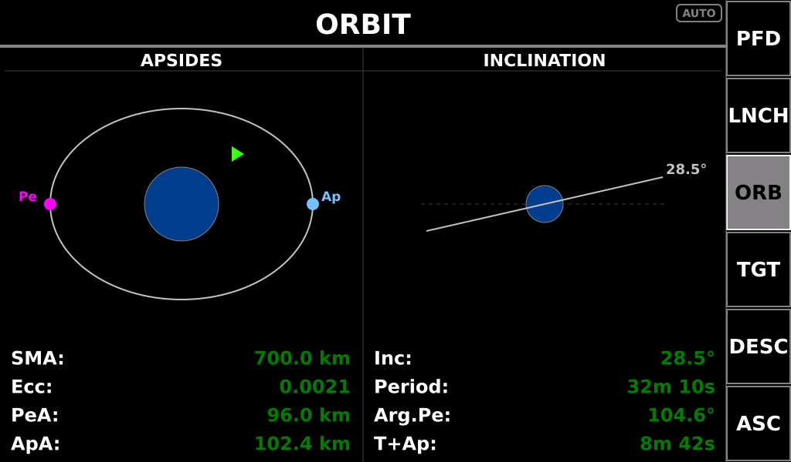

The default `ORB` screen and unit 2's resting state.

**Left half — apsides plan view.** The orbit drawn around the body, with **cyan `Ap`**
and **magenta `Pe`** markers, over four rows: `SMA:`, `Ecc:`, `PeA:`, `ApA:`.

**Right half — inclination view.** The orbit plane against the body's equator, over four
rows: `Inc:`, `Period:`, `Arg.Pe:`, and `T+Pe:` / `T+Ap:` (whichever comes next).

Together these are the shape, the size, the orientation and the timing of the orbit — a
complete picture without needing the advanced page.

---

## ORBIT ADVANCED

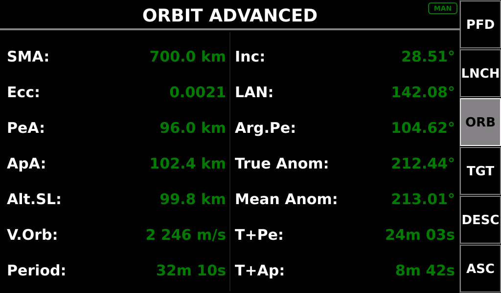

Text only, no picture: the full classical element set, when the plan view is not enough.

| Left column | Right column |
|---|---|
| `SMA:` semi-major axis | `Inc:` inclination |
| `Ecc:` eccentricity | `LAN:` longitude of ascending node |
| `PeA:` periapsis | `Arg.Pe:` argument of periapsis |
| `ApA:` apoapsis | `True Anom:` true anomaly |
| `Alt.SL:` current altitude | `Mean Anom:` mean anomaly |
| `V.Orb:` orbital velocity | `T+Pe:` time to periapsis |
| `Period:` orbital period | `T+Ap:` time to apoapsis |

Reached by cycling `ORB` (`ORB` → `ORB+` → `MNVR`). A first press of `ORB` from another
screen returns you to the apsides view.

---

## MANEUVER

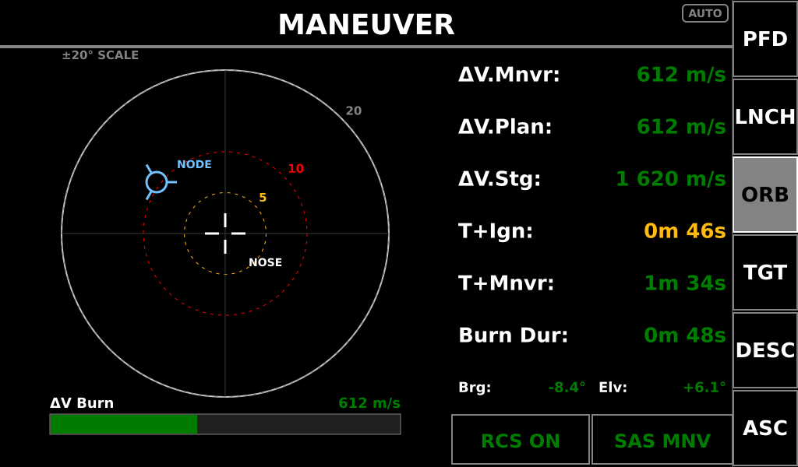

Burn execution against a planned node. **`NO MANEUVER` fills the screen when no node is
planned.**

**The reticle** is ±20° full scale. The white crosshair is your nose; the **blue node
marker** is where the burn vector points. Ring radii are the colour bands for the
numbers, so the picture and the digits can never disagree:

| Ring | Angle | Meaning |
|---|---|---|
| inner (yellow) | **5°** | inside this is nominal |
| middle (red) | **10°** | beyond this the alignment rows go white-on-red |
| outer (grey) | 20° | full scale |

Within 5° a neon-green alignment box appears around the marker — that is your cue that
you are pointed well enough to light the engine.

**The readout panel**

| Row | Meaning | Bands |
|---|---|---|
| `ΔV.Mnvr:` | ΔV remaining on this node | — |
| `ΔV.Plan:` | ΔV across **all** planned nodes | — |
| `ΔV.Stg:` | stage ΔV | yellow 300, red **150 m/s** |
| `T+Ign:` | time to ignition | yellow **60 s**, white-on-red **10 s** |
| `T+Mnvr:` | time to the node itself | — |
| `Burn Dur:` | how long the burn runs | — |
| `Brg:` / `Elv:` | nose-to-node pointing error, split into bearing and elevation | bands as the rings |
| `RCS` / `SAS` | state tiles | — |

A ΔV bar under the reticle shows the burn draining as you fly it.

---

## TARGET

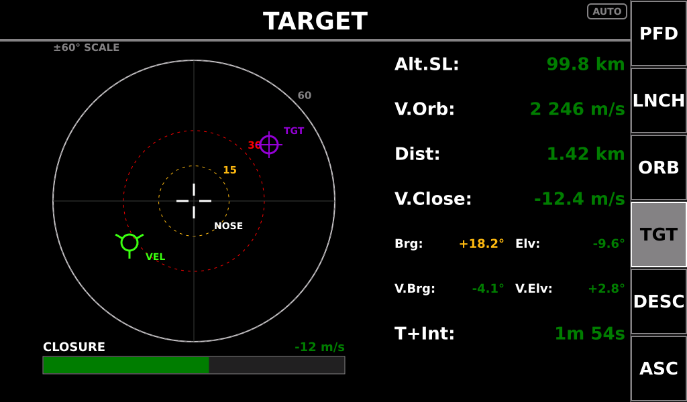

The rendezvous scope — the phase from "I can see it on the map" to "I am close enough to
dock". **`NO TARGET SET` fills the screen when no target is selected.**

**The reticle** is ±60° full scale — wide, because at rendezvous range you are pointing
at things a long way off the nose. All markers are **nose-referenced**:

| Marker | Meaning |
|---|---|
| white crosshair | your nose (boresight) |
| **violet `TGT`** | where the target is |
| **neon-green `VEL`** | where your relative velocity is pointing. **At the centre = the relative velocity runs straight down the boresight; on the `TGT` marker = you are closing directly on the target** |

Ring radii, and the bands for `Brg:` / `Elv:`: **yellow at 15°, white-on-red at 30°**,
outer ring 60°.

**The readout panel**

| Row | Meaning | Bands |
|---|---|---|
| `Alt.SL:` | altitude | — |
| `V.Orb:` | orbital velocity | — |
| `Dist:` | range to target | yellow under **5 km**; **white-on-green under 200 m** — that is the cue to switch to DOCK |
| `V.Close:` | signed closure rate — **negative means closing** | white-on-red past **500 m/s while already inside 5 km**: fast closure far out is a normal transfer, the same number close in is an impact |
| `Brg:` / `Elv:` | bearing and elevation of the target from your nose | 15° / 30° |
| `V.Brg:` / `V.Elv:` | approach-path error about the target axis — the same quantity and labels DOCKING uses | 15° / 30° |
| `T+Int:` | intercept time, range ÷ closure — **shown only while closing** | — |

---

## DOCKING

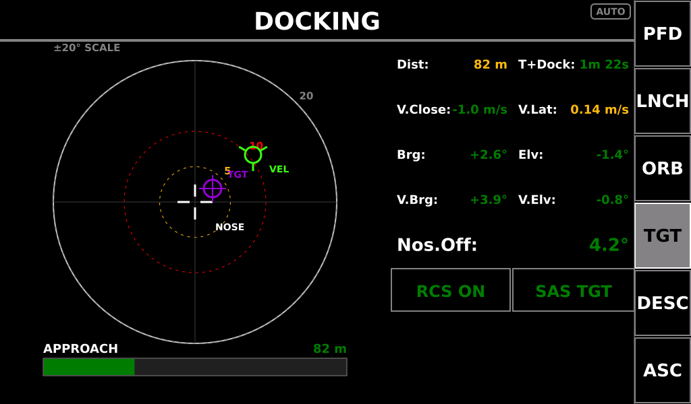

The precision phase. **`DOCKED` or `NO TARGET SET` fills the screen when applicable.**

**The reticle** is ±20° full scale, so the tolerances are four times tighter than
TARGET's:

| Ring | Angle |
|---|---|
| inner (yellow) | **5°** |
| middle (red) | **10°** |
| outer (grey) | 20° |

The green `VEL` marker shows the craft-to-port **relative velocity**, referenced to your
nose, and **the whole marker layer is rotated into the craft's body axes**, so it flies
like a prograde marker at any roll attitude: *marker up and right of the crosshair →
thrust left and down to centre it.*

**The readout panel**

| Row | Meaning | Bands |
|---|---|---|
| `Dist:` / `T+Dock:` | range to the port, and range ÷ closure (closing only) | Dist yellow under **200 m**, white-on-red under **50 m** |
| `V.Close:` / `V.Lat:` | signed closure rate, and total lateral drift magnitude | closure white-on-red past **2 m/s inside 100 m**; lateral drift yellow past **0.1 m/s**, white-on-red past **0.5 m/s** |
| `Brg:` / `Elv:` | the port relative to your nose | 5° / 10° |
| `V.Brg:` / `V.Elv:` | approach-path error about the target axis; reads `---` past 90° | 5° / 10° |
| `Nos.Off:` | total nose angular offset from the port | 5° / 10° |
| `RCS` / `SAS` | state tiles. **SAS: `TARGET` green, `STAB` cyan, `OFF` white-on-red, any other mode red** — during a dock, target-hold or stability are the only two modes that help |

`Brg`/`Elv` are the *component* angles and understate the real error when both are
non-zero; **`Nos.Off` carries the true figure.** Fly the reticle, confirm with
`Nos.Off`.

---

## NAVIGATION

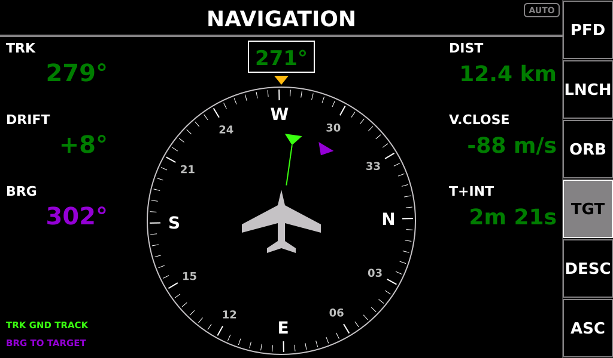

The plan view for atmospheric flight, and the other half of a glass-cockpit pair with
the AIRCRAFT PFD on the opposite panel. It needs no target and works without one.

The compass card is the ROVER renderer at 1.12× — same instrument, two sizes. **Nose
fixed at 12 o'clock**, an own-ship aircraft symbol at the centre, and the rose turning
around it, so the display reads heading-up rather than as a dial.

| Marker | Meaning |
|---|---|
| **green** | ground track — where the vessel is actually moving. A **ground-track line** runs from the aeroplane out to it, so the crab angle is a visible wedge rather than only a signed number |
| **violet** | bearing to target |

A legend in the bottom-left corner names both, in the smallest font on the screen — a
legend is reference material, so it sits where the eye goes last.

**Left column**

| Field | Meaning |
|---|---|
| `TRK` | ground track. **Dashed below 5 m/s**, where KSP's reported velocity heading wanders |
| `DRIFT` | ground track minus heading — the crab angle. **Yellow past 10°.** This is the one number on this screen that appears nowhere else on either panel: it is the difference between a heading that is holding and one that is quietly sliding off. Dashed below 5 m/s with TRK |
| `BRG` | the violet marker's own number, in violet |

**Right column** — all dashed when no target is set:

| Field | Meaning |
|---|---|
| `DIST` | range to target |
| `V.CLOSE` | closure rate |
| `T+INT` | range ÷ closure, closing only — the same quantity, formula and label as TARGET's `T+Int` |

---

## POWERED DESCENT

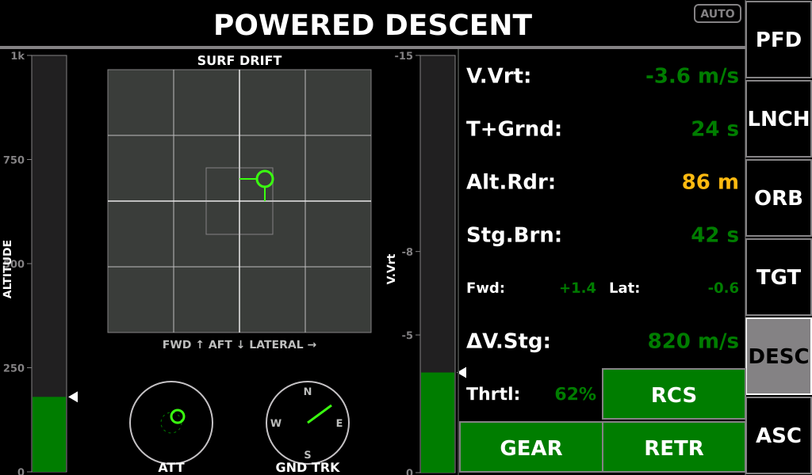

Vertical landing under thrust. **Pictures for the rates, numbers for the state.**

| Instrument | Reading |
|---|---|
| **Altitude tape**, left | radar altitude with a moving marker |
| **X-Pointer** (`SURF DRIFT`) | the big square: **forward/aft drift on the vertical axis, lateral drift on the horizontal**, both roll-corrected into the craft's heading frame. The centre box is the good zone. Fly the dot to the middle |
| **`ATT` bullseye** | attitude against the retrograde/thrust vector |
| **`GND TRK` rose** | which compass direction you are drifting |
| **`V.Vrt` bar**, right | descent rate, with **−5 m/s and −8 m/s** marked |

**The readout panel**

| Row | Meaning | Bands |
|---|---|---|
| `V.Vrt:` | vertical speed | yellow past **−5 m/s**, white-on-red past **−8 m/s** |
| `T+Grnd:` | time to ground | yellow under **30 s** with gear up, white-on-red under **10 s** |
| `Alt.Rdr:` | radar altitude | yellow under **200 m**, white-on-red under **50 m** |
| `Stg.Brn:` | seconds of thrust left | yellow 120 s, red **60 s** |
| `Fwd:` / `Lat:` | horizontal drift, split row | **thresholds tighten as `T.Grnd` falls** — see below |
| `ΔV.Stg:` | stage ΔV | yellow 300, red **150 m/s** |
| `Thrtl:` / `RCS` | split row | — |
| `GEAR` / `SAS` | split row. **SAS here reads landing-context: `STAB` and `RETR` are green, `SAS` off is white-on-red, any other mode is muted** — during a powered descent those are the only two modes that help | — |

**The drift thresholds are contextual.** What is acceptable a minute out is not
acceptable at touchdown:

| `T.Grnd` | Caution (yellow) | Alarm (white on red) |
|---|---|---|
| above 60 s | 20 m/s | — |
| 30–60 s | 5 m/s | 15 m/s |
| 10–30 s | 2 m/s | 8 m/s |
| below 10 s | **1 m/s** | **2 m/s** |

That is the whole discipline of a soft landing in one table: null the drift as the clock
runs down.

---

## RE-ENTRY

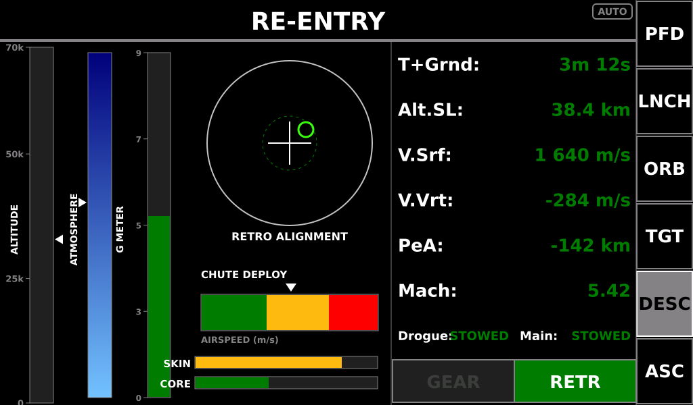

Atmospheric entry. Six-state phase logic drives the corridor bands and the row labels, so
the screen reshapes itself as the entry develops.

| Instrument | Reading |
|---|---|
| **Altitude tape**, left | altitude with a marker |
| **Atmosphere bar** | density, same sky-to-navy scale as the ascent gauge, with a marker for where you are in it |
| **G meter** | G load as a bar rather than a row — during entry it is a *rate* you are watching, not a number you are reading |
| **Retrograde alignment ball** | your heat shield against the airflow. Keep the marker inside the inner ring |
| **Chute deploy envelope** | a horizontal airspeed bar with **green (safe for mains), yellow (drogue only), red (too fast for anything)** and a marker for your current airspeed. Because the limits are dynamic pressure, the safe *speed* shifts with altitude — the bands move under the marker |
| **`SKIN` / `CORE` bars** | hottest skin and core temperatures as a percentage of limit — yellow at **75 %**, red at **90 %** |

**The readout panel**

| Row | Label | Notes |
|---|---|---|
| 0 | `T+Grnd:` / `T+Atm:` | **toggles by descent phase** — time to ground, or time to atmospheric interface |
| 1 | `Alt.SL:` / `Alt.Rdr:` | **toggles by atmosphere state** |
| 2 | `V.Srf:` | surface velocity |
| 3 | `V.Vrt:` | descent rate |
| 4 | `PeA:` | periapsis — how deep the corridor is |
| 5 | `Mach:` | Mach number |
| 6 | `Drogue:` / `Main:` | chute states: `STOWED` → cyan `ARMED` → `OPEN` yellow (semi-deployed) → `OPEN` green (fully open, drogue below 2500 m AGL, main below 1000 m AGL) |
| 7 | `GEAR` / `SAS` | **`SAS OFF` goes white-on-red above Mach 3** — below that a capsule stabilises ballistically and SAS off is acceptable; above it, it is not |

There is no G row: the meter is the G indication, and it is a better one.

---

## Label vocabulary

One quantity, one name, everywhere on both panels. Worth knowing when a label looks
almost-but-not-quite familiar:

| Quantity | The name it always has |
|---|---|
| Throttle | `Thrtl:` |
| Inclination | `Inc:` |
| Dynamic pressure | `Q:` |
| Drogue chute | `Drogue:` |
| Sideslip | `Slip:` |
| Closure rate | `V.Close` (`V.CLOSE` on NAVIGATION, whose column heads are all-caps) |
| Terrain elevation | `Alt.Trn:` |

Note the near-collision: **`Elv:` is an elevation *angle*** (DOCKING, TARGET, MANEUVER)
while **`Alt.Trn:` is a terrain *height*** (ROVER). Different quantities, different
units, deliberately different names.

The single exception to the one-name rule is `Ma:` on AIRCRAFT, where `Mach:` does not
fit the 180 px split cell.

---

## Quick troubleshooting

| Symptom | Look at |
|---|---|
| The panel keeps changing screens under you | the chip reads `AUTO` — press a sidebar key to latch a screen (`MAN`) |
| A screen you selected got taken away | the latch releases when the ladder's answer changes, or on vessel/scene change |
| Your plane gets SPACECRAFT and ORBIT | the vessel is not typed as a Plane in KSP |
| NAVIGATION never appears | it fires only when the other panel is showing the aircraft PFD |
| An Ascent Autopilot value stays cyan | the master never acknowledged the edit — the command did not land |
| The `ASC` key is green on another screen | the autopilot is armed |
| A row reads `---` | there is nothing to show — no target, no node, no data — not a value of zero |
| Tapping `RCS` / `SAS` / `GEAR` does nothing | they are indications, not buttons |
