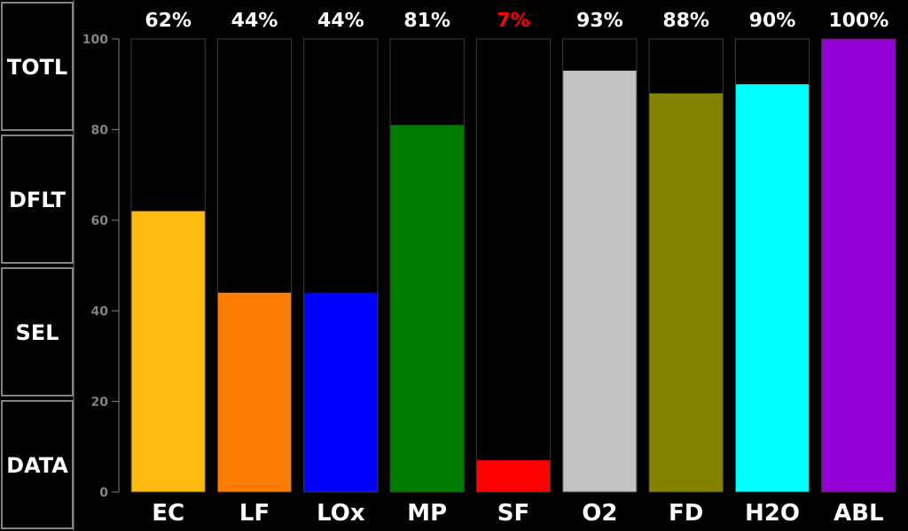
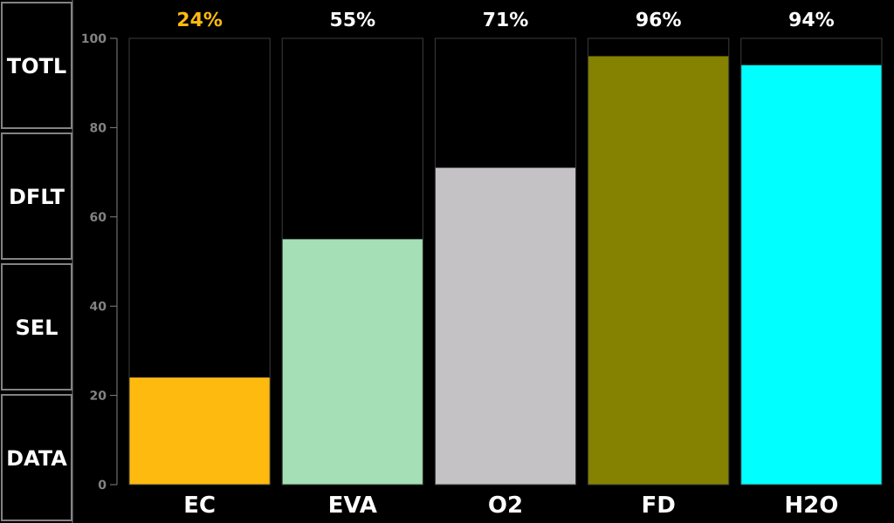
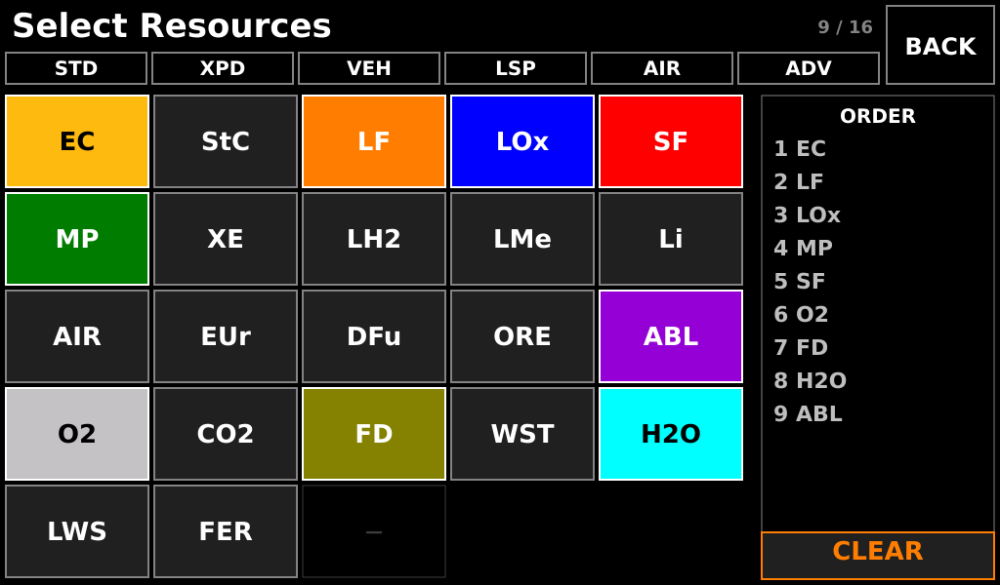
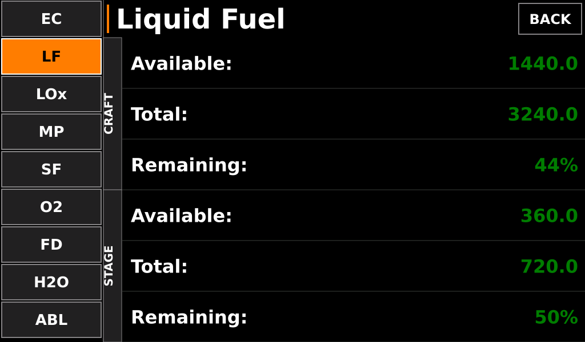

# Resource Display — Operating Guide

**Document type:** User · **Panel:** B1, outboard · **Firmware:** KCMk1_ResourceDisp v3.2.1

The Resource Display answers one question: *what have I got left, and where is it?*
It tracks between 4 and 16 resource slots at once, remembers a different set for each
vessel you fly in a session, and switches itself to a fixed suit-resource set the
moment a Kerbal steps outside.

Four screens: **Standby**, **Main**, **Select**, **Detail**.

- [Main screen](#main-screen)
- [Reading a bar](#reading-a-bar)
- [EVA mode](#eva-mode)
- [Select screen](#select-screen)
- [Detail screen](#detail-screen)
- [Resource catalogue](#resource-catalogue)
- [Per-vessel memory](#per-vessel-memory)

---

## Main screen

A left-hand sidebar of four keys, a percentage axis, and one bar per active slot. The
example is the default nine-slot `STD` configuration on a rocket with a nearly spent
solid booster.

### Sidebar keys

| Key | Action |
|---|---|
| `TOTL` / `STG` | toggles between **vessel totals** and **current-stage** values. `TOTL` draws as a plain key; **`STG` reverse-videos (black on grey)** so you can see at a glance that the panel has moved off its default |
| `DFLT` | reloads the default nine-slot `STD` configuration. Locked while on EVA |
| `SEL` | opens the [Select screen](#select-screen) |
| `DATA` | opens the [Detail screen](#detail-screen) |

The keys are deliberately colourless. All of this panel's colour budget belongs to the
bars and their level thresholds.

---

## Reading a bar

Each bar is one resource. Three things carry meaning:

**Bar height** — the fraction of maximum capacity, read against the 0–100 % axis at the
left of the content area. In `STG` mode the fraction is of the *current stage's*
capacity, which is why a bar can jump on staging.

**Bar colour** — the resource's own identity colour, from the catalogue below. **It
never changes with level.** A bar's colour tells you *what* it is, not how you are
doing.

**Percentage label** — this is where the level warning lives:

| Reading | Label colour | Meaning |
|---|---|---|
| 31–100 % | white | nominal |
| 11–30 % | **yellow** | caution |
| 0–10 % | **red** | critical |

So the habit is: scan the *numbers* along the top for colour, not the bars. A bar can
be a third full and perfectly healthy (ablator), or a third full and about to end your
mission (electric charge) — the number is what tells you which.

**Bars redraw only on a change of at least 0.2 %**, so a stable resource sits
completely still rather than shimmering.

**All values zero on a vessel switch or scene exit** and refill as telemetry arrives —
a screen of empty bars right after switching craft is normal for a fraction of a
second.

---

## EVA mode

When a Kerbal goes outside, the panel snapshots the vessel's slot configuration and
replaces it with a fixed five-bar suit set: **Electric Charge, EVA Propellant, Oxygen,
Food, Water**. The previous configuration is restored automatically when the Kerbal
boards again.

While on EVA the Select grid, the presets, `CLEAR` and `DFLT` are all **locked** — no
other resources can be added. `EVA Propellant` exists only in this mode; off EVA its
grid cell is blank and inert.

`EC` here is suit charge, and it is the number that ends an EVA. Yellow at 20 %, red at
5 %, same as everywhere else on the controller.

---

## Select screen

Configure which resources the Main screen shows.

| Region | Contents |
|---|---|
| **Title row** | `Select Resources`, the current slot count (`9 / 16`), and `BACK` |
| **Preset row** | six group buttons — `STD`, `XPD`, `VEH`, `LSP`, `AIR`, `ADV` |
| **Grid** (left three quarters) | every available resource, five per row, grouped Power → Propellants → Nuclear → Other → Life Support → Agriculture → EVA |
| **ORDER panel** (right quarter) | the current slots in display order |
| `CLEAR` | empties the slot list. Drawn with an orange legend and border — the panel's guard treatment for a control with consequences |

**Tapping a grid cell toggles that resource.** A selected cell is filled with the
resource's identity colour; an unselected one is off-black with a grey border. The
`ORDER` panel updates as you go, and the Main screen's bars will appear left-to-right
in that order.

**Presets replace the configuration entirely** — they are not additive.

| Preset | Purpose | Slots |
|---|---|---|
| `STD` | Standard — the default | 9: EC, LF, LOx, MP, SF, O2, Food, Water, Ablator |
| `XPD` | Expedition craft | 9: EC, LF, LOx, MP, LH2, EUr, O2, Food, Water |
| `VEH` | Everything a vehicle might carry | 15: EC, StC, LF, LOx, MP, SF, XE, ORE, ABL, LH2, LMe, Li, EUr, DFu, FER |
| `LSP` | Life support | 8: EC, O2, CO2, Food, Waste, Water, Liquid Waste, Fertilizer |
| `AIR` | Aircraft | 8: EC, LF, LOx, Intake Air, MP, O2, Food, Water |
| `ADV` | Advanced / modded | 16: EC, StC, XE, ORE, LH2, LMe, Li, EUr, DFu, O2, Food, Water, CO2, Waste, Liquid Waste, FER |

The slot count is bounded: the panel will not go below **4** slots or above **16**.

---

## Detail screen

The numbers behind one bar. A selector column down the left lists every active slot;
tap one to inspect it. `BACK` returns to Main.

| Section | Row | Meaning |
|---|---|---|
| **CRAFT** | `Available:` | how much of this resource is aboard the whole vessel right now |
| | `Total:` | the vessel's total capacity for it |
| | `Remaining:` | available as a percentage of total |
| **STAGE** | `Available:` | how much is in the **current stage** |
| | `Total:` | the current stage's capacity |
| | `Remaining:` | stage percentage |

**Only five resources have real stage data** — Liquid Fuel, Oxidizer, Solid Fuel,
Xenon and Ablator. Those show all six rows. Every other resource shows the three CRAFT
rows only, and the STAGE section is suppressed rather than mirroring the craft totals
and pretending.

The coloured accent bar beside the resource name is the same identity colour as its bar
on the Main screen.

---

## Resource catalogue

Identity colours are fixed per resource and are what let you read the Main screen
without looking at the labels.

| Group | Resource | Label | Bar colour | Needs |
|---|---|---|---|---|
| **Power** | Electric Charge | `EC` | yellow | ARP |
| | Stored Charge | `StC` | air superiority blue | CRP |
| **Propellant** | Liquid Fuel | `LF` | orange | ARP |
| | Oxidizer | `LOx` | blue | ARP |
| | Solid Fuel | `SF` | red | ARP |
| | Mono Propellant | `MP` | dark green | ARP |
| | Xenon Gas | `XE` | magenta | ARP |
| | EVA Propellant | `EVA` | mint | *EVA only* |
| | Liquid Hydrogen | `LH2` | french blue | CRP |
| | Liquid Methane | `LMe` | royal blue | CRP |
| | Lithium | `Li` | international orange | CRP |
| | Intake Air | `AIR` | aqua | CRP |
| **Nuclear** | Enriched Uranium | `EUr` | neon green | CRP |
| | Depleted Fuel | `DFu` | sap green | CRP |
| **Other** | Ore | `ORE` | maroon | ARP |
| | Ablator | `ABL` | violet | ARP |
| **Life support** | Oxygen | `O2` | silver | TAC-LS |
| | Carbon Dioxide | `CO2` | cornell red | TAC-LS |
| | Food | `FD` | olive | TAC-LS |
| | Waste | `WST` | brown | TAC-LS |
| | Water | `H2O` | cyan | TAC-LS |
| | Liquid Waste | `LWS` | dull yellow | TAC-LS |
| **Agriculture** | Fertilizer | `FER` | UPS brown | CRP |

**A bar sitting at zero usually means a missing mod, not an empty tank.** Most channels
need the Alternate Resource Panel; life support needs TAC-LS; the CRP resources need
Community Resource Pack *and* two `CustomResourceMessages` blocks in the KerbalSimpit
`Settings.cfg` (see the firmware README for the exact text).

---

## Per-vessel memory

The panel keeps a slot configuration per vessel name, for up to **20 vessels per
session**:

- **On vessel switch** it looks up the new vessel's saved configuration and loads it.
  If there is none, it keeps whatever is currently on screen.
- **On scene exit** it saves the current configuration for the active vessel.
- **The cache is RAM only.** It does not survive a power cycle, and there is no
  least-recently-used eviction: past 20 vessels, the last cache entry is overwritten.

So a station you have configured once will come back configured for the rest of the
session, and come back as `STD` after the controller is power-cycled.

---

## Quick troubleshooting

| Symptom | Look at |
|---|---|
| Panel sits on the splash | KSP is not in a flight scene — or, in demo mode, touch to advance |
| A bar is permanently at zero | the resource's mod is not installed, or the channel is not in `Settings.cfg` |
| Bars jump on staging | the panel is in `STG` mode — the mode key is reverse-videoed |
| `DFLT`, presets and the grid do nothing | a Kerbal is on EVA; they are locked until they board |
| A resource has no STAGE section | only LF, LOx, SF, Xenon and Ablator carry stage data |
| Slot list will not go below four entries | four is the enforced minimum |
