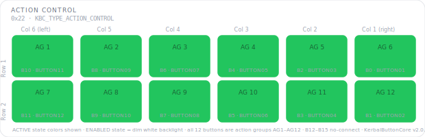

# KCMk1_Action_Control

**Module:** Action Control  
**Version:** 1.0  
**Date:** 2026-04-07  
**Author:** J. Rostoker — Jeb's Controller Works  
**License:** GNU General Public License v3.0 (GPL-3.0)  
**Hardware:** KC-01-1822 Button Module Base v1.1  
**Library:** KerbalButtonCore v1.0.0  

---

## Overview

The Action Control module provides action group toggles (AG1–AG10) and control point selection (CP PRI, CP ALT) for Kerbal Space Program. It also carries two discrete input signals for control mode detection, reported to the system controller alongside the NeoPixel button states.

This module uses 12 NeoPixel RGB button positions (KBC indices 0–11) and 2 discrete input positions (KBC indices 12 and 14). The discrete inputs have no LED output — they are pure signal inputs wired to panel-level control mode switches outside the button matrix.

---

## Module Identity

| Parameter | Value |
|---|---|
| I2C Address | `0x22` |
| Module Type ID | `0x03` (KBC_TYPE_ACTION_CONTROL) |
| Capability Flags | `0x00` (core states only) |
| Extended States | No |
| NeoPixel Buttons | 12 (KBC indices 0–11) |
| Discrete Inputs | 2 (KBC indices 12, 14 — input only, no LED) |
| Not Installed | KBC indices 13, 15 |

---

## Panel Layout

Physical panel orientation: 2 rows × 6 columns. Column 6 is leftmost, Column 1 is rightmost. Button numbering starts top-right (B0) and proceeds left across each row.



Active state colors shown. All NeoPixel buttons illuminate dim white in the ENABLED state. Discrete inputs (B12, B14) are not shown — they have no LED output and are not part of the NeoPixel grid.

---

## Button Reference

### NeoPixel Buttons (KBC indices 0–11)

| KBC Index | PCB Label | Function | Active Color | Notes |
|---|---|---|---|---|
| B0 | BUTTON01 | AG 5 | GREEN | Action group — user defined |
| B1 | BUTTON02 | AG 10 | GREEN | Action group — user defined |
| B2 | BUTTON03 | AG 4 | GREEN | Action group — user defined |
| B3 | BUTTON04 | AG 9 | GREEN | Action group — user defined |
| B4 | BUTTON05 | AG 3 | GREEN | Action group — user defined |
| B5 | BUTTON06 | AG 8 | GREEN | Action group — user defined |
| B6 | BUTTON07 | AG 2 | GREEN | Action group — user defined |
| B7 | BUTTON08 | AG 7 | GREEN | Action group — user defined |
| B8 | BUTTON09 | AG 1 | GREEN | Action group — user defined |
| B9 | BUTTON10 | AG 6 | GREEN | Action group — user defined |
| B10 | BUTTON11 | CP PRI | ROSE | Primary control point |
| B11 | BUTTON12 | CP ALT | ROSE | Alternate control point |

### Discrete Inputs (KBC indices 12–15)

| KBC Index | PCB Label | Signal | LED | Notes |
|---|---|---|---|---|
| B12 | BUTTON13 | CTRL_MODE_SPC | N/A — input only | HIGH = spacecraft control mode active |
| B13 | BUTTON14 | Not installed | N/A | — |
| B14 | BUTTON15 | CTRL_MODE_RVR | N/A — input only | HIGH = rover control mode active |
| B15 | BUTTON16 | Not installed | N/A | — |

Discrete inputs B12 and B14 are wired to panel-level control mode selector switches outside the NeoPixel button matrix. Their states are reported to the system controller in the standard button state packet alongside the NeoPixel button states. No LED hardware is connected to these positions — any LED state command sent to B12 or B14 is ignored.

### Color Design Notes

- **Action Groups (GREEN)** — all 10 action groups share uniform green. They are user-configurable per vessel in KSP so no functional color distinction is meaningful between them. A single illuminated green button instantly identifies the active group.
- **Control Points (ROSE)** — CP PRI and CP ALT share rose, a color unused elsewhere in the system. Control point selection is a vessel-level configuration action distinct from action group toggling and all other module functions.

---

## LED States

This module uses core LED states only for NeoPixel buttons. Discrete inputs have no LED state.

| State | NeoPixel Behavior | Discrete Behavior |
|---|---|---|
| OFF | Unlit | N/A |
| ENABLED | Dim white backlight | N/A |
| ACTIVE | Full brightness, button color | N/A |

---

## Wiring

### NeoPixel Button Inputs

| PCB Connector | PCB Label | KBC Index | Function |
|---|---|---|---|
| P2 | BUTTON01 | 0 | AG 5 |
| P2 | BUTTON02 | 1 | AG 10 |
| P2 | BUTTON03 | 2 | AG 4 |
| P2 | BUTTON04 | 3 | AG 9 |
| P3 | BUTTON05 | 4 | AG 3 |
| P3 | BUTTON06 | 5 | AG 8 |
| P3 | BUTTON07 | 6 | AG 2 |
| P3 | BUTTON08 | 7 | AG 7 |
| P4 | BUTTON09 | 8 | AG 1 |
| P4 | BUTTON10 | 9 | AG 6 |
| P4 | BUTTON11 | 10 | CP PRI |
| P4 | BUTTON12 | 11 | CP ALT |

### Discrete Inputs

| PCB Connector | PCB Label | KBC Index | Signal | LED Pin |
|---|---|---|---|---|
| P5 | BUTTON13 | 12 | CTRL_MODE_SPC | Not connected |
| P5 | BUTTON14 | 13 | Not installed | Not connected |
| P5 | BUTTON15 | 14 | CTRL_MODE_RVR | Not connected |
| P5 | BUTTON16 | 15 | Not installed | Not connected |

---

## Installation

### Prerequisites

1. Arduino IDE with megaTinyCore installed
2. KerbalButtonCore library installed (`Sketch → Include Library → Add .ZIP Library`)
3. ShiftIn library installed (InfectedBytes/ArduinoShiftIn)
4. tinyNeoPixel_Static included with megaTinyCore — no separate install needed

### Arduino IDE Settings

| Setting | Value |
|---|---|
| Board | ATtiny816 (megaTinyCore) |
| Clock | 10 MHz internal or higher |
| tinyNeoPixel Port | **Port A** — critical for NeoPixel timing |
| Programmer | jtag2updi or SerialUPDI |

### Flash Procedure

1. Open `KCMk1_Action_Control.ino` in Arduino IDE
2. Confirm IDE settings above
3. Connect UPDI programmer to the module's UPDI header
4. Click Upload

### Verify Operation

After flashing, all 12 NeoPixel buttons should illuminate in a dim white ENABLED state within one second of power-on. Activate CTRL_MODE_SPC and CTRL_MODE_RVR signals and confirm B12 and B14 state changes are reported via I2C. Use the `DiagnosticDump` example sketch from the KerbalButtonCore library for full verification.

---

## I2C Bus Position

This module occupies address `0x22`. The system controller expects `KBC_TYPE_ACTION_CONTROL` (0x03) at this address during startup enumeration.

| Address | Module |
|---|---|
| `0x20` | UI Control |
| `0x21` | Function Control |
| `0x22` | **Action Control** ← this module |
| `0x23` | Stability Control |
| `0x24` | Vehicle Control |
| `0x25` | Time Control |
| `0x26`–`0x2E` | Reserved / future modules |

---

## Protocol Reference

Full I2C protocol specification: `KBC_Protocol_Spec.md` v1.2

Button state packet (module → controller, INT-triggered):
```
Byte 0-1: Current state bitmask  (bit N = KBC index N, 1=pressed/active)
Byte 2-3: Change mask            (bit N = changed since last read)
```

Bit 12 reflects CTRL_MODE_SPC state. Bit 14 reflects CTRL_MODE_RVR state. Both are reported in the same packet as NeoPixel button states.

LED state command (controller → module):
```
CMD_SET_LED_STATE (0x02) + 8 bytes nibble-packed
Values for B12–B15 nibbles are accepted but ignored (no LED hardware)
```

---

## Revision History

| Version | Date | Notes |
|---|---|---|
| 1.0 | 2026-04-07 | Initial release |
