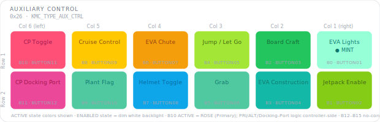

# KCMk1_Auxiliary_Control

**Module:** Auxiliary Control (AUX CTRL)  
**Version:** 1.0  
**Date:** 2026-06-28  
**Author:** J. Rostoker — Jeb's Controller Works  
**License:** GNU General Public License v3.0 (GPL-3.0)  
**Hardware:** KC-01-1802 Button Module Base v1.1  
**Library:** KerbalButtonCore v2.1.0  

---

## Overview

The Auxiliary Control module (AUX CTRL) provides twelve mixed-function buttons for Kerbal Space Program: EVA kerbal controls, rover cruise control, and vessel control-point selection. The functions are grouped by game context — most buttons act only during EVA, one is rover-specific, and the control-point buttons work in all modes.

This module replaces the former standalone 6-button EVA module (PCB KC-01-1852). It is now a standard 12-button KerbalButtonCore module built on the KC-01-1802 Button Module Base, identical in form to Action Control and UI Control.

This module uses all 12 NeoPixel RGB button positions (KBC indices 0–11). KBC indices 12–15 are no-connects on the PCB.

As with Action Control and UI Control, all functions are resolved controller-side. The module only reports button events and renders the LED states the controller commands; it has no knowledge of game state, control points, or keystrokes.

---

## Module Identity

| Parameter | Value |
|---|---|
| I2C Address | `0x26` |
| Module Type ID | `0x07` (KMC_TYPE_AUX_CTRL) |
| Capability Flags | `0x00` (core states only) |
| Extended States | No |
| NeoPixel Buttons | 12 (KBC indices 0–11) |
| Not Installed | KBC indices 12–15 (no-connect) |
| PCB | KC-01-1802 Button Module Base v1.1 |
| Panel | B2 |

---

## Panel Layout

Physical panel orientation: 2 rows × 6 columns. Column 6 is leftmost, Column 1 is rightmost. Even KBC indices populate Row 1, odd KBC indices populate Row 2. Button numbering starts top-right (B0) and proceeds left across each row.



```
              Col 6        Col 5        Col 4        Col 3        Col 2        Col 1
            (left)                                                          (right)
          +-----------+-----------+-----------+-----------+-----------+-----------+
 Row 1    |    B10    |    B8     |    B6     |    B4     |    B2     |    B0     |
          | CP Toggle | Cruise    | EVA Chute | Jump /    | Board     | EVA       |
          |  (ROSE)   | Control   | (AMBER)   | Let Go    | Craft     | Lights    |
          |           | (GOLD)    |           |(CHARTREUSE)| (GREEN)  | (MINT)    |
          +-----------+-----------+-----------+-----------+-----------+-----------+
 Row 2    |    B11    |    B9     |    B7     |    B5     |    B3     |    B1     |
          | CP Docking| Plant Flag| Helmet    | Grab      | EVA       | Jetpack   |
          | Port      | (SEAFOAM) | Toggle    | (SEAFOAM) | Construct.| Enable    |
          | (PINK)    |           | (SKY)     |           | (TEAL)    | (LIME)    |
          +-----------+-----------+-----------+-----------+-----------+-----------+
```

Active state colors shown. All NeoPixel buttons illuminate dim white in the ENABLED state.

---

## Button Reference

### NeoPixel Buttons (KBC indices 0–11)

The function is resolved controller-side; the module reports button events only.

| KBC Index | PCB Label | Function | Active Color | Active When | Controller Implementation |
|---|---|---|---|---|---|
| B0 | BUTTON01 | EVA Lights | MINT | isEVA | KEYBOARD_EMULATOR U |
| B1 | BUTTON02 | Jetpack Enable | LIME | isEVA | KEYBOARD_EMULATOR R |
| B2 | BUTTON03 | Board Craft | GREEN | isEVA | KEYBOARD_EMULATOR B |
| B3 | BUTTON04 | EVA Construction | TEAL | isEVA | KEYBOARD_EMULATOR I |
| B4 | BUTTON05 | Jump / Let Go | CHARTREUSE | isEVA | KEYBOARD_EMULATOR Space |
| B5 | BUTTON06 | Grab | SEAFOAM | isEVA | KEYBOARD_EMULATOR F |
| B6 | BUTTON07 | EVA Chute | AMBER | isEVA | KEYBOARD_EMULATOR P |
| B7 | BUTTON08 | Helmet Toggle | SKY | isEVA | KEYBOARD_EMULATOR O |
| B8 | BUTTON09 | Cruise Control | GOLD | rover mode | Controller-side hold — press to set wheel throttle, press again to release |
| B9 | BUTTON10 | Plant Flag | SEAFOAM | isEVA | KEYBOARD_EMULATOR G (controller flashes briefly on press, returns to ENABLED) |
| B10 | BUTTON11 | CP Toggle (PRI/ALT) | ROSE (Primary) / CORAL (Alternate) | all modes | Cycles base CAG 35/36 (mutually exclusive) |
| B11 | BUTTON12 | CP Docking Port | PINK | all modes | Base CAG 37 (deactivates PRI/ALT) |

KBC indices 12–15 (BUTTON13–16) are no-connects on the PCB.

#### Context Notes

- **EVA buttons (B0–B7, B9)** act only when the controller has `isEVA = true`. With no kerbal on EVA the controller leaves these in the ENABLED (dim white) state and ignores presses.
- **Cruise Control (B8)** is a rover-mode function. It is a controller-side hold: the first press sets the wheel throttle, the next press releases it.
- **Control-Point buttons (B10/B11)** work in all modes (see Control Point Logic below).
- **Plant Flag (B9)** is momentary — the controller flashes the button briefly on press, then returns it to ENABLED.

### Color Design Notes

- **EVA cluster (B0–B7, B9)** — each EVA action carries a distinct hue so the active kerbal action is identifiable at a glance: EVA Lights (MINT), Jetpack Enable (LIME), Board Craft (GREEN), EVA Construction (TEAL), Jump / Let Go (CHARTREUSE), Grab (SEAFOAM), EVA Chute (AMBER), Helmet Toggle (SKY), Plant Flag (SEAFOAM). Grab and Plant Flag share SEAFOAM as paired "interact with the world" actions.
- **Cruise Control (GOLD)** — gold marks the rover throttle hold, consistent with power/throttle-adjacent gold elsewhere on the controller.
- **Control Point (ROSE / CORAL / PINK)** — the control-point cluster shares the warm rose/pink family. ROSE is Primary, CORAL is Alternate, PINK is the Docking-Port control point. See Control Point Logic.

### Control Point Logic

B10 (CP Toggle) and B11 (CP Docking Port) select the vessel control point. The three states are **mutually exclusive** and are managed controller-side via base Custom Action Groups (CAGs) 35, 36, and 37, adjusted by the active control-group offset:

| State | Source Button | Base CAG | Active Color |
|---|---|---|---|
| Primary | B10 (press once) | 35 | ROSE |
| Alternate | B10 (press again) | 36 | CORAL |
| Docking Port | B11 | 37 | PINK |

- **B10 CP Toggle** cycles between Primary (CAG 35) and Alternate (CAG 36). Selecting either deactivates the Docking-Port control point.
- **B11 CP Docking Port** selects CAG 37 and deactivates both Primary and Alternate.
- Because this module has **no extended states**, B10 has a single ACTIVE colour: **ROSE** (Primary). The Primary (ROSE) / Alternate (CORAL) visual distinction and the mutually-exclusive PRI / ALT / Docking-Port logic are entirely controller-side — the module simply renders ACTIVE in ROSE when commanded.

---

## LED States

This module uses core LED states only. There are no extended states.

| State | NeoPixel Behavior |
|---|---|
| OFF | Unlit |
| ENABLED | Dim white backlight |
| ACTIVE | Full brightness, button color |

The module powers on dark (BOOT_READY → DISABLED). On `CMD_ENABLE` from the controller, all 12 NeoPixel buttons illuminate to the ENABLED (dim white) state. The controller then drives individual buttons to ACTIVE as game context dictates.

---

## Wiring

### NeoPixel Button Inputs

PCB connectors P2/P3/P4 map BUTTON01–BUTTON12 to KBC indices 0–11 in order.

| PCB Connector | PCB Label | KBC Index | Function |
|---|---|---|---|
| P2 | BUTTON01 | 0 | EVA Lights |
| P2 | BUTTON02 | 1 | Jetpack Enable |
| P2 | BUTTON03 | 2 | Board Craft |
| P2 | BUTTON04 | 3 | EVA Construction |
| P3 | BUTTON05 | 4 | Jump / Let Go |
| P3 | BUTTON06 | 5 | Grab |
| P3 | BUTTON07 | 6 | EVA Chute |
| P3 | BUTTON08 | 7 | Helmet Toggle |
| P4 | BUTTON09 | 8 | Cruise Control |
| P4 | BUTTON10 | 9 | Plant Flag |
| P4 | BUTTON11 | 10 | CP Toggle (PRI/ALT) |
| P4 | BUTTON12 | 11 | CP Docking Port |

KBC indices 12–15 (BUTTON13–16) are no-connects on the PCB.

---

## Installation

### Prerequisites

1. Arduino IDE with megaTinyCore installed
2. KerbalButtonCore library installed (`Sketch → Include Library → Add .ZIP Library`)
3. ShiftIn library installed (InfectedBytes/ArduinoShiftIn)
4. tinyNeoPixel_Static included with megaTinyCore — no separate install needed

### Arduino IDE Settings

| Setting | Value |
|---|---|
| Board | ATtiny816 (megaTinyCore) |
| Clock | 10 MHz internal or higher |
| tinyNeoPixel Port | **Port A** — critical for NeoPixel timing |
| Programmer | jtag2updi or SerialUPDI |

### Flash Procedure

1. Open `KCMk1_Auxiliary_Control.ino` in Arduino IDE
2. Confirm IDE settings above
3. Connect UPDI programmer to the module's UPDI header
4. Click Upload

### Verify Operation

After flashing, the module powers on dark (BOOT_READY → DISABLED). Once the controller sends `CMD_ENABLE`, all 12 NeoPixel buttons illuminate in a dim white ENABLED state. Use the `DiagnosticDump` example sketch from the KerbalButtonCore library for full verification.

---

## I2C Bus Position

This module occupies address `0x26`. The system controller expects `KMC_TYPE_AUX_CTRL` (0x07) at this address during startup enumeration.

| Address | Module |
|---|---|
| `0x20` | UI Control |
| `0x21` | Function Control |
| `0x22` | Action Control |
| `0x23` | Stability Control |
| `0x24` | Vehicle Control |
| `0x25` | Time Control |
| `0x26` | **Auxiliary Control** ← this module |
| `0x27`–`0x2E` | Reserved / future modules |

---

## Protocol Reference

Full I2C protocol specification: `I2C_Protocol_Specification.md` v2.6

Standard 7-byte button state packet (module → controller, INT-triggered): a 3-byte universal header followed by a 4-byte payload (button events HI/LO, change mask HI/LO).

```
Byte 0:   Status byte   (lifecycle bits 1:0, fault bit 2, data-changed bit 3)
Byte 1:   Module Type ID
Byte 2:   Transaction counter
Byte 3:   Button events HI  (bit N = button N, current state)
Byte 4:   Button events LO  (bit N = button 8+N)
Byte 5:   Change mask  HI   (bit N = button N changed since last read)
Byte 6:   Change mask  LO
```

LED state command (controller → module):
```
CMD_SET_LED_STATE (0x02) + 8 bytes nibble-packed
Values for the B12–B15 nibbles are accepted but ignored (no LED hardware)
```

Identity response (controller → module, `CMD_GET_IDENTITY`):
```
Module Type ID 0x07 · firmware major/minor · capability flags 0x00
```

---

## Revision History

| Version | Date | Notes |
|---|---|---|
| 1.0 | 2026-06-28 | Initial release. Replaces the former standalone 6-button EVA module (KC-01-1852) with a standard 12-button KerbalButtonCore module on the KC-01-1802 Button Module Base. Adds Cruise Control (B8) and the control-point cluster (B10 CP Toggle PRI/ALT, B11 CP Docking Port). KerbalButtonCore v2.1.0, I2C protocol v2.6; core LED states only (no extended states). |
