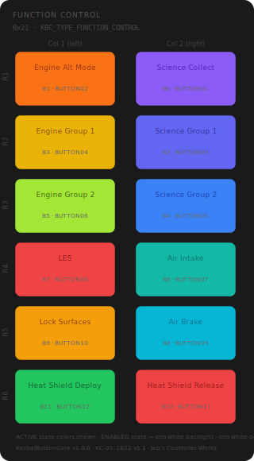

# KCMk1_Function_Control

**Module:** Function Control  
**Version:** 1.0  
**Date:** 2026-04-07  
**Author:** J. Rostoker — Jeb's Controller Works  
**License:** GNU General Public License v3.0 (GPL-3.0)  
**Hardware:** KC-01-1822 Button Module Base v1.1  
**Library:** KerbalButtonCore v1.0.0  

---

## Overview

The Function Control module provides science experiment, engine group, atmosphere, and thermal control functions for Kerbal Space Program. It is the second module on the KBC I2C bus.

This module uses 12 of the 16 available button positions. The four discrete LED button positions (KBC indices 12-15) are not populated on this module.

---

## Module Identity

| Parameter | Value |
|---|---|
| I2C Address | `0x21` |
| Module Type ID | `0x02` (KBC_TYPE_FUNCTION_CONTROL) |
| Capability Flags | `0x00` (core states only) |
| Extended States | No |
| Populated Buttons | 12 (KBC indices 0-11) |
| Discrete LEDs | None |

---

## Panel Layout

Physical panel orientation: 6 rows × 2 columns. Column 1 is leftmost, Column 2 is rightmost. Button numbering starts top-right (B0) and proceeds left within each row, then steps down.



Active state colors shown. All buttons illuminate dim white in the ENABLED state.

---

## Button Reference

| KBC Index | PCB Label | Function | Active Color | Color Family |
|---|---|---|---|---|
| B0 | BUTTON01 | Science Collect | PURPLE | Science family |
| B1 | BUTTON02 | Engine Alt Mode | ORANGE | Engine family |
| B2 | BUTTON03 | Science Group 1 | INDIGO | Science family |
| B3 | BUTTON04 | Engine Group 1 | YELLOW | Engine family |
| B4 | BUTTON05 | Science Group 2 | BLUE | Science family |
| B5 | BUTTON06 | Engine Group 2 | CHARTREUSE | Engine family |
| B6 | BUTTON07 | Air Intake | TEAL | Atmosphere family |
| B7 | BUTTON08 | LES | RED | Irreversible |
| B8 | BUTTON09 | Air Brake | CYAN | Atmosphere family |
| B9 | BUTTON10 | Lock Surfaces | AMBER | Awareness |
| B10 | BUTTON11 | Heat Shield Release | RED | Irreversible |
| B11 | BUTTON12 | Heat Shield Deploy | GREEN | Thermal |
| B12–B15 | — | Not installed | — | — |

### Color Design Notes

- **Science family (PURPLE → INDIGO → BLUE)** — three-step gradient darkening from Science Collect (broadest action) down through the individual groups. Purple associates with discovery and data collection.
- **Engine family (ORANGE → YELLOW → CHARTREUSE)** — warm gradient from Engine Alt Mode through Engine Groups 1 and 2. Warm tones associate with propulsion and energy.
- **Atmosphere family (TEAL, CYAN)** — two related blue-greens for Air Intake and Air Brake. Distinct from the science blue family.
- **LES (RED)** — irreversible jettison action. Strongest possible visual warning.
- **Heat Shield Release (RED)** — irreversible release action. Paired with GREEN deploy in Row 6 for a clear deploy/release distinction.
- **Lock Surfaces (AMBER)** — awareness color. Locking control surfaces is notable but not dangerous.

---

## LED States

This module uses core LED states only. No extended states (WARNING, ALERT, ARMED, PARTIAL_DEPLOY) are implemented.

| State | Behavior | Trigger |
|---|---|---|
| OFF | Unlit | Controller sends `0x0` for this button |
| ENABLED | Dim white backlight | Controller sends `0x1` — button ready |
| ACTIVE | Full brightness, button color | Controller sends `0x2` — function engaged |

---

## Wiring

Button inputs are connected sequentially to the shift register chain:

| PCB Connector | PCB Label | KBC Index | Function |
|---|---|---|---|
| P2 | BUTTON01 | 0 | Science Collect |
| P2 | BUTTON02 | 1 | Engine Alt Mode |
| P2 | BUTTON03 | 2 | Science Group 1 |
| P2 | BUTTON04 | 3 | Engine Group 1 |
| P3 | BUTTON05 | 4 | Science Group 2 |
| P3 | BUTTON06 | 5 | Engine Group 2 |
| P3 | BUTTON07 | 6 | Air Intake |
| P3 | BUTTON08 | 7 | LES |
| P4 | BUTTON09 | 8 | Air Brake |
| P4 | BUTTON10 | 9 | Lock Surfaces |
| P4 | BUTTON11 | 10 | Heat Shield Release |
| P4 | BUTTON12 | 11 | Heat Shield Deploy |
| P5 | BUTTON13–16 | 12–15 | Not connected |

---

## Installation

### Prerequisites

1. Arduino IDE with megaTinyCore installed
2. KerbalButtonCore library installed (`Sketch → Include Library → Add .ZIP Library`)
3. ShiftIn library installed (InfectedBytes/ArduinoShiftIn)
4. tinyNeoPixel_Static included with megaTinyCore — no separate install needed

### Arduino IDE Settings

| Setting | Value |
|---|---|
| Board | ATtiny816 (megaTinyCore) |
| Clock | 10 MHz internal or higher |
| tinyNeoPixel Port | **Port A** — critical for NeoPixel timing |
| Programmer | jtag2updi or SerialUPDI |

### Flash Procedure

1. Open `KCMk1_Function_Control.ino` in Arduino IDE
2. Confirm IDE settings above
3. Connect UPDI programmer to the module's UPDI header
4. Click Upload

### Verify Operation

After flashing, all 12 buttons should illuminate in a dim white ENABLED state within one second of power-on. Use the `DiagnosticDump` example sketch from the KerbalButtonCore library to verify button inputs and LED outputs before installing in the controller chassis.

---

## I2C Bus Position

This module occupies address `0x21`. The system controller expects `KBC_TYPE_FUNCTION_CONTROL` (0x02) at this address during startup enumeration.

Full bus address map:

| Address | Module |
|---|---|
| `0x20` | UI Control |
| `0x21` | **Function Control** ← this module |
| `0x22` | Action Control |
| `0x23` | Stability Control |
| `0x24` | Vehicle Control |
| `0x25` | Time Control |
| `0x26`–`0x2E` | Reserved / future modules |

---

## Protocol Reference

Full I2C protocol specification: `KBC_Protocol_Spec.md` v1.2

Button state packet (module → controller, INT-triggered):
```
Byte 0-1: Current state bitmask  (bit N = KBC index N, 1=pressed)
Byte 2-3: Change mask            (bit N = changed since last read)
```

LED state command (controller → module):
```
CMD_SET_LED_STATE (0x02) + 8 bytes nibble-packed
Two buttons per byte, high nibble first, values 0x0-0x2
```

---

## Revision History

| Version | Date | Notes |
|---|---|---|
| 1.0 | 2026-04-07 | Initial release |
