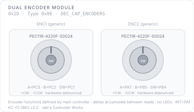

# KCMk1_Dual_Encoder

**Module:** Dual Rotary Encoder  
**Version:** 1.0  
**Date:** 2026-04-08  
**Author:** J. Rostoker — Jeb's Controller Works  
**License:** GNU General Public License v3.0 (GPL-3.0)  
**Hardware:** KC-01-1862 Dual Encoder Module v2.0  

---

## Overview

The Dual Encoder Module provides two independent quadrature rotary encoders with pushbutton switches for the Kerbal Controller Mk1. Encoder functions are defined by the main controller — this module reports signed delta values and button events without semantic interpretation. Deltas accumulate between reads so no clicks are lost if the controller is slow to respond.

This is a standalone sketch with tab-based organisation.

---

## Module Identity

| Parameter | Value |
|---|---|
| I2C Address | `0x2D` |
| Module Type ID | `0x0E` |
| Capability Flags | `0x04` (DEC_CAP_ENCODERS, bit 2) |
| Data Packet Size | 7 bytes (3-byte header + 4-byte payload) |
| Encoders | 2 × PEC11R-4220F-S0024 |
| Pushbuttons | 2 (one per encoder, active high) |
| LEDs | None |

---

## Panel Layout



Both encoders are identical hardware. Functions are assigned by the main controller at runtime.

---

## Encoder Reference

| Encoder | Pin A | Pin B | Pin SW | Delta Sign |
|---|---|---|---|---|
| ENC1 | PC3 | PC2 | PC1 | +CW / -CCW |
| ENC2 | PA7 | PB5 | PB4 | +CW / -CCW |

Both encoders are PEC11R-4220F-S0024 mounted on KC-01-1852 passive carrier boards (5-pin header per encoder) with hardware RC debounce (10nF capacitors on A and B channels) and 10k pull-up resistors. Software adds a 2ms guard against any residual glitches.

Pushbutton switches have hardware pull-down resistors — active high.

---

## I2C Protocol

### Data Packet (module → controller, 7 bytes)

```
Byte 0:  Status byte    (lifecycle / fault / data-changed)
Byte 1:  Module Type ID (0x0E)
Byte 2:  Transaction counter
Byte 3:  Button events  (bit0=ENC1_SW pressed, bit1=ENC2_SW pressed)
Byte 4:  Change mask    (same bit layout — set on both press and release)
Byte 5:  ENC1 delta     (signed int8, +CW, -CCW, since last read)
Byte 6:  ENC2 delta     (signed int8, +CW, -CCW, since last read)
```

**Delta behavior:** Encoder deltas accumulate between reads. If the module asserts INT and the controller does not read immediately, subsequent clicks continue accumulating — no clicks are lost. Deltas are clamped to the int8 range (-128 to +127) and cleared after each packet read.

**Button events (byte 3):** Rising-edge only — set in the packet that captures the press, cleared after read. Byte 4 (change mask) is set on both press and release edges.

INT asserts on any encoder movement or button press. All pending data is delivered in a single 7-byte read.

### Commands (controller → module)

All standard commands 0x01–0x0A are supported. Module-specific notes:

| Command | Behavior |
|---|---|
| CMD_SET_LED_STATE (0x02) | Accepted, ignored — no LEDs |
| CMD_SET_BRIGHTNESS (0x03) | Accepted, ignored — no LEDs |
| CMD_BULB_TEST (0x04) | Accepted, ignored — no user LEDs |
| CMD_SLEEP / CMD_DISABLE | Stops reporting, INT deasserted |
| CMD_WAKE / CMD_ENABLE | Resumes normal operation |
| CMD_RESET | Clears all deltas and button state |

---

## Wiring

| Signal | ATtiny816 Pin | Function |
|---|---|---|
| ENC1_A | PC3 (pin 18) | Encoder 1 channel A (hardware debounced) |
| ENC1_B | PC2 (pin 17) | Encoder 1 channel B (hardware debounced) |
| ENC1_SW | PC1 (pin 16) | Encoder 1 pushbutton (active high) |
| ENC2_A | PA7 (pin 8) | Encoder 2 channel A (hardware debounced) |
| ENC2_B | PB5 (pin 9) | Encoder 2 channel B (hardware debounced) |
| ENC2_SW | PB4 (pin 10) | Encoder 2 pushbutton (active high) |
| INT | PA1 (pin 20) | Interrupt output (active low) |
| SCL | PB0 (pin 14) | I2C clock |
| SDA | PB1 (pin 13) | I2C data |

Not connected: PA2, PA3, PA4, PA5, PA6, PC0, PB2, PB3.

---

## Tab Structure

```
KCMk1_Dual_Encoder.ino  — setup(), loop()
Config.h                 — pins, constants, I2C command bytes
Encoders.h / .cpp        — quadrature decode, delta accumulation
Buttons.h / .cpp         — pushbutton debounce and event tracking
I2C.h / .cpp             — protocol handler, packet build, INT management
```

---

## Installation

### Prerequisites

1. Arduino IDE with megaTinyCore installed
2. No additional libraries required

### Arduino IDE Settings

| Setting | Value |
|---|---|
| Board | ATtiny816 (megaTinyCore) |
| Clock | 10 MHz or higher |
| Programmer | jtag2updi or SerialUPDI |

### Flash Procedure

1. Open `KCMk1_Dual_Encoder.ino` in Arduino IDE
2. Confirm IDE settings
3. Connect UPDI programmer to the module's UPDI header
4. Click Upload

### Verify Operation

After flashing the module is immediately active — no enable command required (unlike the throttle module). Turn either encoder and confirm INT asserts and delta values change. Press the encoder pushbuttons and confirm button events are reported. Use an I2C analyzer or the system controller to read the 7-byte packet.

---

## I2C Bus Position

| Address | Module |
|---|---|
| `0x20`–`0x25` | Standard button modules |
| `0x26` | EVA Module |
| `0x27` | Reserved |
| `0x28` | Joystick Rotation |
| `0x29` | Joystick Translation |
| `0x2A` | GPWS Input Panel |
| `0x2B` | Pre-Warp Time |
| `0x2C` | Throttle Module |
| `0x2D` | **Dual Encoder** — this module |

---

## Revision History

| Version | Date | Notes |
|---|---|---|
| 1.0 | 2026-04-08 | Initial release |
| 2.0 | 2026-06-28 | I2C Protocol v2.0 conformance — 3-byte universal header added (7-byte data packet) |
| 2.1 | 2026-07-05 | Pin map realigned to KC-01-1862 v2.0 schematic — ENC1 A/SW swapped (A→PC3, SW→PC1); ENC2 moved to PA7/PB5/PB4. Board designator updated from KC-01-1871/1872 to KC-01-1862. |
