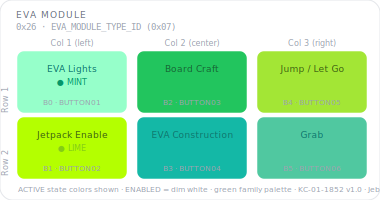

# KCMk1_EVA_Module

**Module:** EVA (Extra-Vehicular Activity) Control  
**Version:** 2.0  
**Date:** 2026-04-08  
**Author:** J. Rostoker — Jeb's Controller Works  
**License:** GNU General Public License v3.0 (GPL-3.0)  
**Hardware:** KC-01-1852 Half Button Module v1.0  
**Protocol:** Kerbal Controller Mk1 I2C Protocol  

---

## Overview

The EVA Module provides extra-vehicular activity controls for Kerbal Space Program including EVA lights, jetpack enable, boarding, construction, jumping, and grabbing. It uses a unified green family color palette to visually distinguish it from all cockpit control modules.

This module is **not** a KerbalButtonCore (KBC) module. It shares the same Kerbal Controller Mk1 I2C wire protocol as KBC modules but is implemented as a standalone sketch. The hardware design (KC-01-1852) differs from the KBC base board in several important ways — see Hardware Differences below.

> **Note:** This 6-button standalone board (KC-01-1852 "Half Button Module") is a *predecessor* to the 12-button "AUX CTRL" module documented at address `0x26` in the canonical Module UI Reference. The canonical `0x26` spec — AUX CTRL: 12 NeoPixel buttons driven by KerbalButtonCore, with controls such as CP Toggle/Docking, Cruise Control, and Plant Flag — is the target design. This firmware implements the current 6-button hardware, not that target.

---

## Module Identity

| Parameter | Value |
|---|---|
| I2C Address | `0x26` |
| Module Type ID | `0x07` (EVA_MODULE_TYPE_ID) |
| Firmware | 2.0 |
| Capability Flags | `0x00` (none reported — encoders unpopulated) |
| Extended States | No |
| NeoPixel Buttons | 6 (WS2811, PC0) |
| Button Input | 6 direct GPIO (no shift registers) |
| Encoders | 2 headers (future use — not implemented) |

---

## Panel Layout

Physical panel orientation: 2 rows x 3 columns. Column 1 is leftmost, Column 3 is rightmost. Button 0 is top-left.



Active state colors shown — all from the EVA green family palette. All buttons illuminate dim white in the ENABLED state.

---

## Button Reference

| Index | PCB Label | ATtiny Pin | Function | Active Color |
|---|---|---|---|---|
| B0 | BUTTON01 | PB3 | EVA Lights | MINT |
| B1 | BUTTON02 | PB2 | Jetpack Enable | LIME |
| B2 | BUTTON03 | PA7 | Board Craft | GREEN |
| B3 | BUTTON04 | PB5 | EVA Construction | TEAL |
| B4 | BUTTON05 | PA5 | Jump / Let Go | CHARTREUSE |
| B5 | BUTTON06 | PA6 | Grab | SEAFOAM |

### Color Design Notes

The EVA module uses a unified green family to distinguish it from all cockpit modules at a glance. The gradient runs from soft cool greens (MINT, SEAFOAM) through mid greens (GREEN, TEAL) to warm yellow-greens (LIME, CHARTREUSE):

- **EVA Lights (MINT)** — soft, cool, gentle. The light from a Kerbal's helmet is a delicate thing.
- **Jetpack Enable (LIME)** — bright and energetic. Propulsion is active and immediate.
- **Board Craft (GREEN)** — positive confirmed action. Returning to the vessel.
- **EVA Construction (TEAL)** — technical blue-green. Engineering and building.
- **Jump / Let Go (CHARTREUSE)** — warm and active. Physical action with consequence.
- **Grab (SEAFOAM)** — mid green, deliberate. Careful physical interaction.

---

## Color Palette

Only two colors are EVA-specific and defined locally in `Config.h`; they are not part of the shared system palette:

| Constant | RGB | Use |
|---|---|---|
| `EVA_LIME` | 180, 255, 0 | Jetpack Enable |
| `EVA_SEAFOAM` | 80, 200, 160 | Grab |

All other per-button colors are referenced directly from the shared **KerbalModuleCommon** palette (`KMC_*`):

| Constant | Use |
|---|---|
| `KMC_MINT` | EVA Lights |
| `KMC_GREEN` | Board Craft |
| `KMC_TEAL` | EVA Construction |
| `KMC_CHARTREUSE` | Jump / Let Go |

---

## Hardware Differences from KBC Base Module

| Feature | KBC Base (KC-01-1822) | EVA Module (KC-01-1852) |
|---|---|---|
| Button inputs | 74HC165 shift registers | Direct GPIO |
| Button count | 16 | 6 |
| NeoPixel count | 12 | 6 |
| NeoPixel pin | PA4 (Port A) | PC0 (Port C) |
| Discrete LEDs | 4 outputs | None |
| Encoders | None | 2 headers (future) |
| Library | KerbalButtonCore | Standalone sketch |

---

## I2C Protocol

This module implements the Kerbal Controller Mk1 I2C protocol independently. All standard commands are supported.

### Commands (controller → module)

| Command | Byte | Payload | Notes |
|---|---|---|---|
| CMD_GET_IDENTITY | `0x01` | None | Returns 4-byte identity packet |
| CMD_SET_LED_STATE | `0x02` | 8 bytes | Nibble-packed, buttons 0-5 only |
| CMD_SET_BRIGHTNESS | `0x03` | 1 byte | ENABLED state brightness 0-255 |
| CMD_BULB_TEST | `0x04` | None | All white for 2 seconds |
| CMD_SLEEP | `0x05` | None | LEDs off, reduced polling |
| CMD_WAKE | `0x06` | None | Resume, all buttons ENABLED |
| CMD_RESET | `0x07` | None | Clear all state, LEDs off |
| CMD_ACK_FAULT | `0x08` | None | Acknowledged, no fault tracking |
| CMD_ENABLE | `0x09` | None | Enter ACTIVE; all buttons set to ENABLED |
| CMD_DISABLE | `0x0A` | None | Enter DISABLED; LEDs off, defaults reset |

### Button State Response (7 bytes)

This module returns a 7-byte data packet as defined in the Kerbal Controller Mk1 I2C Protocol Specification Section 9.1. The first three bytes are the universal header; bytes 3-6 are the standard button payload. There are no encoder delta bytes (encoder hardware is unpopulated, capability `0x00`):

```
Byte 0:  Status         (lifecycle / fault / data-changed flags)
Byte 1:  Module Type ID (0x07)
Byte 2:  Transaction counter
Byte 3:  Button events HI (bits 0-5 = buttons 0-5, 1=pressed)
Byte 4:  Button events LO (always 0 — buttons 8-15 unused)
Byte 5:  Change mask  HI  (bits 0-5 = buttons 0-5, 1=changed)
Byte 6:  Change mask  LO  (always 0)
```

### Identity Response (4 bytes)

```
Byte 0:  0x07  (EVA_MODULE_TYPE_ID)
Byte 1:  0x02  (firmware major)
Byte 2:  0x00  (firmware minor)
Byte 3:  0x00  (capability flags — none reported; encoders unpopulated)
```

---

## Encoder Headers (Future Use)

Two 5-pin encoder headers (H1, H2) are present on the PCB for future extension. They are initialised as inputs but not currently active.

| Header | Signal | Pin |
|---|---|---|
| H1 | ENC1_A | PA3 |
| H1 | ENC1_B | PA2 |
| H1 | ENC1_SW | PA1 |
| H2 | ENC2_A | PC3 |
| H2 | ENC2_B | PC2 |
| H2 | ENC2_SW | PC1 |

Encoder support is currently unpopulated and is **not** present in the data packet — the firmware reports capability `0x00` and the 7-byte button state packet carries no encoder bytes. If and when encoders are implemented, both the packet format (adding delta bytes) and the reported capability flag would need to change. See `Encoders.cpp` for implementation guidance.

---

## Sketch Tab Structure

```
KCMk1_EVA_Module.ino  — setup(), loop(), top-level coordination
Config.h              — pins, constants, color palette, helpers
Buttons.h / .cpp      — direct GPIO input, debounce, dual-buffer
Encoders.h / .cpp     — encoder interface stub (future use)
LEDs.h / .cpp         — tinyNeoPixel_Static control, 6 LEDs
I2C.h / .cpp          — Wire callbacks, command dispatch, INT pin
```

---

## Installation

### Prerequisites

1. Arduino IDE with megaTinyCore installed
2. tinyNeoPixel_Static included with megaTinyCore — no separate install
3. No additional libraries required

### Arduino IDE Settings

| Setting | Value |
|---|---|
| Board | ATtiny816 (megaTinyCore) |
| Clock | 10 MHz internal or higher |
| tinyNeoPixel Port | **Port C** — NeoPixel is on PC0 |
| Programmer | jtag2updi or SerialUPDI |

### Flash Procedure

1. Open `KCMk1_EVA_Module.ino` in Arduino IDE
2. Confirm IDE settings — especially **Port C** for NeoPixel
3. Connect UPDI programmer to the module's UPDI header
4. Click Upload

### Verify Operation

After flashing all 6 buttons should illuminate dim white within one second. Press each button and confirm the INT pin asserts low. Use a logic analyzer or I2C controller to verify the 7-byte response packet.

---

## I2C Bus Position

| Address | Module |
|---|---|
| `0x20` | UI Control (KBC) |
| `0x21` | Function Control (KBC) |
| `0x22` | Action Control (KBC) |
| `0x23` | Stability Control (KBC) |
| `0x24` | Vehicle Control (KBC) |
| `0x25` | Time Control (KBC) |
| `0x26` | **EVA Module** — this module |
| `0x27`–`0x2E` | Reserved / future modules |

---

## Revision History

| Version | Date | Notes |
|---|---|---|
| 1.0 | 2026-04-08 | Initial release |
| 2.0 | 2026-06-28 | Updated to I2C protocol v2.x: 3-byte universal header (7-byte data packet), BOOT_READY/DISABLED/ACTIVE/SLEEPING lifecycle, CMD_ENABLE/CMD_DISABLE; encoder bytes removed (capability 0x00); corrected button pin map and color-palette documentation. |
