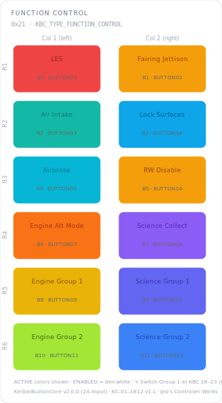

# KCMk1_Function_Control

**Module:** Function Control  
**Version:** 2.0  
**Date:** 2026-06-28  
**Author:** J. Rostoker — Jeb's Controller Works  
**License:** GNU General Public License v3.0 (GPL-3.0)  
**Hardware:** KC-01-1812 Wide Button Module Base v1.1  
**Library:** KerbalButtonCore v2.0.0 (24-input)  

---

## Overview

The Function Control module provides launch, flight-system, aerodynamic, and engine/science group functions for Kerbal Space Program over 12 NeoPixel RGB buttons, plus the eight **Switch Group 1** panel switches read as discrete inputs.

This module reads **24 inputs** via three daisy-chained 74HC165 shift registers: the 12 NeoPixel buttons at KBC indices 0–11, and Switch Group 1 at KBC indices 16–23. KBC indices 12–15 are no-connects. The 24-input variant is selected in the sketch via `#define KBC_INPUT_COUNT 24` / `KBC_SHIFTREG_COUNT 3`.

---

## Module Identity

| Parameter | Value |
|---|---|
| I2C Address | `0x21` |
| Module Type ID | `0x02` (KBC_TYPE_FUNCTION_CONTROL) |
| Capability Flags | `0x00` (core states only) |
| Extended States | No |
| NeoPixel Buttons | 12 (KBC indices 0–11) |
| Switch Group 1 inputs | 8 (KBC indices 16–23, discrete, no LED) |
| Not Installed | KBC indices 12–15 (no-connect) |
| Data packet | 9 bytes (3-byte header + 6-byte payload) |

---

## Panel Layout

Physical panel orientation: 6 rows × 2 columns. Column 1 is leftmost, Column 2 is rightmost.



Active state colors shown. All buttons illuminate dim white in the ENABLED state.

---

## Button Reference

### NeoPixel Buttons (KBC indices 0–11)

| KBC Index | PCB Label | Function | Active Color | Color Family |
|---|---|---|---|---|
| B0 | BUTTON01 | LES (Launch Escape System) | RED | Irreversible |
| B1 | BUTTON02 | Fairing Jettison | AMBER | Awareness |
| B2 | BUTTON03 | Air Intake | TEAL | Atmosphere family |
| B3 | BUTTON04 | Lock Surfaces | SKY | Awareness |
| B4 | BUTTON05 | Airbrake | CYAN | Atmosphere family |
| B5 | BUTTON06 | Reaction Wheel Disable | AMBER | Awareness |
| B6 | BUTTON07 | Engine Alt Mode | ORANGE | Engine family |
| B7 | BUTTON08 | Science Collect | PURPLE | Science family |
| B8 | BUTTON09 | Engine Group 1 | YELLOW | Engine family |
| B9 | BUTTON10 | Science Group 1 | INDIGO | Science family |
| B10 | BUTTON11 | Engine Group 2 | CHARTREUSE | Engine family |
| B11 | BUTTON12 | Science Group 2 | BLUE | Science family |
| B12–B15 | — | No-connect (PCB) | — | — |

### Switch Group 1 (KBC indices 16–23, discrete inputs, no LED)

Reported in the button-event payload (inputs 16–23). Switch semantics and controller actions are resolved on the main controller; the module reports raw input state only.

| KBC Index | Switch | OFF / ON |
|---|---|---|
| B16 | MSTR | OPER / RESET |
| B17 | DISPL | OPER / CLR |
| B18 | ENGINE | SAFE / ARM |
| B19 | THROTTLE | INOP / ACT |
| B20 | SCE | NORM / AUX |
| B21 | UPTLM | INHIB / XMIT |
| B22 | LTG | NORM / TEST |
| B23 | THRTL | STD / FINE |

### Color Design Notes

- **Engine family (ORANGE → YELLOW → CHARTREUSE)** — warm gradient from Engine Alt Mode through Engine Groups 1 and 2.
- **Science family (PURPLE → INDIGO → BLUE)** — gradient from Science Collect down through the groups.
- **Atmosphere family (TEAL, CYAN)** — Air Intake and Airbrake.
- **LES (RED)** — irreversible jettison action; strongest possible visual warning.
- **Awareness (AMBER / SKY)** — Fairing Jettison and Reaction Wheel Disable (amber); Lock Surfaces (sky).

---

## LED States

This module uses core LED states only. No extended states (WARNING, ALERT, ARMED, PARTIAL_DEPLOY) are implemented.

| State | Behavior | Trigger |
|---|---|---|
| OFF | Unlit | Controller sends `0x0` for this button |
| ENABLED | Dim white backlight | Controller sends `0x1` — button ready |
| ACTIVE | Full brightness, button color | Controller sends `0x2` — function engaged |

---

## Wiring

Button inputs are connected to the three-register shift chain (U14/U15/U16):

| PCB Connector | PCB Label | KBC Index | Function |
|---|---|---|---|
| P2 | BUTTON01 | 0 | LES |
| P2 | BUTTON02 | 1 | Fairing Jettison |
| P2 | BUTTON03 | 2 | Air Intake |
| P2 | BUTTON04 | 3 | Lock Surfaces |
| P3 | BUTTON05 | 4 | Airbrake |
| P3 | BUTTON06 | 5 | Reaction Wheel Disable |
| P3 | BUTTON07 | 6 | Engine Alt Mode |
| P3 | BUTTON08 | 7 | Science Collect |
| P4 | BUTTON09 | 8 | Engine Group 1 |
| P4 | BUTTON10 | 9 | Science Group 1 |
| P4 | BUTTON11 | 10 | Engine Group 2 |
| P4 | BUTTON12 | 11 | Science Group 2 |
| — | (no-connect) | 12–15 | Not connected |
| DB127S #1 | SW1–4 | 16–19 | Switch Group 1: MSTR, DISPL, ENGINE, THROTTLE |
| DB127S #2 | SW5–8 | 20–23 | Switch Group 1: SCE, UPTLM, LTG, THRTL |

---

## Installation

### Prerequisites

1. Arduino IDE with megaTinyCore installed
2. KerbalButtonCore library installed (`Sketch → Include Library → Add .ZIP Library`)
3. ShiftIn library installed (InfectedBytes/ArduinoShiftIn)
4. tinyNeoPixel_Static included with megaTinyCore — no separate install needed

### Arduino IDE Settings

| Setting | Value |
|---|---|
| Board | ATtiny816 (megaTinyCore) |
| Clock | 10 MHz internal or higher |
| tinyNeoPixel Port | **Port A** — critical for NeoPixel timing |
| Programmer | jtag2updi or SerialUPDI |

### Flash Procedure

1. Open `KCMk1_Function_Control.ino` in Arduino IDE
2. Confirm IDE settings above
3. Connect UPDI programmer to the module's UPDI header
4. Click Upload

### Verify Operation

After flashing, the module powers on dark (BOOT_READY → DISABLED). Once the controller sends `CMD_ENABLE`, all 12 NeoPixel buttons illuminate in a dim white ENABLED state. Verify the Switch Group 1 inputs (KBC indices 16–23) are reported in the data packet. Use the `DiagnosticDump` example sketch from the KerbalButtonCore library to verify button/switch inputs and LED outputs before installing in the controller chassis.

---

## I2C Bus Position

This module occupies address `0x21`. The system controller expects `KBC_TYPE_FUNCTION_CONTROL` (0x02) at this address during startup enumeration.

Full bus address map:

| Address | Module |
|---|---|
| `0x20` | UI Control |
| `0x21` | **Function Control** ← this module |
| `0x22` | Action Control |
| `0x23` | Stability Control |
| `0x24` | Vehicle Control |
| `0x25` | Time Control |
| `0x26`–`0x2E` | Reserved / future modules |

---

## Protocol Reference

Full I2C protocol specification: `I2C_Protocol_Specification.md` v2.6 (§9.1.1 switch-group variant)

Button state packet (module → controller, INT-triggered, 9 bytes):
```
Byte 0:   Status byte   (lifecycle bits 1:0, fault bit 2, data-changed bit 3)
Byte 1:   Module Type ID
Byte 2:   Transaction counter
Byte 3:   Button events  0  (bit N = input N)        — buttons 0-7
Byte 4:   Button events  1  (bit N = input 8+N)      — buttons 8-15
Byte 5:   Button events  2  (bit N = input 16+N)     — Switch Group 1 (16-23)
Byte 6:   Change mask    0
Byte 7:   Change mask    1
Byte 8:   Change mask    2                            — Switch Group 1
```

LED state command (controller → module):
```
CMD_SET_LED_STATE (0x02) + 8 bytes nibble-packed
Two buttons per byte, high nibble first, values 0x0-0x2.
Only the 12 NeoPixel positions have LED hardware.
```

---

## Revision History

| Version | Date | Notes |
|---|---|---|
| 1.0 | 2026-04-07 | Initial release |
| 2.0 | 2026-06-28 | Relaid out to the v5.x panel (LES / Fairing Jettison / Air Intake / Lock Surfaces / Airbrake / RW Disable / Engine Alt / Science Collect / Engine Grp 1-2 / Science Grp 1-2) and added Switch Group 1 at KBC indices 16–23 via the 24-input / 3-byte shift-register variant (KerbalButtonCore v2.0, I2C protocol v2.6). Packet is now 9 bytes (3-byte header + 6-byte payload); module powers on dark until CMD_ENABLE. PCB designator corrected to KC-01-1812. |
