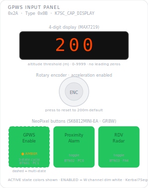

# KCMk1_GPWS_Input

**Module:** GPWS Input Panel  
**Version:** 2.0.0  
**Date:** 2026-04-28  
**Author:** J. Rostoker — Jeb's Controller Works  
**License:** GNU General Public License v3.0 (GPL-3.0)  
**Hardware:** KC-01-1880 7-Segment Display Module v2.0  
**Library:** Kerbal7SegmentCore v2.0.0  

---

## Overview

The GPWS Input Panel allows the pilot to configure ground proximity warning system behaviour in Kerbal Space Program. A 4-digit display shows the current altitude threshold. Three illuminated buttons control GPWS mode, proximity alarm, and rendezvous radar states. The rotary encoder adjusts the threshold value with dynamic acceleration. All state is reported to the master controller on each change.

---

## Module Identity

| Parameter | Value |
|---|---|
| I2C Address | `0x2A` |
| Module Type ID | `KMC_TYPE_GPWS_INPUT` (0x0B) |
| Capability Flags | `KMC_CAP_DISPLAY` (0x10) |
| Data Packet Size | 8 bytes (3-byte header + 5-byte payload) |
| NeoPixel Buttons | 3 (SK6812MINI-EA, NEO_GRB 3-byte) |
| GPIO Buttons | 1 (BTN_EN — encoder pushbutton, no LED) |
| Display | 4-digit MAX7219, 0–9999m |
| Encoder | PEC11R-4220F-S0024, hardware RC debounced |

---

## Panel Layout



---

## Button Reference

| Button | Pin | Function | Behaviour | Colours |
|---|---|---|---|---|
| BTN01 | PA1 | GPWS Enable | 3-state cycle | BACKLIT → GREEN → AMBER → BACKLIT |
| BTN02 | PC2 | Proximity Alarm | Toggle | BACKLIT ↔ GREEN |
| BTN03 | PC1 | Rendezvous Radar | Toggle | BACKLIT ↔ GREEN |
| BTN_EN | PB3 | Reset Threshold | Momentary | No LED — resets display to 200m |

### BTN01 State Meanings

| State | Colour | Meaning |
|---|---|---|
| 0 | BACKLIT (dim warm) | GPWS disabled — display blank |
| 1 | GREEN | Full GPWS active — warning at threshold |
| 2 | AMBER | Proximity tone only |

### BTN02 Special Behaviour

Pressing BTN02 while BTN01 is in state 1 (GREEN / full GPWS) forces BTN01 to state 2 (AMBER / proximity only) and simultaneously activates the proximity alarm. Both changes are reported in the same packet.

### INT Suppression

When BTN01 is in state 0 (GPWS off), BTN02, BTN03, and encoder events are silently discarded — no INT is asserted for them. BTN01 itself always reports since it is the only way to exit the suppressed state.

---

## Display Reference

| Parameter | Value |
|---|---|
| Range | 0–9999 |
| Units | Metres (altitude threshold) |
| Default value | 200 |
| Leading zeros | Suppressed — shows `200` not `0200` |
| Decimal point | Not used |

Display is only active when GPWS mode is state 1 or 2. In state 0 the display is blanked regardless of threshold value.

### Encoder Acceleration

Step size based on consecutive clicks in same direction. Direction reversal resets count — first click of new direction always steps by 1.

| Consecutive clicks | Step |
|---|---|
| 1–14 | ±1 |
| 15–29 | ±10 |
| 30–49 | ±100 |
| 50+ | ±1000 |

Value clamps at 0 and 9999.

---

## I2C Protocol

### Data Packet (8 bytes, module → controller)

```
Byte 0:  Status      lifecycle (bits 1:0), fault (bit 2), data_changed (bit 3)
Byte 1:  Type ID     0x0B
Byte 2:  Counter     transaction counter, uint8, wraps 255→0
Byte 3:  Events      rising edge bitmask (bit0=BTN01, bit1=BTN02,
                      bit2=BTN03, bit3=BTN_EN)
Byte 4:  Change mask same bit layout
Byte 5:  State       bits 1:0 = BTN01 cycle state (0/1/2),
                      bit 2 = BTN02 active,
                      bit 3 = BTN03 active
Byte 6:  Value HIGH  threshold int16, big-endian
Byte 7:  Value LOW
```

INT asserts LOW on any reportable event. Deasserts after master reads packet.

### Commands accepted

All standard `KMC_CMD_*` commands are accepted. Module-specific behaviour:

| Command | Effect |
|---|---|
| `CMD_ENABLE` | Buttons go backlit, display state follows GPWS mode |
| `CMD_DISABLE` | All dark, all state reset to defaults |
| `CMD_SLEEP` | State frozen exactly, INT suppressed, no visual change |
| `CMD_WAKE` | Resume — sends current state packet |
| `CMD_RESET` | Clears all state to defaults, buttons go backlit, display blanks. Module stays ACTIVE |
| `CMD_SET_VALUE` | Sets threshold. Display updates if GPWS is active |
| `CMD_BULB_TEST 0x01` | All pixels white, all display segments on. **Commandable regardless of lifecycle state** |
| `CMD_BULB_TEST 0x00` | Restore previous state |
| `CMD_SET_BRIGHTNESS` | Top nibble sets MAX7219 intensity (0–15) |
| `CMD_SET_LED_STATE` | Payload byte passed to sketch — this module ignores it |

### Vessel switch

This module takes no action on vessel switch. The master controller does not need to send any command. GPWS state persists across vessel switches — the pilot configures as needed for each flight.

---

## Lifecycle

```
Power on → BOOT_READY → master sends DISABLE → dark, defaults
Flight scene load → ENABLE → buttons backlit, pilot configures
Game pause → SLEEP → state frozen exactly, no visual change
Game resume → WAKE → resumes, sends state packet
Flight scene exit / serial loss → DISABLE → all dark, defaults reset
```

---

## Wiring

| Signal | ATtiny816 | Net |
|---|---|---|
| CLK | PA7 (pin 8) | MAX7219 SPI clock |
| DATA | PA6 (pin 7) | MAX7219 SPI data |
| LOAD | PA5 (pin 6) | MAX7219 SPI latch |
| BTN01 | PA1 (pin 20) | BUTTON01 |
| BTN02 | PC2 (pin 17) | BUTTON02 |
| BTN03 | PC1 (pin 16) | BUTTON03 |
| NEOPIX | PC3 (pin 18) | SK6812 data chain |
| BTN_EN | PB3 (pin 11) | BUTTON_EN |
| ENC_A | PB4 (pin 10) | Encoder channel A |
| ENC_B | PB5 (pin 9) | Encoder channel B |
| INT | PC0 (pin 15) | Interrupt output (active LOW) |
| SCL | PB0 (pin 14) | I2C clock |
| SDA | PB1 (pin 13) | I2C data |

---

## Installation

### Prerequisites

1. Arduino IDE with megaTinyCore installed
2. KerbalModuleCommon v1.1.0 (Sketch → Include Library → Add .ZIP)
3. Kerbal7SegmentCore v2.0.0 (Sketch → Include Library → Add .ZIP)

### Arduino IDE Settings

| Setting | Value |
|---|---|
| Board | ATtiny816 (megaTinyCore) |
| Clock | 20 MHz internal |
| Programmer | serialUPDI |

### Flash Procedure

1. Open `KCMk1_GPWS_Input.ino`
2. Confirm settings above
3. Connect UPDI programmer to module UPDI header
4. Upload

---

## Revision History

| Version | Date | Notes |
|---|---|---|
| 2.0.0 | 2026-04-28 | Complete rewrite for Kerbal7SegmentCore v2.0.0. All application logic moved to sketch. Library is now hardware interface only. Encoder acceleration sketch-implemented. INT suppression redesigned. Vessel switch is a no-op. |
| 1.1.0 | 2026-04-27 | Updated for Kerbal7SegmentCore v1.1.0 |
| 1.0 | 2026-04-08 | Initial release |

---

## License

GNU General Public License v3.0 — https://www.gnu.org/licenses/gpl-3.0.html  
Code by J. Rostoker, Jeb's Controller Works.
