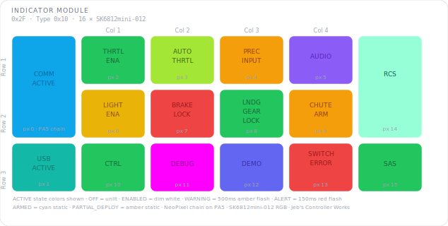

# KCMk1_Indicator_Module

**Module:** Indicator Module  
**Version:** 1.0  
**Date:** 2026-04-08  
**Author:** J. Rostoker — Jeb's Controller Works  
**License:** GNU General Public License v3.0 (GPL-3.0)  
**Hardware:** KC-01 Indicator Module v1.0  

---

## Overview

The Indicator Module provides 16 individually addressable RGB status indicators for the Kerbal Controller Mk1. Each indicator displays a system state driven entirely by the main controller via `CMD_SET_LED_STATE`. The module uses the standard KBC nibble-packed LED state protocol — the controller sends a state value (OFF, ENABLED, ACTIVE, WARNING, ALERT, ARMED, PARTIAL_DEPLOY) for each pixel and the module handles all color mapping, flash timing, and animation.

Two rotary encoder headers (H1, H2) are present on the PCB for future expansion but are not currently installed.

This is a standalone sketch with tab-based organisation.

---

## Module Identity

| Parameter | Value |
|---|---|
| I2C Address | `0x2F` |
| Module Type ID | `0x10` |
| Capability Flags | `0x00` |
| NeoPixels | 16 × SK6812mini-012 RGB |
| NeoPixel Port | **Port A** (PA5 — not Port C) |
| Encoder Headers | H1, H2 (not installed) |

---

## Panel Layout



ACTIVE state colors shown. All other states (ENABLED, WARNING, ALERT, ARMED, PARTIAL_DEPLOY) use system-wide colors defined in the KBC protocol.

---

## Pixel Reference

| Pixel | Indicator | Active Color | Color Name |
|---|---|---|---|
| 0 | COMM ACTIVE |  `#0EA5E9` | SKY |
| 1 | USB ACTIVE |  `#14B8A6` | TEAL |
| 2 | THRTL ENA |  `#22C55E` | GREEN |
| 3 | AUTO THRTL |  `#A3E635` | CHARTREUSE |
| 4 | PREC INPUT |  `#F59E0B` | AMBER |
| 5 | AUDIO |  `#8B5CF6` | PURPLE |
| 6 | LIGHT ENA |  `#EAB308` | YELLOW |
| 7 | BRAKE LOCK |  `#EF4444` | RED |
| 8 | LNDG GEAR LOCK |  `#22C55E` | GREEN |
| 9 | CHUTE ARM |  `#F59E0B` | AMBER |
| 10 | CTRL |  `#22C55E` | GREEN |
| 11 | DEBUG |  `#FF00FF` | MAGENTA |
| 12 | DEMO |  `#6366F1` | INDIGO |
| 13 | SWITCH ERROR |  `#EF4444` | RED |
| 14 | RCS |  `#96FFD8` | MINT |
| 15 | SAS |  `#22C55E` | GREEN |

---

## LED State Reference

| Value | State | Behavior | Color |
|---|---|---|---|
| `0x0` | OFF | Unlit | — |
| `0x1` | ENABLED | Dim static | White (all pixels) |
| `0x2` | ACTIVE | Full brightness static | Per-pixel (see table above) |
| `0x3` | WARNING | Flashing 500ms/500ms | Amber (all pixels) |
| `0x4` | ALERT | Flashing 150ms/150ms | Red (all pixels) |
| `0x5` | ARMED | Full brightness static | Cyan (all pixels) |
| `0x6` | PARTIAL_DEPLOY | Full brightness static | Amber (all pixels) |

All flash timing is handled on the module. The controller only sends state values. If both WARNING and ALERT states are present simultaneously, ALERT flash timing takes priority.

---

## I2C Protocol

### Primary Command — CMD_SET_LED_STATE (0x02)

8-byte nibble-packed payload. High nibble of byte 0 = pixel 0, low nibble = pixel 1, and so on:

```
Byte 0:  Pixel 0  [7:4]  |  Pixel 1  [3:0]
Byte 1:  Pixel 2  [7:4]  |  Pixel 3  [3:0]
Byte 2:  Pixel 4  [7:4]  |  Pixel 5  [3:0]
Byte 3:  Pixel 6  [7:4]  |  Pixel 7  [3:0]
Byte 4:  Pixel 8  [7:4]  |  Pixel 9  [3:0]
Byte 5:  Pixel 10 [7:4]  |  Pixel 11 [3:0]
Byte 6:  Pixel 12 [7:4]  |  Pixel 13 [3:0]
Byte 7:  Pixel 14 [7:4]  |  Pixel 15 [3:0]
```

### All Commands

| Command | Behavior |
|---|---|
| CMD_GET_IDENTITY (0x01) | Returns 4-byte identity packet |
| CMD_SET_LED_STATE (0x02) | Sets all 16 pixel states — primary runtime command |
| CMD_SET_BRIGHTNESS (0x03) | Accepted, reserved for future use |
| CMD_BULB_TEST (0x04) | All pixels full white for 2 seconds, then restore |
| CMD_SLEEP / CMD_DISABLE | All pixels off, stops accepting CMD_SET_LED_STATE |
| CMD_WAKE / CMD_ENABLE | All pixels ENABLED dim white, resumes normal operation |
| CMD_RESET | All pixels off, clears state |
| CMD_ACK_FAULT | Accepted, ignored |

### INT Line

INT is permanently deasserted in the current firmware — this is a pure output module with no inputs connected. When encoder headers H1/H2 are populated, INT will assert on encoder movement and button presses.

---

## Wiring

| Signal | ATtiny816 Pin | Function |
|---|---|---|
| NEOPIX_CMD | PA5 (pin 6) | NeoPixel data chain output |
| INT | PA1 (pin 20) | Interrupt output (active low — unused) |
| SCL | PB0 (pin 14) | I2C clock |
| SDA | PB1 (pin 13) | I2C data |

### Encoder Header Pins (not installed)

| Signal | ATtiny816 Pin | Header |
|---|---|---|
| ENC1_A | PA6 (pin 7) | H1 |
| ENC1_B | PA7 (pin 8) | H1 |
| ENC1_SW | PB5 (pin 9) | H1 |
| ENC2_A | PB4 (pin 10) | H2 |
| ENC2_B | PB3 (pin 11) | H2 |
| ENC2_SW | PB2 (pin 12) | H2 |

---

## Tab Structure

```
KCMk1_Indicator_Module.ino  — setup(), loop()
Config.h                     — pins, constants, command bytes, color palette
LEDs.h / .cpp                — NeoPixel state machine, flash timing, color mapping
I2C.h / .cpp                 — protocol handler, CMD_SET_LED_STATE dispatch
```

---

## Installation

### Prerequisites

1. Arduino IDE with megaTinyCore installed
2. tinyNeoPixel_Static included with megaTinyCore — no separate install needed

### Arduino IDE Settings

| Setting | Value |
|---|---|
| Board | ATtiny816 (megaTinyCore) |
| Clock | 10 MHz or higher |
| tinyNeoPixel Port | **Port A** — NEOPIX_CMD is on PA5, not Port C |
| Programmer | jtag2updi or SerialUPDI |

**The Port A setting is critical.** All other modules use Port C. This module uses Port A. Setting the wrong port will result in no NeoPixel output.

### Flash Procedure

1. Open `KCMk1_Indicator_Module.ino` in Arduino IDE
2. Set tinyNeoPixel Port to **Port A**
3. Connect UPDI programmer to the module's UPDI header
4. Click Upload

### Verify Operation

After flashing all 16 pixels should be OFF. Send `CMD_BULB_TEST` and confirm all pixels illuminate white. Send `CMD_SET_LED_STATE` with all nibbles = `0x2` (ACTIVE) and confirm all pixels show their assigned active colors. Send nibble `0x3` for any pixel and confirm amber flashing at 500ms rate.

---

## I2C Bus Position

| Address | Module |
|---|---|
| `0x20`–`0x25` | Standard button modules |
| `0x26` | EVA Module |
| `0x27` | Reserved |
| `0x28` | Joystick Rotation |
| `0x29` | Joystick Translation |
| `0x2A` | GPWS Input Panel |
| `0x2B` | Pre-Warp Time |
| `0x2C` | Throttle Module |
| `0x2D` | Dual Encoder |
| `0x2E` | Switch Panel |
| `0x2F` | **Indicator Module** — this module |

---

## Revision History

| Version | Date | Notes |
|---|---|---|
| 1.0 | 2026-04-08 | Initial release |
