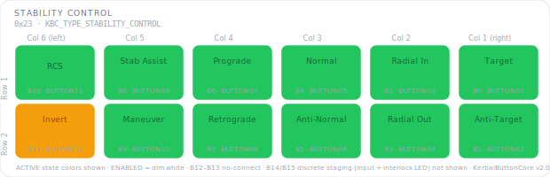

# KCMk1_Stability_Control

**Module:** Stability Control  
**Version:** 1.0  
**Date:** 2026-04-07  
**Author:** J. Rostoker — Jeb's Controller Works  
**License:** GNU General Public License v3.0 (GPL-3.0)  
**Hardware:** KC-01-1822 Button Module Base v1.1  
**Library:** KerbalButtonCore v1.0.0  

---

## Overview

The Stability Control module provides SAS mode selection and control inversion for Kerbal Space Program. It also carries four discrete signal positions for SAS enable, RCS enable, staging trigger, and staging enable. The staging enable position (B15) includes both a button input and a discrete LED output acting as a safety interlock indicator.

This module uses 11 NeoPixel RGB button positions (KBC indices 0-9 and 11), with index 10 unpopulated. Four discrete positions (KBC indices 12-15) carry auxiliary signals outside the NeoPixel grid.

---

## Module Identity

| Parameter | Value |
|---|---|
| I2C Address | `0x23` |
| Module Type ID | `0x04` (KBC_TYPE_STABILITY_CONTROL) |
| Capability Flags | `0x00` (core states only) |
| Extended States | No |
| NeoPixel Buttons | 11 (KBC indices 0-9, 11 — index 10 not installed) |
| Discrete Input Only | 2 (KBC indices 12, 13) |
| Not Installed | KBC indices 14, 15 |

---

## Panel Layout

Physical panel orientation: 2 rows x 6 columns. Column 6 is leftmost, Column 1 is rightmost. Button numbering starts top-right (B0) and proceeds left across each row.

Active state colors shown. All installed NeoPixel buttons illuminate dim white in the ENABLED state. B10 (dashed) is not installed. Discrete positions B12-B15 are outside the NeoPixel grid and not shown.

---

## Button Reference

### NeoPixel Buttons (KBC indices 0-11)

| KBC Index | PCB Label | Function | Active Color | Notes |
|---|---|---|---|---|
| B0 | BUTTON01 | Target | GREEN | SAS mode — one active at a time |
| B1 | BUTTON02 | Anti-Target | GREEN | SAS mode |
| B2 | BUTTON03 | Radial In | GREEN | SAS mode |
| B3 | BUTTON04 | Radial Out | GREEN | SAS mode |
| B4 | BUTTON05 | Normal | GREEN | SAS mode |
| B5 | BUTTON06 | Anti-Normal | GREEN | SAS mode |
| B6 | BUTTON07 | Prograde | GREEN | SAS mode |
| B7 | BUTTON08 | Retrograde | GREEN | SAS mode |
| B8 | BUTTON09 | Stab Assist | GREEN | SAS mode |
| B9 | BUTTON10 | Maneuver | GREEN | SAS mode |
| B10 | BUTTON11 | N/A | — | Not installed |
| B11 | BUTTON12 | Invert | AMBER | Control modifier |

### Discrete Positions (KBC indices 12-15)

| KBC Index | PCB Label | Signal | LED | Notes |
|---|---|---|---|---|
| B12 | BUTTON13 | SAS_ENA | N/A — input only | HIGH = SAS system enabled |
| B13 | BUTTON14 | RCS_ENA | N/A — input only | HIGH = RCS system enabled |
| B14 | BUTTON15 | Not installed | N/A | — |
| B15 | BUTTON16 | Not installed | N/A | — |

### Color Design Notes

- **SAS modes (GREEN)** — all 10 SAS modes share uniform green. Only one mode can be active at a time in KSP, so the single illuminated green button identifies the current mode without any color distinction between modes.
- **Invert (AMBER)** — amber signals awareness; control inversion modifies whatever SAS mode is active and warrants a distinct visual.

---

## Wiring

### NeoPixel Button Inputs

| PCB Connector | PCB Label | KBC Index | Function |
|---|---|---|---|
| P2 | BUTTON01 | 0 | Target |
| P2 | BUTTON02 | 1 | Anti-Target |
| P2 | BUTTON03 | 2 | Radial In |
| P2 | BUTTON04 | 3 | Radial Out |
| P3 | BUTTON05 | 4 | Normal |
| P3 | BUTTON06 | 5 | Anti-Normal |
| P3 | BUTTON07 | 6 | Prograde |
| P3 | BUTTON08 | 7 | Retrograde |
| P4 | BUTTON09 | 8 | Stab Assist |
| P4 | BUTTON10 | 9 | Maneuver |
| P4 | BUTTON11 | 10 | Not installed |
| P4 | BUTTON12 | 11 | Invert |

### Discrete Positions

| PCB Connector | PCB Label | KBC Index | Signal | LED Pin |
|---|---|---|---|---|
| P5 | BUTTON13 | 12 | SAS_ENA | Not connected |
| P5 | BUTTON14 | 13 | RCS_ENA | Not connected |
| P5 | BUTTON15 | 14 | Not installed | Not connected |
| P5 | BUTTON16 | 15 | Not installed | Not connected |

---

## Installation

### Prerequisites

1. Arduino IDE with megaTinyCore installed
2. KerbalButtonCore library installed (`Sketch → Include Library → Add .ZIP Library`)
3. ShiftIn library installed (InfectedBytes/ArduinoShiftIn)
4. tinyNeoPixel_Static included with megaTinyCore — no separate install needed

### Arduino IDE Settings

| Setting | Value |
|---|---|
| Board | ATtiny816 (megaTinyCore) |
| Clock | 10 MHz internal or higher |
| tinyNeoPixel Port | **Port A** — critical for NeoPixel timing |
| Programmer | jtag2updi or SerialUPDI |

### Flash Procedure

1. Open `KCMk1_Stability_Control.ino` in Arduino IDE
2. Confirm IDE settings above
3. Connect UPDI programmer to the module's UPDI header
4. Click Upload

### Verify Operation

After flashing, NeoPixel buttons B0-B9 and B11 should illuminate in dim white ENABLED state. B10 remains off (not installed). Activate SAS_ENA and RCS_ENA signals and confirm B12 and B13 state changes are reported via I2C. Use the `DiagnosticDump` example sketch for full verification.

---

## I2C Bus Position

| Address | Module |
|---|---|
| `0x20` | UI Control |
| `0x21` | Function Control |
| `0x22` | Action Control |
| `0x23` | **Stability Control** — this module |
| `0x24` | Vehicle Control |
| `0x25` | Time Control |
| `0x26`–`0x2E` | Reserved / future modules |

---

## Protocol Reference

Full I2C protocol specification: `KBC_Protocol_Spec.md` v1.2

Button state packet bits of note:
- Bit 12 — SAS_ENA state
- Bit 13 — RCS_ENA state

LED nibble notes for `CMD_SET_LED_STATE`:
- B10, B14-B15: any value accepted but ignored (not installed)
- B12-B13: any value accepted but ignored (no LED hardware)

---

## Revision History

| Version | Date | Notes |
|---|---|---|
| 1.0 | 2026-04-07 | Initial release |
