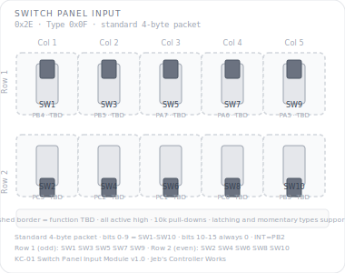

# KCMk1_Switch_Panel

**Module:** Switch Panel Input  
**Version:** 1.0  
**Date:** 2026-04-08  
**Author:** J. Rostoker — Jeb's Controller Works  
**License:** GNU General Public License v3.0 (GPL-3.0)  
**Hardware:** KC-01 Switch Panel Input Module v1.0  

---

## Overview

The Switch Panel Input Module provides 10 toggle switch inputs to the Kerbal Controller Mk1 system controller. Switch functions are TBD — defined by the main controller. Both latching and momentary toggle switches are supported on any position. The dual-buffer latching strategy guarantees every state change edge is reported to the controller regardless of how quickly a momentary switch returns to its default position.

The module uses the standard 4-byte KBC-style packet format, making it straightforward to integrate on the controller side.

This is a standalone sketch with tab-based organisation.

---

## Module Identity

| Parameter | Value |
|---|---|
| I2C Address | `0x2E` |
| Module Type ID | `0x0F` |
| Capability Flags | `0x00` |
| Packet Format | Standard 4-byte (state HI/LO + change HI/LO) |
| Data Packet Size | 4 bytes |
| Switch Inputs | 10 (active high, hardware 10k pull-downs) |
| LEDs | None |

---

## Panel Layout

Physical layout: 2 rows × 5 columns. Odd-numbered switches in Row 1, even-numbered in Row 2.



All switch functions are TBD — dashed borders indicate unassigned functions.

---

## Switch Reference

| Switch | Bit | Pin | Row | Col | Function |
|---|---|---|---|---|---|
| SW1 | 0 | PB4 | 1 | 1 | TBD |
| SW2 | 1 | PC3 | 2 | 1 | TBD |
| SW3 | 2 | PB5 | 1 | 2 | TBD |
| SW4 | 3 | PC2 | 2 | 2 | TBD |
| SW5 | 4 | PA7 | 1 | 3 | TBD |
| SW6 | 5 | PC1 | 2 | 3 | TBD |
| SW7 | 6 | PA6 | 1 | 4 | TBD |
| SW8 | 7 | PC0 | 2 | 4 | TBD |
| SW9 | 8 | PA5 | 1 | 5 | TBD |
| SW10 | 9 | PB3 | 2 | 5 | TBD |

Bits 10-15 of the state and change mask words are always 0.

---

## I2C Protocol

### Data Packet (module → controller, 4 bytes)

Standard KBC-style packet format:

```
Byte 0:  Current state HIGH  — bits 15-8  (bits 10-15 always 0x00)
Byte 1:  Current state LOW   — bits 7-0   (SW1-SW8, bit N = switch N+1)
Byte 2:  Change mask HIGH    — bits 15-8  (bits 10-15 always 0x00)
Byte 3:  Change mask LOW     — bits 7-0
```

**Controller logic:** AND bytes 0-1 with bytes 2-3 to identify which switches changed and what state they changed to.

INT asserts on any debounced switch state change. The dual-buffer strategy guarantees every edge is reported — if a momentary switch flips and returns between reads, both transitions are captured.

### Commands (controller → module)

All standard commands 0x01–0x0A are supported:

| Command | Behavior |
|---|---|
| CMD_SET_LED_STATE (0x02) | Accepted, ignored — no LEDs |
| CMD_SET_BRIGHTNESS (0x03) | Accepted, ignored — no LEDs |
| CMD_BULB_TEST (0x04) | Accepted, ignored — no LEDs |
| CMD_SLEEP / CMD_DISABLE | Stops reporting, INT deasserted |
| CMD_WAKE / CMD_ENABLE | Resumes normal operation |
| CMD_RESET | Clears all switch state and pending INT |

---

## Wiring

| Signal | ATtiny816 Pin | Net |
|---|---|---|
| SW1 | PB4 (pin 10) | Toggle switch 1 |
| SW2 | PC3 (pin 18) | Toggle switch 2 |
| SW3 | PB5 (pin 9) | Toggle switch 3 |
| SW4 | PC2 (pin 17) | Toggle switch 4 |
| SW5 | PA7 (pin 8) | Toggle switch 5 |
| SW6 | PC1 (pin 16) | Toggle switch 6 |
| SW7 | PA6 (pin 7) | Toggle switch 7 |
| SW8 | PC0 (pin 15) | Toggle switch 8 |
| SW9 | PA5 (pin 6) | Toggle switch 9 |
| SW10 | PB3 (pin 11) | Toggle switch 10 |
| INT | PB2 (pin 12) | Interrupt output (active low) |
| SCL | PB0 (pin 14) | I2C clock |
| SDA | PB1 (pin 13) | I2C data |

Not connected: PA4, PA3, PA2, PA1, PC0 (used for SW8 — see above).

---

## Tab Structure

```
KCMk1_Switch_Panel.ino  — setup(), loop()
Config.h                 — pins, constants, I2C command bytes
Switches.h / .cpp        — GPIO reading, debounce, dual-buffer latching
I2C.h / .cpp             — protocol handler, packet build, INT management
```

---

## Installation

### Prerequisites

1. Arduino IDE with megaTinyCore installed
2. No additional libraries required

### Arduino IDE Settings

| Setting | Value |
|---|---|
| Board | ATtiny816 (megaTinyCore) |
| Clock | 10 MHz or higher |
| Programmer | jtag2updi or SerialUPDI |

### Flash Procedure

1. Open `KCMk1_Switch_Panel.ino` in Arduino IDE
2. Confirm IDE settings
3. Connect UPDI programmer to the module's UPDI header
4. Click Upload

### Verify Operation

After flashing the module is immediately active. Toggle any switch and confirm INT asserts and the correct bit changes in the state packet. Test a momentary switch by flipping and quickly releasing — confirm both the press and release edges are reported in separate packets.

---

## I2C Bus Position

| Address | Module |
|---|---|
| `0x20`–`0x25` | Standard button modules |
| `0x26` | EVA Module |
| `0x27` | Reserved |
| `0x28` | Joystick Rotation |
| `0x29` | Joystick Translation |
| `0x2A` | GPWS Input Panel |
| `0x2B` | Pre-Warp Time |
| `0x2C` | Throttle Module |
| `0x2D` | Dual Encoder |
| `0x2E` | **Switch Panel** — this module |

---

## Revision History

| Version | Date | Notes |
|---|---|---|
| 1.0 | 2026-04-08 | Initial release — switch functions TBD |
