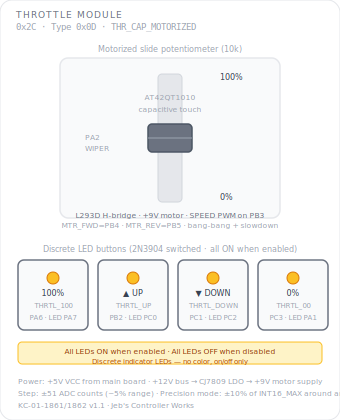

# KCMk1_Throttle_Module

**Module:** Throttle Module  
**Version:** 1.0  
**Date:** 2026-04-08  
**Author:** J. Rostoker — Jeb's Controller Works  
**License:** GNU General Public License v3.0 (GPL-3.0)  
**Hardware:** KC-01-1861/1862 Throttle Module v1.1  

---

## Overview

The Throttle Module provides motorized throttle control for Kerbal Space Program. A 10k motorized slide potentiometer provides physical position control and feedback. A capacitive touch sensor (AT42QT1010) detects pilot contact, stopping the motor immediately when the pilot grabs the slider. Four discrete LED buttons set throttle to 100%, 0%, or step up/down in 5% increments. The module must be explicitly enabled by the system controller before it becomes active.

This is a standalone sketch with tab-based organisation. It is not a KerbalButtonCore or library-based module.

---

## Module Identity

| Parameter | Value |
|---|---|
| I2C Address | `0x2C` |
| Module Type ID | `0x0D` |
| Capability Flags | `0x20` (THR_CAP_MOTORIZED, bit 5) |
| Data Packet Size | 4 bytes |
| Buttons | 4 discrete (active high, hardware pull-downs) |
| LEDs | 4 discrete (2N3904 NPN switched, on/off only) |
| Motor driver | L293DD H-bridge |
| Position sensor | 10k motorized slide potentiometer |
| Touch sensor | AT42QT1010-TSHR capacitive |

---

## Panel Layout



---

## Button Reference

| Button | Pin | Function | Step |
|---|---|---|---|
| THRTL_100 | PA6 | Drive to 100% throttle | Full range |
| THRTL_UP | PB2 | Step up ~5% | +51 ADC counts |
| THRTL_DOWN | PC1 | Step down ~5% | -51 ADC counts |
| THRTL_00 | PC3 | Drive to 0% throttle | Full range |

### LED Reference

| LED | Pin | State |
|---|---|---|
| THRTL_100_LED | PA7 | ON when module enabled |
| THRTL_UP_LED | PC0 | ON when module enabled |
| THRTL_DOWN_LED | PC2 | ON when module enabled |
| THRTL_00_LED | PA1 | ON when module enabled |

All four LEDs illuminate together when the module is enabled, extinguish together when disabled. They do not indicate individual button state.

---

## Motor Control

### H-Bridge (L293DD)

| Signal | Pin | Function |
|---|---|---|
| MTR_FWD | PB4 | Direction control — binary HIGH/LOW |
| MTR_REV | PB5 | Direction control — binary HIGH/LOW |
| SPEED | PB3 | PWM speed control — L293D ENABLE pin |

Only SPEED uses PWM. MTR_FWD and MTR_REV are binary direction signals. Only one should be HIGH at a time.

### Bang-Bang Position Controller

```
Outside slowdown zone (>50 ADC counts from target): full speed (PWM 200/255)
Within slowdown zone  (≤50 ADC counts from target): slow speed  (PWM 80/255)
Within arrival deadzone: stop
```

### Arrival Deadzones

| Target | Deadzone | Reason |
|---|---|---|
| 0% (THRTL_00) | ±8 ADC counts | Must reach true zero |
| 100% (THRTL_100) | ±8 ADC counts | Must reach true maximum |
| Intermediate | ±20 ADC counts | Relaxed for natural feel |

---

## Touch Sensor Behavior

The AT42QT1010 capacitive sensor detects pilot contact with the slider:

| State | Touch detected | Behavior |
|---|---|---|
| Enabled | Yes | Motor stops immediately, module follows wiper position |
| Enabled | No | Motor seeks commanded target normally |
| Disabled | Yes | Motor resists — drives to 0% and holds |
| Disabled | No | Motor holds at 0% |

---

## Precision Mode

Precision mode maps the full physical slider travel to ±10% of INT16_MAX centered on the throttle position at the moment precision mode was entered.

| Parameter | Normal Mode | Precision Mode |
|---|---|---|
| Full travel range | 0 to INT16_MAX | anchor ± 3276 |
| Physical center | Not significant | = anchor output value |
| Motor position on entry | Unchanged | Drives to physical 50% |
| Motor on exit | Unchanged | Drives to position for current output |

**Entry:** Controller sends `CMD_SET_PRECISION [0x01]`. Module records current output as anchor, motor drives slider to physical center.

**Exit:** Controller sends `CMD_SET_PRECISION [0x00]`. Current precision output becomes new throttle position, motor repositions to physical match.

---

## Throttle Value Scaling

All threshold comparisons happen in raw ADC space. Conversion to INT16 output happens once at packet build time.

```
Normal mode:
  output = map(wiperADC, 0, 1023, 0, INT16_MAX)

Precision mode:
  delta = wiperADC - 512  (centered on physical midpoint)
  outputDelta = map(delta, -512, 511, -3276, +3276)
  output = clamp(anchor + outputDelta, 0, INT16_MAX)
```

---

## I2C Protocol

### Data Packet (module → controller, 4 bytes)

```
Byte 0:   Status flags  (bit0=enabled, bit1=precision mode,
                          bit2=pilot touching slider, bit3=motor moving)
Byte 1:   Button events (bit0=THRTL_100 pressed, bit1=THRTL_UP pressed,
                          bit2=THRTL_DOWN pressed, bit3=THRTL_00 pressed)
Byte 2:   Value HIGH    (throttle value, big-endian uint16, 0 to INT16_MAX)
Byte 3:   Value LOW     (throttle value)
```

Button events (byte 1) are rising-edge only — set in the packet that captures the press, cleared after read. The throttle value (bytes 2-3) reflects the current output regardless of how it was set.

INT asserts on any button press or throttle value change exceeding THR_WIPER_CHANGE_MIN (4 ADC counts).

### Commands (controller → module)

| Command | Byte | Payload | Notes |
|---|---|---|---|
| CMD_GET_IDENTITY | `0x01` | None | Standard identity response |
| CMD_SET_LED_STATE | `0x02` | 8 bytes | Accepted, ignored |
| CMD_SET_BRIGHTNESS | `0x03` | 1 byte | Accepted, ignored |
| CMD_BULB_TEST | `0x04` | None | Flashes all LEDs for 2 seconds |
| CMD_SLEEP | `0x05` | None | Same as CMD_DISABLE |
| CMD_WAKE | `0x06` | None | Same as CMD_ENABLE |
| CMD_RESET | `0x07` | None | Disable, clear all state |
| CMD_ACK_FAULT | `0x08` | None | Accepted, ignored |
| CMD_ENABLE | `0x09` | None | Enable module, LEDs on |
| CMD_DISABLE | `0x0A` | None | Motor to 0, hold, LEDs off |
| CMD_SET_THROTTLE | `0x0B` | 2 bytes (uint16 BE) | Drive motor to position |
| CMD_SET_PRECISION | `0x0C` | 1 byte (0=off, 1=on) | Toggle precision mode |

`CMD_SET_THROTTLE` is ignored if the module is disabled or the pilot is touching the slider.

---

## Power Requirements

| Rail | Source | Used For |
|---|---|---|
| +5V VCC | Main board connector | ATtiny816 logic, button pull-ups |
| +12V | Panel bus | Input to CJ7809 LDO regulator |
| +9V | CJ7809 output | L293D motor supply |

The +12V bus must be present for motor operation. Logic functions (I2C, button reading, position reporting) work on +5V alone when motor power is absent.

---

## Wiring

| Signal | ATtiny816 Pin | Function |
|---|---|---|
| MTR_FWD | PB4 (pin 10) | Motor forward direction |
| MTR_REV | PB5 (pin 9) | Motor reverse direction |
| SPEED | PB3 (pin 11) | Motor PWM speed |
| THRTL_100_LED | PA7 (pin 8) | 100% button LED |
| THRTL_100 | PA6 (pin 7) | 100% button input |
| INT | PA5 (pin 6) | Interrupt output (active low) |
| TOUCH_IND | PA3 (pin 2) | Touch sensor output |
| WIPER | PA2 (pin 1) | Potentiometer analog input |
| THRTL_UP | PB2 (pin 12) | UP button input |
| THRTL_UP_LED | PC0 (pin 15) | UP button LED |
| THRTL_DOWN | PC1 (pin 16) | DOWN button input |
| THRTL_DOWN_LED | PC2 (pin 17) | DOWN button LED |
| THRTL_00 | PC3 (pin 18) | 0% button input |
| THRTL_00_LED | PA1 (pin 20) | 0% button LED |
| SCL | PB0 (pin 14) | I2C clock |
| SDA | PB1 (pin 13) | I2C data |

---

## Tab Structure

```
KCMk1_Throttle_Module.ino  — setup(), loop(), top-level coordination
Config.h                   — pins, constants, thresholds
Motor.h / Motor.cpp        — L293D H-bridge position controller
Wiper.h / Wiper.cpp        — ADC reading, touch, scaling, precision mode
Buttons.h / Buttons.cpp    — button input, LED output
I2C.h / I2C.cpp            — protocol handler, state machine, INT management
```

---

## Installation

### Prerequisites

1. Arduino IDE with megaTinyCore installed
2. No additional libraries required

### Arduino IDE Settings

| Setting | Value |
|---|---|
| Board | ATtiny816 (megaTinyCore) |
| Clock | 10 MHz or higher |
| Programmer | jtag2updi or SerialUPDI |

### Flash Procedure

1. Open `KCMk1_Throttle_Module.ino` in Arduino IDE
2. Confirm IDE settings
3. Connect UPDI programmer to the module's UPDI header
4. Click Upload

### Verify Operation

After flashing all LEDs should be OFF (module starts disabled). Send `CMD_ENABLE` from the controller and confirm all four LEDs illuminate. Move the slider and confirm INT asserts and throttle value changes are reported.

---

## I2C Bus Position

| Address | Module |
|---|---|
| `0x20`–`0x25` | Standard button modules |
| `0x26` | EVA Module |
| `0x27` | Reserved |
| `0x28` | Joystick Rotation |
| `0x29` | Joystick Translation |
| `0x2A` | GPWS Input Panel |
| `0x2B` | Pre-Warp Time |
| `0x2C` | **Throttle Module** — this module |

---

## Revision History

| Version | Date | Notes |
|---|---|---|
| 1.0 | 2026-04-08 | Initial release |
