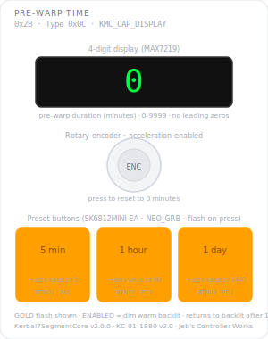

# KCMk1_PreWarp_Time

**Module:** Pre-Warp Time  
**Version:** 2.0.0  
**Date:** 2026-04-28  
**Author:** J. Rostoker — Jeb's Controller Works  
**License:** GNU General Public License v3.0 (GPL-3.0)  
**Hardware:** KC-01-1880 v2.0 (ATtiny816)  
**Library:** Kerbal7SegmentCore v2.0.0  

---

## Overview

The Pre-Warp Time module allows the pilot to set a pre-warp duration in minutes using the rotary encoder or three GOLD preset buttons. The value is transmitted to the master controller for use in time warp sequencing. Three preset buttons provide one-press access to the most commonly used durations. The encoder allows fine control across the full 0–9999 minute range with dynamic acceleration.

---

## Module Identity

| Parameter | Value |
|---|---|
| I2C Address | `0x2B` |
| Module Type ID | `KMC_TYPE_PRE_WARP_TIME` (0x0C) |
| Capability Flags | `KMC_CAP_DISPLAY` (0x10) |
| Data Packet Size | 8 bytes (3-byte header + 5-byte payload) |
| NeoPixel Buttons | 3 (SK6812MINI-EA, NEO_GRB 3-byte) |
| GPIO Buttons | 1 (BTN_EN — encoder pushbutton, no LED) |
| Display | 4-digit MAX7219, 0–9999 |
| Encoder | PEC11R-4220F-S0024, hardware RC debounced |

---

## Panel Layout



---

## Button Reference

| Button | Pin | Function | Behaviour | Value |
|---|---|---|---|---|
| BTN01 | PA1 | 5 min preset | GOLD flash 150ms | 5 |
| BTN02 | PC2 | 1 hour preset | GOLD flash 150ms | 60 |
| BTN03 | PC1 | 1 day preset | GOLD flash 150ms | 1440 |
| BTN_EN | PB3 | Reset | Momentary — no LED | 0 |

All three preset buttons flash GOLD for 150ms on press then return to BACKLIT. The display jumps to the preset value immediately. There is no persistent toggle state — all three are the same action type.

---

## Display Reference

| Parameter | Value |
|---|---|
| Range | 0–9999 |
| Units | Minutes |
| Default value | 0 |
| Leading zeros | Suppressed — shows `60` not `0060` |
| Decimal point | Not used |

Display is always on when ACTIVE regardless of encoder or button state.

### Encoder Acceleration

Step size based on consecutive clicks in the same direction. Direction reversal resets the count.

| Consecutive clicks | Step |
|---|---|
| 1–14 | ±1 |
| 15–29 | ±10 |
| 30–49 | ±100 |
| 50+ | ±1000 |

The click count resets after 500ms of inactivity — a pause mid-scroll always returns to slow mode on the next click.

Value clamps at 0 and 9999.

---

## I2C Protocol

### Data Packet (8 bytes, module → controller)

```
Byte 0:  Status      lifecycle (bits 1:0), fault (bit 2), data_changed (bit 3)
Byte 1:  Type ID     0x0C
Byte 2:  Counter     transaction counter, uint8, wraps 255→0
Byte 3:  Events      rising edge bitmask (bit0=BTN01, bit1=BTN02,
                      bit2=BTN03, bit3=BTN_EN)
Byte 4:  Change mask same bit layout
Byte 5:  State       always 0x00 — no persistent toggle state
Byte 6:  Value HIGH  duration in minutes, signed int16, big-endian
Byte 7:  Value LOW
```

INT asserts LOW on any button press or value change. Deasserts after master reads packet.

### Commands accepted

All standard `KMC_CMD_*` commands. Module-specific behaviour:

| Command | Effect |
|---|---|
| `CMD_ENABLE` | Buttons go backlit, display shows current value |
| `CMD_DISABLE` | All dark, value reset to 0, input suppressed |
| `CMD_SLEEP` | State frozen exactly, INT suppressed, no visual change |
| `CMD_WAKE` | Resume — sends current state packet |
| `CMD_RESET` | Value resets to 0, buttons go backlit. Module stays ACTIVE |
| `CMD_SET_VALUE` | Sets value directly. Display updates immediately |
| `CMD_BULB_TEST 0x01` | All pixels white, all display segments on. **Commandable regardless of lifecycle state** |
| `CMD_BULB_TEST 0x00` | Restore previous state |
| `CMD_SET_BRIGHTNESS` | Top nibble sets MAX7219 intensity (0–15) |

### Vessel switch

No action. State persists across vessel switches — pilot configures as needed.

---

## Wiring

| Signal | ATtiny816 | Net |
|---|---|---|
| CLK | PA7 (pin 8) | MAX7219 SPI clock |
| DATA | PA6 (pin 7) | MAX7219 SPI data |
| LOAD | PA5 (pin 6) | MAX7219 SPI latch |
| BTN01 | PA1 (pin 20) | BUTTON01 |
| BTN02 | PC2 (pin 17) | BUTTON02 |
| BTN03 | PC1 (pin 16) | BUTTON03 |
| NEOPIX | PC3 (pin 18) | SK6812 data chain |
| BTN_EN | PB3 (pin 11) | BUTTON_EN |
| ENC_A | PB4 (pin 10) | Encoder channel A |
| ENC_B | PB5 (pin 9) | Encoder channel B |
| INT | PC0 (pin 15) | Interrupt output (active LOW) |
| SCL | PB0 (pin 14) | I2C clock |
| SDA | PB1 (pin 13) | I2C data |

---

## Installation

### Prerequisites

1. Arduino IDE with megaTinyCore installed
2. KerbalModuleCommon v1.1.0 (Sketch → Include Library → Add .ZIP)
3. Kerbal7SegmentCore v2.0.0 (Sketch → Include Library → Add .ZIP)

### Arduino IDE Settings

| Setting | Value |
|---|---|
| Board | ATtiny816 (megaTinyCore) |
| Clock | 20 MHz internal |
| Programmer | serialUPDI |

### Flash Procedure

1. Open `KCMk1_PreWarp_Time.ino`
2. Confirm settings above
3. Connect UPDI programmer to module UPDI header
4. Upload

### Verify Operation

After flashing: display shows `0`, all three buttons backlit dim warm. Press BTN01 — display jumps to 5 with a brief GOLD flash. Press BTN02 — display shows 60. Press BTN03 — display shows 1440. Press BTN_EN — display returns to 0. Turn encoder — value increments/decrements.

---

## Revision History

| Version | Date | Notes |
|---|---|---|
| 2.0.0 | 2026-04-28 | Rewritten for Kerbal7SegmentCore v2.0.0. All application logic in sketch. Click-count encoder acceleration. Universal 3-byte packet header. Pin assignments corrected to match KC-01-1880 v2.0 hardware. Clock corrected to 20 MHz. |
| 1.0 | 2026-04-08 | Initial release |

---

## License

GNU General Public License v3.0 — https://www.gnu.org/licenses/gpl-3.0.html  
Code by J. Rostoker, Jeb's Controller Works.
