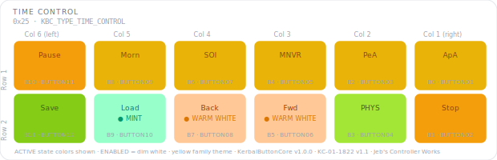

# KCMk1_Time_Control

**Module:** Time Control  
**Version:** 1.0  
**Date:** 2026-04-07  
**Author:** J. Rostoker — Jeb's Controller Works  
**License:** GNU General Public License v3.0 (GPL-3.0)  
**Hardware:** KC-01-1822 Button Module Base v1.1  
**Library:** KerbalButtonCore v1.0.0  

---

## Overview

The Time Control module provides time warp control, warp target selection, physics warp, game pause, and quicksave / quickload functions for Kerbal Space Program.

The panel uses a yellow family color theme reflecting the unusual and consequential nature of time manipulation. All five warp target buttons share YELLOW, warp rate controls use WARM WHITE, physics warp uses CHARTREUSE to distinguish it from standard warp, and game state actions use AMBER (pause/stop), LIME (save), and MINT (load).

This module uses 12 NeoPixel RGB button positions (KBC indices 0-11). The four discrete LED button positions (KBC indices 12-15) are not populated.

---

## Module Identity

| Parameter | Value |
|---|---|
| I2C Address | `0x25` |
| Module Type ID | `0x06` (KBC_TYPE_TIME_CONTROL) |
| Capability Flags | `0x00` (core states only) |
| Extended States | No |
| Populated Buttons | 12 (KBC indices 0-11) |
| Discrete LEDs | None |

---

## Panel Layout

Physical panel orientation: 2 rows x 6 columns. Column 6 is leftmost, Column 1 is rightmost. Button numbering starts top-right (B0) and proceeds left across each row.



Active state colors shown. All buttons illuminate dim white in the ENABLED state. The yellow color family reads as a coherent "time warp" panel at a glance.

---

## Button Reference

| KBC Index | PCB Label | Function | Active Color | Color Family | Notes |
|---|---|---|---|---|---|
| B0 | BUTTON01 | ApA | YELLOW | Warp target | Warp to apoapsis |
| B1 | BUTTON02 | Stop | AMBER | Awareness | Stop time warp |
| B2 | BUTTON03 | PeA | YELLOW | Warp target | Warp to periapsis |
| B3 | BUTTON04 | PHYS | CHARTREUSE | Physics warp | Engage physics time warp |
| B4 | BUTTON05 | MNVR | YELLOW | Warp target | Warp to maneuver node |
| B5 | BUTTON06 | Fwd | WARM WHITE | Warp rate | Increase time warp |
| B6 | BUTTON07 | SOI | YELLOW | Warp target | Warp to SOI change |
| B7 | BUTTON08 | Back | WARM WHITE | Warp rate | Decrease time warp |
| B8 | BUTTON09 | Morn | YELLOW | Warp target | Warp to morning (sunrise) |
| B9 | BUTTON10 | Load | MINT | Restoration | Load quicksave |
| B10 | BUTTON11 | Pause | AMBER | Awareness | Pause game |
| B11 | BUTTON12 | Save | LIME | Positive | Quicksave |
| B12-B15 | — | Not installed | — | — | — |

### Color Design Notes

- **Warp targets (YELLOW)** — ApA, PeA, MNVR, SOI, and Morn all share yellow. They are all "jump to a point in time" actions and the uniform color reinforces that.
- **Warp rate (WARM WHITE)** — Fwd and Back are rate controls, not destinations. Warm white is in the yellow family but clearly not a destination button.
- **PHYS (CHARTREUSE)** — physics warp is mechanically different from standard time warp. Chartreuse is warm and yellow-adjacent but distinct enough to stand out from the warp target bank.
- **Stop / Pause (AMBER)** — both interrupt the flow of time. Amber signals awareness — these require the pilot's attention.
- **Save (LIME)** — positive reinforcement. Saving is a good thing.
- **Load (MINT)** — restoration / recovery. Mint is fresh and cool, distinct from save's lime, and reads as "going back" rather than "going forward."

---

## LED States

This module uses core LED states only. No extended states (WARNING, ALERT, ARMED, PARTIAL_DEPLOY) are implemented.

| State | Behavior | Trigger |
|---|---|---|
| OFF | Unlit | Controller sends `0x0` for this button |
| ENABLED | Dim white backlight | Controller sends `0x1` — button ready |
| ACTIVE | Full brightness, button color | Controller sends `0x2` — function engaged |

---

## Wiring

| PCB Connector | PCB Label | KBC Index | Function |
|---|---|---|---|
| P2 | BUTTON01 | 0 | ApA |
| P2 | BUTTON02 | 1 | Stop |
| P2 | BUTTON03 | 2 | PeA |
| P2 | BUTTON04 | 3 | PHYS |
| P3 | BUTTON05 | 4 | MNVR |
| P3 | BUTTON06 | 5 | Fwd |
| P3 | BUTTON07 | 6 | SOI |
| P3 | BUTTON08 | 7 | Back |
| P4 | BUTTON09 | 8 | Morn |
| P4 | BUTTON10 | 9 | Load |
| P4 | BUTTON11 | 10 | Pause |
| P4 | BUTTON12 | 11 | Save |
| P5 | BUTTON13-16 | 12-15 | Not connected |

---

## Installation

### Prerequisites

1. Arduino IDE with megaTinyCore installed
2. KerbalButtonCore library installed (`Sketch → Include Library → Add .ZIP Library`)
3. ShiftIn library installed (InfectedBytes/ArduinoShiftIn)
4. tinyNeoPixel_Static included with megaTinyCore — no separate install needed

### Arduino IDE Settings

| Setting | Value |
|---|---|
| Board | ATtiny816 (megaTinyCore) |
| Clock | 10 MHz internal or higher |
| tinyNeoPixel Port | **Port A** — critical for NeoPixel timing |
| Programmer | jtag2updi or SerialUPDI |

### Flash Procedure

1. Open `KCMk1_Time_Control.ino` in Arduino IDE
2. Confirm IDE settings above
3. Connect UPDI programmer to the module's UPDI header
4. Click Upload

### Verify Operation

After flashing, all 12 buttons should illuminate in dim white ENABLED state. Use the `DiagnosticDump` example sketch from the KerbalButtonCore library to verify all button inputs and LED outputs before installing in the controller chassis.

---

## I2C Bus Position

| Address | Module |
|---|---|
| `0x20` | UI Control |
| `0x21` | Function Control |
| `0x22` | Action Control |
| `0x23` | Stability Control |
| `0x24` | Vehicle Control |
| `0x25` | **Time Control** — this module |
| `0x26`–`0x2E` | Reserved / future modules |

---

## Protocol Reference

Full I2C protocol specification: `KBC_Protocol_Spec.md` v1.2

Button state packet (module → controller, INT-triggered):
```
Byte 0-1: Current state bitmask  (bit N = KBC index N, 1=pressed)
Byte 2-3: Change mask            (bit N = changed since last read)
```

LED state command (controller → module):
```
CMD_SET_LED_STATE (0x02) + 8 bytes nibble-packed
Two buttons per byte, high nibble first, values 0x0-0x2
```

---

## Revision History

| Version | Date | Notes |
|---|---|---|
| 1.0 | 2026-04-07 | Initial release |
