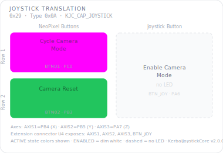

# KCMk1_Joystick_Translation

**Module:** Joystick Translation  
**Version:** 1.0  
**Date:** 2026-04-08  
**Author:** J. Rostoker — Jeb's Controller Works  
**License:** GNU General Public License v3.0 (GPL-3.0)  
**Hardware:** KC-01-1831/1832 Joystick Module v1.0  
**Library:** KerbalJoystickCore v1.0.0  

---

## Overview

The Joystick Translation module provides three-axis translational input for Kerbal Space Program vessel control. Axis data is calibrated at startup, filtered through a deadzone and change threshold, and delivered to the system controller as signed INT16 values via I2C. Two NeoPixel RGB buttons provide camera mode cycling and camera reset. The joystick pushbutton enables camera mode.

This module is **not** a KerbalButtonCore (KBC) module. It uses the KerbalJoystickCore library and communicates via the Kerbal Controller Mk1 I2C protocol using a device-specific 8-byte data packet.

---

## Module Identity

| Parameter | Value |
|---|---|
| I2C Address | `0x29` |
| Module Type ID | `0x0A` |
| Capability Flags | `0x08` (KJC_CAP_JOYSTICK) |
| Data Packet Size | 8 bytes |
| NeoPixel Buttons | 2 (BTN01, BTN02) |
| GPIO Buttons | 1 (BTN_JOY — no LED) |
| Analog Axes | 3 (AXIS1, AXIS2, AXIS3) |

---

## Panel Layout



---

## Button and Axis Reference

### NeoPixel Buttons

| Button | Pin | Function | Active Color | Notes |
|---|---|---|---|---|
| BTN01 | PC0 | Cycle Camera Mode | MAGENTA | Cycles through available camera views |
| BTN02 | PB3 | Camera Reset | GREEN | Returns camera to default position |

### Joystick Button

| Button | Pin | Function | LED | Notes |
|---|---|---|---|---|
| BTN_JOY | PA6 | Enable Camera Mode | None | Active high, hardware pull-down |

### Analog Axes

| Axis | Pin | ADC Channel | Function | Output Range |
|---|---|---|---|---|
| AXIS1 | PB4 | AIN9 | X axis | -32768 to +32767 |
| AXIS2 | PB5 | AIN8 | Y axis | -32768 to +32767 |
| AXIS3 | PA7 | AIN7 | Z axis | -32768 to +32767 |

All axis values are signed INT16, centered at zero. Center position is calibrated at startup. Do not touch the joystick during the first ~80ms after power-on.

---

## I2C Protocol

### Data Packet (8 bytes, module → controller)

```
Byte 0:   Button state  (bit0=BTN_JOY, bit1=BTN01, bit2=BTN02)
Byte 1:   Change mask   (same bit layout)
Byte 2-3: AXIS1         (int16, big-endian, -32768 to +32767)
Byte 4-5: AXIS2         (int16, big-endian, -32768 to +32767)
Byte 6-7: AXIS3         (int16, big-endian, -32768 to +32767)
```

### INT Assertion Strategy

| Source | Behavior |
|---|---|
| Button change | Immediate INT, no throttling |
| Axis outside deadzone, above change threshold | INT if quiet period elapsed |
| Joystick at rest (within deadzone) | No INT |
| Joystick held steady (below change threshold) | No INT |

Default thresholds (all in raw ADC counts):

| Parameter | Default | Notes |
|---|---|---|
| Deadzone | ±32 counts | ~3.1% of full range |
| Change threshold | ±8 counts | ~0.8% of full range |
| Quiet period | 10 ms | Max 100 axis reads/second |

---

## Wiring

### On-Module Connections

| Signal | ATtiny816 Pin | Net |
|---|---|---|
| AXIS1 | PB4 (pin 10) | Joystick X via extension connector |
| AXIS2 | PB5 (pin 9) | Joystick Y via extension connector |
| AXIS3 | PA7 (pin 8) | Joystick Z via extension connector |
| BTN_JOY | PA6 (pin 7) | Joystick pushbutton via extension connector |
| BTN01 | PC0 (pin 15) | NeoPixel button 1 |
| BTN02 | PB3 (pin 11) | NeoPixel button 2 |
| NEOPIX_CMD | PC1 (pin 16) | NeoPixel data output |
| INT | PA1 (pin 20) | Interrupt output (active low) |
| SCL | PB0 (pin 14) | I2C clock |
| SDA | PB1 (pin 13) | I2C data |

### Extension Connector (U4)

The 6-pin screw terminal (DB127S-5.08-6P) carries the physical joystick signals:

| Pin | Signal |
|---|---|
| 1 | GND |
| 2 | BTN_JOY |
| 3 | AXIS3 |
| 4 | AXIS2 |
| 5 | AXIS1 |
| 6 | VCC |

---

## Installation

### Prerequisites

1. Arduino IDE with megaTinyCore installed
2. KerbalJoystickCore library installed (`Sketch → Include Library → Add .ZIP Library`)
3. tinyNeoPixel_Static included with megaTinyCore — no separate install needed

### Arduino IDE Settings

| Setting | Value |
|---|---|
| Board | ATtiny816 (megaTinyCore) |
| Clock | 10 MHz or higher |
| tinyNeoPixel Port | **Port C** — NeoPixel is on PC1 |
| Programmer | jtag2updi or SerialUPDI |

### Flash Procedure

1. Open `KCMk1_Joystick_Translation.ino` in Arduino IDE
2. Confirm IDE settings — especially **Port C** for NeoPixel
3. Connect UPDI programmer to the module's UPDI header
4. Click Upload
5. Do not touch the joystick at power-on — calibration runs in the first ~80ms

### Verify Operation

After flashing, BTN01 and BTN02 should illuminate dim white (ENABLED state). Move the joystick and confirm INT asserts and axis data changes. Use the `DiagnosticDump` example from the KerbalJoystickCore library to verify all axes and buttons via serial output.

---

## I2C Bus Position

| Address | Module |
|---|---|
| `0x20` | UI Control |
| `0x21` | Function Control |
| `0x22` | Action Control |
| `0x23` | Stability Control |
| `0x24` | Vehicle Control |
| `0x25` | Time Control |
| `0x26` | EVA Module |
| `0x27` | Reserved |
| `0x28` | Joystick Rotation |
| `0x29` | **Joystick Translation** — this module |

---

## Revision History

| Version | Date | Notes |
|---|---|---|
| 1.0 | 2026-04-08 | Initial release |
