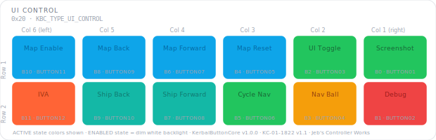

# KCMk1_UI_Control

**Module:** UI Control  
**Version:** 1.0  
**Date:** 2026-04-07  
**Author:** J. Rostoker — Jeb's Controller Works  
**License:** GNU General Public License v3.0 (GPL-3.0)  
**Hardware:** KC-01-1822 Button Module Base v1.1  
**Library:** KerbalButtonCore v1.0.0  

---

## Overview

The UI Control module provides cinematic, navigation, and interface control functions for Kerbal Space Program. It is the first module on the KBC I2C bus and communicates with the system controller as an I2C target device.

This module uses 12 of the 16 available button positions. The four discrete LED button positions (KBC indices 12-15) are not populated on this module.

---

## Module Identity

| Parameter | Value |
|---|---|
| I2C Address | `0x20` |
| Module Type ID | `0x01` (KBC_TYPE_UI_CONTROL) |
| Capability Flags | `0x00` (core states only) |
| Extended States | No |
| Populated Buttons | 12 (KBC indices 0-11) |
| Discrete LEDs | None |

---

## Panel Layout

Physical panel orientation: 2 rows × 6 columns. Column 6 is leftmost, Column 1 is rightmost. Button numbering starts top-right (B0) and proceeds left across each row.



Active state colors shown. All buttons illuminate dim white in the ENABLED state.

---

## Button Reference

| KBC Index | PCB Label | Function | Active Color | Color Family |
|---|---|---|---|---|
| B0 | BUTTON01 | Screenshot | GREEN | General UI |
| B1 | BUTTON02 | Debug | RED | Caution |
| B2 | BUTTON03 | UI Toggle | GREEN | General UI |
| B3 | BUTTON04 | Nav Ball Toggle | AMBER | Awareness |
| B4 | BUTTON05 | Map Reset | SKY | Map family |
| B5 | BUTTON06 | Cycle Nav | GREEN | General UI |
| B6 | BUTTON07 | Map Forward | SKY | Map family |
| B7 | BUTTON08 | Ship Forward | TEAL | Ship family |
| B8 | BUTTON09 | Map Back | SKY | Map family |
| B9 | BUTTON10 | Ship Back | TEAL | Ship family |
| B10 | BUTTON11 | Map Enable | SKY | Map family |
| B11 | BUTTON12 | IVA | CORAL | Mode shift |
| B12–B15 | — | Not installed | — | — |

### Color Design Notes

- **Map family (SKY)** — four map control buttons share a unified sky blue, reading as a navigation group at a glance
- **Ship family (TEAL)** — vessel cycling buttons in teal, related to but distinct from the map family
- **Nav Ball (AMBER)** — amber indicates awareness; toggling the nav ball is a significant display change worth noticing
- **IVA (CORAL)** — coral distinguishes a full perspective mode shift from general UI toggles
- **Debug (RED)** — red signals caution; debug menu access is not a normal flight operation

---

## LED States

This module uses core LED states only. No extended states (WARNING, ALERT, ARMED, PARTIAL_DEPLOY) are implemented.

| State | Behavior | Trigger |
|---|---|---|
| OFF | Unlit | Controller sends `0x0` for this button |
| ENABLED | Dim white backlight | Controller sends `0x1` — button ready |
| ACTIVE | Full brightness, button color | Controller sends `0x2` — function engaged |

---

## Wiring

Button inputs are connected sequentially to the shift register chain:

| PCB Connector | PCB Label | KBC Index | Function |
|---|---|---|---|
| P2 | BUTTON01 | 0 | Screenshot |
| P2 | BUTTON02 | 1 | Debug |
| P2 | BUTTON03 | 2 | UI Toggle |
| P2 | BUTTON04 | 3 | Nav Ball Toggle |
| P3 | BUTTON05 | 4 | Map Reset |
| P3 | BUTTON06 | 5 | Cycle Nav |
| P3 | BUTTON07 | 6 | Map Forward |
| P3 | BUTTON08 | 7 | Ship Forward |
| P4 | BUTTON09 | 8 | Map Back |
| P4 | BUTTON10 | 9 | Ship Back |
| P4 | BUTTON11 | 10 | Map Enable |
| P4 | BUTTON12 | 11 | IVA |
| P5 | BUTTON13–16 | 12–15 | Not connected |

---

## Installation

### Prerequisites

1. Arduino IDE with megaTinyCore installed
2. KerbalButtonCore library installed (`Sketch → Include Library → Add .ZIP Library`)
3. ShiftIn library installed (InfectedBytes/ArduinoShiftIn)
4. tinyNeoPixel_Static included with megaTinyCore — no separate install needed

### Arduino IDE Settings

| Setting | Value |
|---|---|
| Board | ATtiny816 (megaTinyCore) |
| Clock | 10 MHz internal or higher |
| tinyNeoPixel Port | **Port A** — critical for NeoPixel timing |
| Programmer | jtag2updi or SerialUPDI |

### Flash Procedure

1. Open `KCMk1_UI_Control.ino` in Arduino IDE
2. Confirm IDE settings above
3. Connect UPDI programmer to the module's UPDI header
4. Click Upload

### Verify Operation

After flashing, all 12 buttons should illuminate in a dim white ENABLED state within one second of power-on. Use the `DiagnosticDump` example sketch from the KerbalButtonCore library to verify button inputs and LED outputs before installing in the controller chassis.

---

## I2C Bus Position

This module occupies address `0x20`, the first position in the KBC address range. The system controller expects `KBC_TYPE_UI_CONTROL` (0x01) at this address during startup enumeration. If the wrong module type is detected, the controller will flag a configuration error.

Full bus address map:

| Address | Module |
|---|---|
| `0x20` | **UI Control** ← this module |
| `0x21` | Function Control |
| `0x22` | Action Control |
| `0x23` | Stability Control |
| `0x24` | Vehicle Control |
| `0x25` | Time Control |
| `0x26`–`0x2E` | Reserved / future modules |

---

## Protocol Reference

Full I2C protocol specification: `KBC_Protocol_Spec.md` v1.2

Button state packet (module → controller, INT-triggered):
```
Byte 0-1: Current state bitmask  (bit N = KBC index N, 1=pressed)
Byte 2-3: Change mask            (bit N = changed since last read)
```

LED state command (controller → module):
```
CMD_SET_LED_STATE (0x02) + 8 bytes nibble-packed
Two buttons per byte, high nibble first, values 0x0-0x6
```

---

## Revision History

| Version | Date | Notes |
|---|---|---|
| 1.0 | 2026-04-07 | Initial release |
