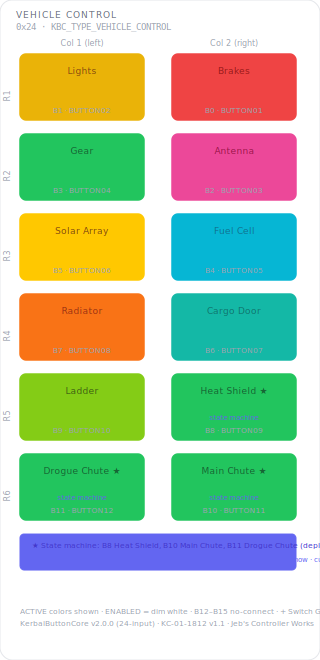

# KCMk1_Vehicle_Control

**Module:** Vehicle Control  
**Version:** 1.0  
**Date:** 2026-04-07  
**Author:** J. Rostoker — Jeb's Controller Works  
**License:** GNU General Public License v3.0 (GPL-3.0)  
**Hardware:** KC-01-1822 Button Module Base v1.1  
**Library:** KerbalButtonCore v1.0.0  

---

## Overview

The Vehicle Control module provides vehicle systems management including brakes, lights, landing gear, solar arrays, antenna, cargo door, ladder, radiators, and parachute deployment for Kerbal Space Program. Parachute buttons (B8-B11) support extended LED states for pre-deployment sequencing.

Four discrete input positions carry vehicle state signals (parking brake, parachutes armed, lights lock, gear lock). None have LED outputs.

This module is the only standard module that declares `KBC_CAP_EXTENDED_STATES` — the system controller uses WARNING, ALERT, ARMED, and PARTIAL_DEPLOY states on the parachute buttons to communicate deployment status.

---

## Module Identity

| Parameter | Value |
|---|---|
| I2C Address | `0x24` |
| Module Type ID | `0x05` (KBC_TYPE_VEHICLE_CONTROL) |
| Capability Flags | `0x01` (KBC_CAP_EXTENDED_STATES) |
| Extended States | Yes — parachute buttons B8-B11 |
| NeoPixel Buttons | 12 (KBC indices 0-11) |
| Discrete Inputs | 4 (KBC indices 12-15 — input only, no LED) |

---

## Panel Layout

Physical panel orientation: 6 rows x 2 columns. Column 1 is leftmost, Column 2 is rightmost. Button numbering starts top-right (B0) and proceeds left within each row, then steps down.



Active state colors shown. All NeoPixel buttons illuminate dim white in the ENABLED state. Buttons marked with extended states (B8-B11) also support WARNING, ALERT, ARMED, and PARTIAL_DEPLOY states. Discrete inputs (B12-B15) are outside the NeoPixel grid and not shown.

---

## Button Reference

### NeoPixel Buttons (KBC indices 0-11)

| KBC Index | PCB Label | Function | Active Color | Extended States | Notes |
|---|---|---|---|---|---|
| B0 | BUTTON01 | Brakes | RED | No | Significant — red for attention |
| B1 | BUTTON02 | Lights | YELLOW | No | Natural light association |
| B2 | BUTTON03 | Solar Array | GOLD | No | Power / sunlight |
| B3 | BUTTON04 | Gear | GREEN | No | Terrain family |
| B4 | BUTTON05 | Cargo Door | TEAL | No | Terrain family |
| B5 | BUTTON06 | Antenna | PINK | No | Comms family |
| B6 | BUTTON07 | Ladder | LIME | No | Terrain family |
| B7 | BUTTON08 | Radiator | ORANGE | No | Thermal management |
| B8 | BUTTON09 | Main Deploy | GREEN | Yes | Parachute deploy |
| B9 | BUTTON10 | Drogue Deploy | GREEN | Yes | Parachute deploy |
| B10 | BUTTON11 | Main Cut | RED | Yes | Irreversible |
| B11 | BUTTON12 | Drogue Cut | RED | Yes | Irreversible |

### Discrete Inputs (KBC indices 12-15)

| KBC Index | PCB Label | Signal | LED | Notes |
|---|---|---|---|---|
| B12 | BUTTON13 | Parking Brake | N/A — input only | HIGH = parking brake engaged |
| B13 | BUTTON14 | Parachutes Armed | N/A — input only | HIGH = parachutes armed |
| B14 | BUTTON15 | Lights Lock | N/A — input only | HIGH = lights locked |
| B15 | BUTTON16 | Gear Lock | N/A — input only | HIGH = gear locked |

### Color Design Notes

- **Terrain family (GREEN, TEAL, LIME)** — Gear, Cargo Door, and Ladder share a green-adjacent family. Physical proximity on the vehicle to the ground unifies them.
- **Brakes (RED)** — not strictly irreversible but high consequence — red draws attention.
- **Parachute deploy (GREEN) / cut (RED)** — the most consequential paired actions on the panel. GREEN for deploy (positive, controlled), RED for cut (irreversible). Extended states carry the sequencing story.
- **Solar Array (GOLD)** — distinct warm color for power generation. Not confused with YELLOW (lights) or ORANGE (thermal).

---

## Extended LED States — Parachute Buttons

Buttons B8-B11 support the full extended state set. The system controller uses these to communicate parachute deployment status. All timing and visual behavior is handled by the module.

| State | Color | Behavior | Meaning |
|---|---|---|---|
| ENABLED | White (dim) | Static | System nominal, parachutes available |
| ACTIVE | GREEN / RED | Static | Normal active state |
| WARNING | Amber | 500ms flash | Deployment window approaching |
| ALERT | Red | 150ms flash | Deploy immediately |
| ARMED | Cyan | Static | Parachute armed and ready |
| PARTIAL_DEPLOY | Amber | Static | Drogue deployed, main pending |

---

## Wiring

### NeoPixel Button Inputs

| PCB Connector | PCB Label | KBC Index | Function |
|---|---|---|---|
| P2 | BUTTON01 | 0 | Brakes |
| P2 | BUTTON02 | 1 | Lights |
| P2 | BUTTON03 | 2 | Solar Array |
| P2 | BUTTON04 | 3 | Gear |
| P3 | BUTTON05 | 4 | Cargo Door |
| P3 | BUTTON06 | 5 | Antenna |
| P3 | BUTTON07 | 6 | Ladder |
| P3 | BUTTON08 | 7 | Radiator |
| P4 | BUTTON09 | 8 | Main Deploy |
| P4 | BUTTON10 | 9 | Drogue Deploy |
| P4 | BUTTON11 | 10 | Main Cut |
| P4 | BUTTON12 | 11 | Drogue Cut |

### Discrete Inputs

| PCB Connector | PCB Label | KBC Index | Signal | LED Pin |
|---|---|---|---|---|
| P5 | BUTTON13 | 12 | Parking Brake | Not connected |
| P5 | BUTTON14 | 13 | Parachutes Armed | Not connected |
| P5 | BUTTON15 | 14 | Lights Lock | Not connected |
| P5 | BUTTON16 | 15 | Gear Lock | Not connected |

---

## Installation

### Prerequisites

1. Arduino IDE with megaTinyCore installed
2. KerbalButtonCore library installed (`Sketch → Include Library → Add .ZIP Library`)
3. ShiftIn library installed (InfectedBytes/ArduinoShiftIn)
4. tinyNeoPixel_Static included with megaTinyCore — no separate install needed

### Arduino IDE Settings

| Setting | Value |
|---|---|
| Board | ATtiny816 (megaTinyCore) |
| Clock | 10 MHz internal or higher |
| tinyNeoPixel Port | **Port A** — critical for NeoPixel timing |
| Programmer | jtag2updi or SerialUPDI |

### Flash Procedure

1. Open `KCMk1_Vehicle_Control.ino` in Arduino IDE
2. Confirm IDE settings above
3. Connect UPDI programmer to the module's UPDI header
4. Click Upload

### Verify Operation

After flashing, all 12 NeoPixel buttons should illuminate in dim white ENABLED state. Send `KBC_LED_WARNING` to B8 via `CMD_SET_LED_STATE` and confirm the amber flash. Use the `DiagnosticDump` example sketch for full input and extended state verification.

---

## I2C Bus Position

| Address | Module |
|---|---|
| `0x20` | UI Control |
| `0x21` | Function Control |
| `0x22` | Action Control |
| `0x23` | Stability Control |
| `0x24` | **Vehicle Control** — this module |
| `0x25` | Time Control |
| `0x26`–`0x2E` | Reserved / future modules |

---

## Protocol Reference

Full I2C protocol specification: `KBC_Protocol_Spec.md` v1.2

Identity response capability flags: `0x01` (KBC_CAP_EXTENDED_STATES) — the system controller uses this to know extended LED states are valid for this module.

Button state packet bits of note:
- Bit 12 — Parking Brake state
- Bit 13 — Parachutes Armed state
- Bit 14 — Lights Lock state
- Bit 15 — Gear Lock state

LED state nibble values for parachute buttons (B8-B11):
```
0x0 = OFF
0x1 = ENABLED  (dim white)
0x2 = ACTIVE   (full GREEN or RED)
0x3 = WARNING  (amber flash 500ms)
0x4 = ALERT    (red flash 150ms)
0x5 = ARMED    (static cyan)
0x6 = PARTIAL_DEPLOY (static amber)
```

---

## Revision History

| Version | Date | Notes |
|---|---|---|
| 1.0 | 2026-04-07 | Initial release |
